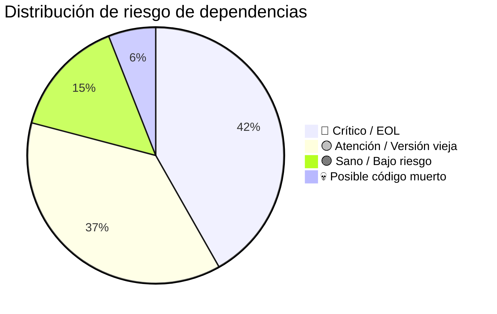

# Stack Tecnológico

> **Proyecto:** Muvinapp (app-panel)
> **Última revisión:** 2026-04-16
> **Archivo de referencia:** `package.json` (Egret v6.0.1)

---

## Framework y lenguaje base

| Tecnología | Versión | Propósito | Estado vendor | Riesgo |
|---|---|---|---|---|
| **Angular** | 6.0.1 | Framework SPA principal | 🔴 EOL (nov 2018) | 🔴 Sin parches de seguridad desde 2019 |
| **TypeScript** | 2.7.2 | Lenguaje de desarrollo | 🔴 EOL | 🔴 Muy atrás de versión actual (5.x) |
| **RxJS** | 6.1.0 | Programación reactiva | 🟡 Compatible con Angular 6 | 🟡 Requiere `rxjs-compat` para APIs legacy |
| **rxjs-compat** | 6.1.0 | Capa de compatibilidad RxJS 5→6 | 🔴 Deprecado | 🟡 Parche temporal que nunca se quitó |
| **Zone.js** | 0.8.26 | Change detection Angular | 🔴 Versión vieja | 🟡 Acoplado a Angular 6 |

---

## Plantilla base

| Tecnología | Versión | Propósito | Estado vendor | Riesgo |
|---|---|---|---|---|
| **Egret Admin** | 6.0.1 | Plantilla Angular Material Dashboard | 🔴 Producto comercial ThemeForest, versión vieja | 🟡 Código Egret mezclado con custom hace difícil actualizar |

> [!info] Origen del proyecto
> El proyecto fue scaffoldeado a partir de **Egret v6**, una plantilla comercial de ThemeForest para Angular Material. Muchos componentes en `shared/components/` (customizer, layouts, sidebar, header, notifications, breadcrumb) provienen de Egret y están customizados.

---

## UI y componentes visuales

| Tecnología | Versión | Propósito | Estado vendor | Riesgo |
|---|---|---|---|---|
| **Angular Material** | ^6.4.7 | Componentes UI base (buttons, cards, dialogs, etc.) | 🔴 EOL (sigue como v6) | 🟡 Funcional pero sin mejoras |
| **Angular CDK** | ^6.4.7 | Utilidades UI (overlays, drag, tables) | 🔴 EOL | 🟡 Acoplado a Material 6 |
| **Angular Flex Layout** | 6.0.0-beta.16 | Layout responsive (fxLayout, fxFlex) | 🔴 Deprecado por Angular team (2023) | 🔴 No hay migración directa; reemplazar por CSS Grid/Flexbox |
| **Kendo UI for Angular** | Múltiples (Grid ^3.7, Inputs ^3.2, DateInputs ^3.4, Dropdowns ^3.1, Buttons ^4.1, Excel Export ^2.1) | Grids avanzados, inputs, datepickers, dropdowns, export Excel | 🟡 Kendo sigue activo pero estas versiones son muy viejas | 🟡 Licencia comercial requerida; actualizar requiere Angular nuevo |
| **Handsontable Pro** | ^6.2.3 | Grids tipo spreadsheet | 🔴 Versión Pro descontinuada, migró a modelo Open Core | 🔴 Licencia y compatibilidad problemáticas |
| **@swimlane/ngx-datatable** | 11.1.7 | Tablas de datos alternativas | 🟡 Proyecto con bajo mantenimiento | 🟡 Funcional pero estancado |
| **ngx-perfect-scrollbar** | 6.1.0 | Scrollbars personalizados | 🔴 Deprecado | 🟢 Bajo impacto, decorativo |
| **ngx-color-picker** | 5.3.8 | Selector de colores | 🟡 Activo | 🟢 Bajo impacto |
| **ngx-quill** | 2.0.4 | Editor rich text (Quill.js) | 🟡 Versión vieja pero Quill sigue activo | 🟡 Actualizar requiere Angular nuevo |
| **mat-select-autocomplete** | ^1.3.0 | Select con autocomplete | 🔴 Paquete abandonado | 🟡 Pocos resultados, bajo impacto |
| **saturn-datepicker** | ^6.1.1 | Datepicker con rango | 🔴 Deprecado | 🟡 Funcional pero sin mantenimiento |
| **amazing-time-picker** | ^1.8.0 | Time picker | 🔴 Proyecto abandonado | 🟡 Funcional |
| **ngx-material-timepicker** | ^3.3.1 | Otro time picker | 🟡 Activo | 🟢 Bajo impacto |
| **angular-star-rating** / **css-star-rating** | 3.0.8 / 1.2.4 | Rating de estrellas | 🔴 Abandonado | 🟢 Bajo impacto |
| **ngx-owl-carousel-o** | ^3.0.0 | Carousel | 🟡 Activo | 🟢 Bajo impacto |
| **@ngu/carousel** | 1.4.2 | Carousel alternativo | 🔴 Versión vieja | ⚠️ Posible duplicación con ngx-owl-carousel-o |

---

## Mapas y geolocalización

| Tecnología | Versión | Propósito | Estado vendor | Riesgo |
|---|---|---|---|---|
| **@agm/core** (Angular Google Maps) | ~1.0.0 | Mapas Google Maps | 🔴 Deprecado, reemplazado por @angular/google-maps | 🟡 Funcional pero sin mantenimiento |
| **@agm/js-marker-clusterer** | ^1.0.0-beta.5 | Clustering de markers | 🔴 Deprecado | 🟡 Acoplado a @agm |
| **agm-direction** | ^0.7.8 | Direcciones en mapa | 🔴 Deprecado | 🟡 Acoplado a @agm |
| **agm-oms** | ^1.0.0-beta.5 | Overlapping Marker Spiderfier | 🔴 Deprecado | 🟡 Acoplado a @agm |
| **js-marker-clusterer** | ^1.0.0 | Clustering nativo | 🔴 Deprecado | 🟡 Reemplazado por @googlemaps/markerclusterer |
| **ts-overlapping-marker-spiderfier** | ^1.0.2 | Spiderfier en TS | 🔴 Proyecto abandonado | 🟢 Bajo impacto |
| **ngx-google-places-autocomplete** | ^2.0.3 | Autocomplete de direcciones | 🟡 Bajo mantenimiento | 🟡 Funcional |

---

## Backend y datos

| Tecnología | Versión | Propósito | Estado vendor | Riesgo |
|---|---|---|---|---|
| **Firebase** | ^6.4.0 | BaaS (auth, Firestore, storage) | 🟡 Firebase activo pero SDK v6 es viejo | 🟡 Migrar a v9+ modular |
| **@angular/fire (AngularFire)** | ^5.2.1 | Wrapper Angular para Firebase | 🔴 v5 deprecada, actual es v7+ | 🟡 Acoplado a Angular 6 |
| **angularfire2** | ^5.2.1 | ⚠️ Paquete duplicado / alias legacy de @angular/fire | 🔴 Renombrado | 🟡 Posible import duplicado |
| **angular-in-memory-web-api** | 0.6.0 | Mock API en memoria (desarrollo) | 🟡 Útil para dev | 🟢 Solo en desarrollo |
| **ngx-socket-io** | ^2.1.1 | WebSocket via Socket.io | 🟡 Activo | 🟡 Versión vieja |

> [!warning] Arquitectura backend dual
> El proyecto consume **dos backends** distintos:
> 1. **API principal:** `https://dev.muvinapp.com/api/backend/web/` (variable `apiURL`)
> 2. **API nueva:** `URL_SERVICIOS` → `https://dev.muvinapp.com/muvinapp-new-api/` (en dev) / `http://localhost/api_muvin` (en prod ⚠️)
>
> Además usa **Firebase/Firestore** como tercer canal de datos (notificaciones en tiempo real, posiblemente auth).
> Ver [[arquitectura-alto-nivel]].

---

## Generación de archivos y exportación

| Tecnología | Versión | Propósito | Estado vendor | Riesgo |
|---|---|---|---|---|
| **jsPDF** | 1.5.3 | Generación de PDF | 🟡 jsPDF activo (v2.x actual) | 🟡 Versión vieja |
| **ExcelJS** | ^1.12.0 | Generación de Excel | 🟡 ExcelJS activo (v4.x actual) | 🟡 Versión vieja pero funcional |
| **xlsx** | ^0.14.0 | Lectura/escritura de Excel (SheetJS) | 🟡 SheetJS activo | 🟡 Versión vieja |
| **xlsx-styles** | ^0.8.21 | Estilos para xlsx | 🔴 Proyecto abandonado | 🟡 Fork no mantenido |
| **file-saver** | ^2.0.5 | Descarga de archivos en browser | 🟡 Activo | 🟢 Estable |
| **html2canvas** | 1.0.0-rc.1 | Captura de pantalla HTML→Canvas | 🟡 Activo (v1.4 actual) | 🟡 Versión RC antigua |
| **pdfjs-dist** | ^2.0.943 | Visor de PDF | 🟡 Activo (v3.x actual) | 🟡 Versión vieja |
| **ng2-pdf-viewer** | ^5.2.4 | Componente Angular para visor PDF | 🟡 Activo | 🟡 Versión vieja |

---

## Gráficos y visualización

| Tecnología | Versión | Propósito | Estado vendor | Riesgo |
|---|---|---|---|---|
| **Chart.js** | 2.5.0 | Gráficos (barras, líneas, pie, etc.) | 🟡 Chart.js activo (v4.x actual) | 🟡 API cambió en v3, migración no trivial |
| **ng2-charts** | 1.6.0 | Wrapper Angular para Chart.js | 🔴 Versión muy vieja | 🟡 Acoplado a Chart.js 2.x |

> [!info] Duplicación de Chart.js
> Chart.js está tanto en `node_modules` (vía package.json v2.5.0) como embebido en `src/vendor/Chart.min.js`. 💀 Posible versión fantasma.

---

## Internacionalización

| Tecnología | Versión | Propósito | Estado vendor | Riesgo |
|---|---|---|---|---|
| **@ngx-translate/core** | 10.0.1 | i18n — traducciones dinámicas | 🟡 Activo pero comunidad migra a Angular i18n | 🟢 Funcional |
| **@ngx-translate/http-loader** | 3.0.1 | Carga de archivos de traducción via HTTP | 🟡 Acoplado a ngx-translate | 🟢 Funcional |

> Archivos de traducción en `src/assets/i18n/` (en.json, es.json).

---

## Utilidades varias

| Tecnología | Versión | Propósito | Estado vendor | Riesgo |
|---|---|---|---|---|
| **moment** | ^2.24.0 | Manipulación de fechas | 🔴 En mantenimiento, recomiendan migrar | 🟡 Funcional pero pesado (~300kb) |
| **@angular/material-moment-adapter** | ^11.0.3 | Adapter de Moment para Material Datepicker | ⚠️ Versión 11 en proyecto Angular 6 | 🟡 Posible incompatibilidad |
| **date-fns** | 1.28.5 | Alternativa a moment para fechas | 🟡 Activo (v3.x actual) | 🟡 Versión vieja |
| **angular-calendar** | 0.23.7 | Componente de calendario | 🟡 Activo | 🟡 Versión vieja |
| **ng2-dragula** | 1.3.1 | Drag and drop | 🔴 Versión vieja (v2 actual) | 🟡 Funcional |
| **ng2-file-upload** | 1.2.1 | Upload de archivos | 🔴 Proyecto con bajo mantenimiento | 🟡 Funcional |
| **ng2-pipes** / **ngx-pipes** | ^2.0.1 / ^2.5.6 | Pipes utilitarios | 🟡 Bajo mantenimiento | ⚠️ Dos librerías de pipes duplicadas |
| **ng2-validation** | 4.2.0 | Validaciones custom | 🔴 Abandonado | 🟡 Funcional |
| **ng-recaptcha** | ^5.0.0 | Google reCAPTCHA | 🟡 Activo | 🟢 Bajo impacto |
| **ng-fallimg** | 0.0.1 | Imagen fallback | 🔴 Versión 0.0.1, proyecto mínimo | 🟢 Bajo impacto |
| **angular-md5** | ^0.1.10 | Hash MD5 | 🔴 Abandonado | 🟡 MD5 no es seguro para crypto |
| **angular-moment** | ^1.3.0 | Pipes de moment para Angular | 🔴 Deprecado | 🟡 Redundante con moment directo |
| **hopscotch** | 0.3.1 | Tours / guías interactivas | 🔴 Proyecto abandonado (LinkedIn) | 🟡 Funcional si se usa |
| **ngx-pagination** | 3.1.0 | Paginación | 🟡 Activo | 🟢 Estable |
| **cors** | ^2.8.5 | ⚠️ Middleware CORS de Express en un proyecto Angular | 🟡 Activo | ⚠️ No tiene sentido en frontend; posible error de dependencia |
| **http** | 0.0.1-security | ⚠️ Placeholder de seguridad npm | 🔴 No es una librería real | 🟡 Inofensivo pero innecesario |
| **http-proxy** | ^1.18.1 | Proxy HTTP | 🟡 Activo | ⚠️ Dependencia de servidor, no de frontend |
| **hammerjs** | 2.0.8 | Gestos táctiles | 🟡 Activo | 🟢 Requerido por Angular Material 6 |
| **classlist.js** | 1.1.20150312 | Polyfill classList | 🔴 Innecesario en browsers modernos | 💀 Posible código muerto |
| **core-js** | 2.4.1 | Polyfills ES6+ | 🔴 v2 deprecada | 🟡 Acoplado a Angular 6 |
| **web-animations-js** | 2.3.1 | Polyfill Web Animations API | 🔴 Innecesario en browsers modernos | 💀 Posible código muerto |

---

## Testing

| Tecnología | Versión | Propósito | Estado vendor | Riesgo |
|---|---|---|---|---|
| **Karma** | ~1.4.1 | Test runner | 🔴 Angular migró a Jest/Web Test Runner | 🟡 Funcional pero obsoleto |
| **Jasmine** | ~2.5.2 | Framework de tests | 🟡 Activo (v5.x actual) | 🟡 Versión muy vieja |
| **Protractor** | ~5.1.0 | E2E testing | 🔴 Deprecado por Angular team (2022) | 🔴 Sin mantenimiento, migrar a Playwright/Cypress |
| **karma-chrome-launcher** | ~2.1.1 | Lanzador Chrome para Karma | 🟡 Acoplado a Karma | 🟡 Funcional |
| **karma-coverage-istanbul-reporter** | ~0.2.0 | Cobertura de código | 🟡 Funcional | 🟡 Versión vieja |
| **codelyzer** | ~2.0.0 | Linter Angular (sobre TSLint) | 🔴 Deprecado junto con TSLint | 🔴 Reemplazar por ESLint |
| **TSLint** | 4.5.0 | Linter TypeScript | 🔴 Deprecado (2019), reemplazado por ESLint | 🔴 Sin actualizaciones |

---

## Build y deploy

| Tecnología | Versión | Propósito | Estado vendor | Riesgo |
|---|---|---|---|---|
| **@angular/cli** | ^6.0.1 | CLI de Angular (build, serve, generate) | 🔴 EOL | 🔴 Acoplado a Angular 6 |
| **@angular-devkit/build-angular** | ~0.6.0 | Builder de Webpack para Angular | 🔴 EOL | 🔴 Acoplado a CLI 6 |
| **Node.js** (Dockerfile) | 12 | Runtime de build | 🔴 EOL (abr 2022) | 🔴 Sin parches de seguridad |
| **Nginx** (Dockerfile) | 1.21.4-alpine | Servidor web para servir la SPA | 🟡 Nginx activo (versión vieja) | 🟡 Actualizar imagen |
| **node-sass** | ^4.14.1 | Compilador SCSS (binding nativo) | 🔴 Deprecado, reemplazado por sass (Dart) | 🔴 Problemas de compilación en plataformas nuevas |

---

## Resumen de riesgo por categoría

---

## Dependencias sospechosas o fuera de lugar

| Dependencia | Problema |
|---|---|
| `cors` (^2.8.5) | Middleware Express en proyecto Angular frontend. No debería estar acá. |
| `http` (0.0.1-security) | Placeholder de seguridad npm, no es una librería real. |
| `http-proxy` (^1.18.1) | Librería de servidor, no de frontend. Posiblemente usada solo para proxy de dev. |
| `angularfire2` + `@angular/fire` | Dos paquetes que son el mismo (angularfire2 fue renombrado a @angular/fire). Posible importación duplicada. |
| `ng2-pipes` + `ngx-pipes` | Dos librerías de pipes utilitarios que se solapan. |
| `@angular/material-moment-adapter` (^11.0.3) | Versión 11 en proyecto Angular 6. Incompatibilidad de major version. ⚠️ Pendiente de verificar si realmente funciona o es ignorada. |
| `node-sass` | En `dependencies` en lugar de `devDependencies`. Solo se necesita en build. |

---

## URLs de backend configuradas

| Variable | Dev (`environment.ts`) | Prod (`environment.prod.ts`) | Observación |
|---|---|---|---|
| `apiURL` | `https://dev.muvinapp.com/api/backend/web/` | `https://dev.muvinapp.com/api/backend/web/` | ⚠️ Misma URL en dev y prod |
| `apiUrlExt` | `api/v1` | `api/v1` | Extensión de ruta |
| `wsUrl` | `https://dev.muvinapp.com/socket/` | `https://dev.muvinapp.com/socket/` | WebSocket |
| `URL_SERVICIOS` | `https://dev.muvinapp.com/muvinapp-new-api/` | `http://localhost/api_muvin` | 🔴 Prod apunta a localhost |
| `frontCarga` | `https://dev.muvinapp.com/logistica/carga` | `https://dev.muvinapp.com/logistica/carga` | Frontend de carga (micro-frontend?) |
| `frontDocumentacion` | `https://dev.muvinapp.com/documentaciones/` | `https://dev.muvinapp.com/documentaciones/` | Frontend de documentaciones |
| `frontDescarga` | `https://dev.muvinapp.com/descargas` | `https://dev.muvinapp.com/descargas` | Frontend de descargas |
| `cookiesPath` | `muvinapp.com` | `muvinapp.com` | Dominio de cookies |

> [!danger] Riesgo de seguridad
> La API key de Firebase está hardcodeada en ambos archivos de environment y se commitea al repositorio. Si bien las API keys de Firebase para web son "públicas" por diseño, las security rules de Firestore/Storage deben ser estrictas. Ver [[security-inventory]].

---

## Referencias

- `package.json` — Dependencias completas
- `angular.json` — Configuración de build
- `Dockerfile` — Pipeline de build y deploy
- `src/environments/environment.ts` — Variables dev
- `src/environments/environment.prod.ts` — Variables prod
- [[tree-estructura-archivos]] — Estructura de archivos completa
- [[core-vs-custom-dependencies]] — Análisis core vs custom
- [[deuda-tecnica]] — Deuda técnica asociada al stack
