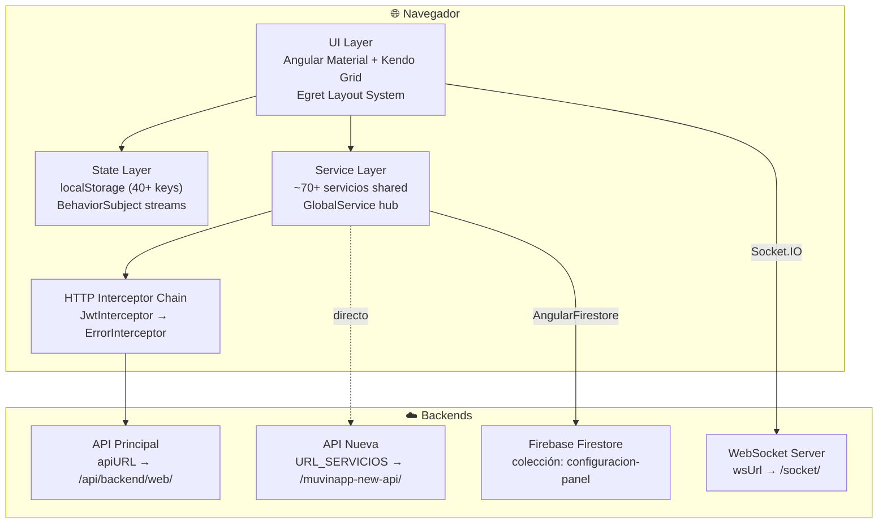
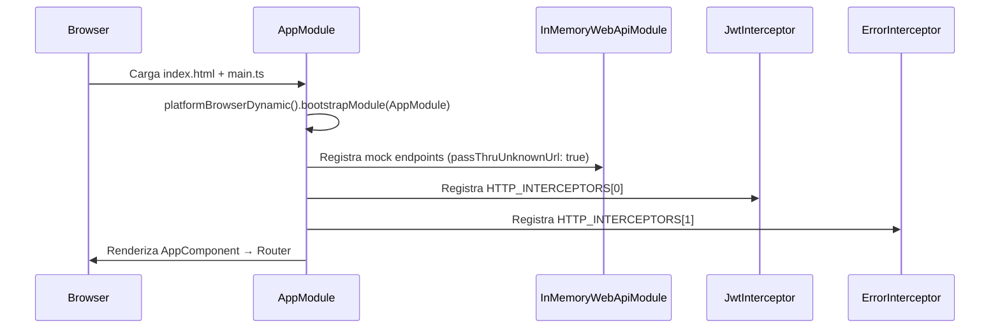
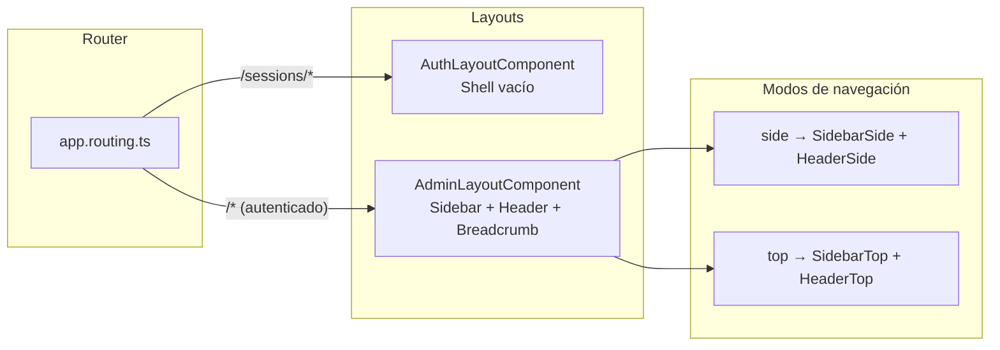
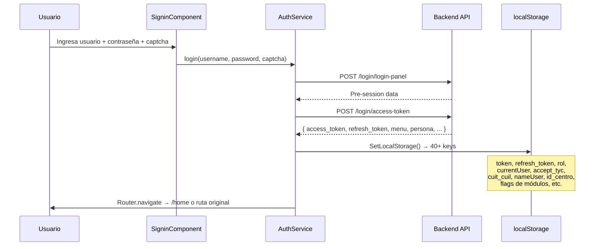
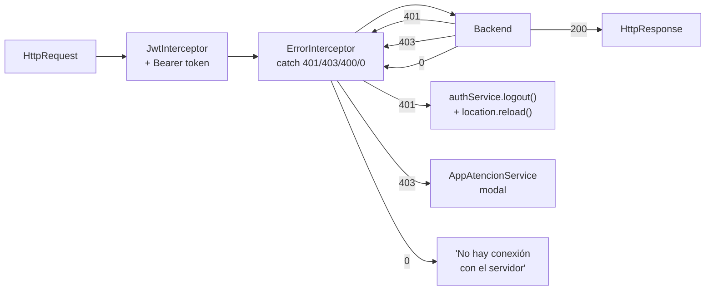
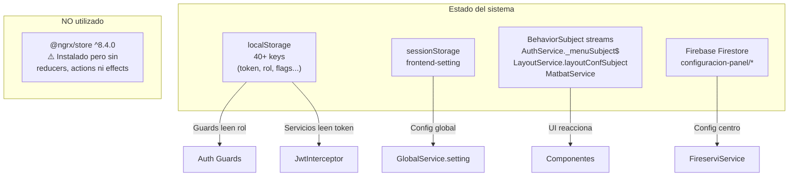
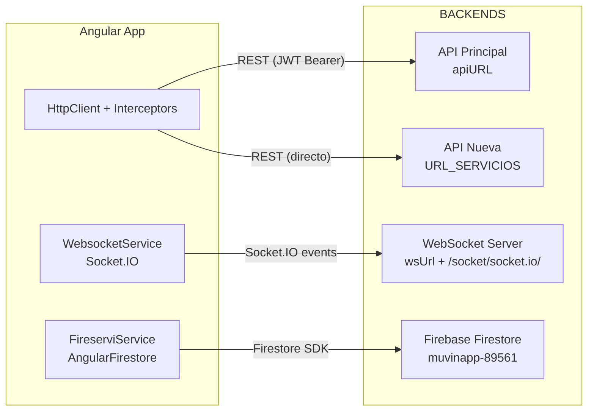
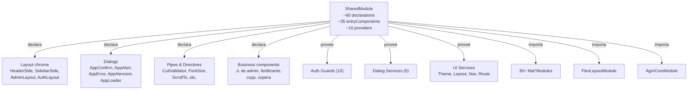
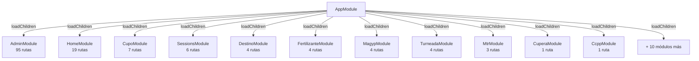

# Arquitectura de Alto Nivel

> **Proyecto:** Muvinapp (app-panel)
> **Última revisión:** 2026-04-16
> **Framework:** Angular 6.0.1 · Egret v6.0.1 · TypeScript 2.7.2

---

## Diagrama de capas



---

## 1. Bootstrap y carga inicial



**`AppModule` providers raíz:**
| Provider | Tipo | Rol |
|---|---|---|
| `AuthService` | Singleton | Autenticación, BehaviorSubject de menú y usuarios |
| `UserService` | Singleton | Datos de usuario |
| `GlobalService` | Singleton | Wrapper de `environment.apiURL` → `apiHost` |
| `MatbatService` | Singleton | BehaviorSubject + localStorage para parámetro MATBA |
| `JwtInterceptorService` | HTTP_INTERCEPTORS | Adjunta `Bearer` token a cada request |
| `ErrorInterceptor` | HTTP_INTERCEPTORS | Maneja 401/403/400/404/0 |

> [!warning] InMemoryWebApiModule en producción
> `InMemoryWebApiModule.forRoot(InMemoryDataService, { passThruUnknownUrl: true })` corre en todos los ambientes. Los mock endpoints del chat (`contacts`, `chat-collections`, `chat-user`) se sirven localmente; las URLs no reconocidas pasan al backend real. Riesgo: una URL de mock podría shadear un endpoint real si los nombres colisionan.

---

## 2. Sistema de layout



**`AdminLayoutComponent`** controla dos modos de navegación vía `LayoutService.layoutConf.navigationPos`:

| Propiedad | Default | Opciones |
|---|---|---|
| `navigationPos` | `"side"` | `"side"` · `"top"` |
| `sidebarStyle` | `"compact"` | `"full"` · `"compact"` · `"closed"` |
| `dir` | `"ltr"` | `"ltr"` · `"rtl"` |
| `topbarFixed` | `true` | boolean |
| `useBreadcrumb` | `false` | boolean |

---

## 3. Flujo de autenticación



**Autenticación 100% JWT custom** — Firebase NO se usa para auth.

### Cadena de interceptores HTTP



> [!info] Doble manejo de 401
> Ambos interceptores manejan el 401: `JwtInterceptor` navega a `/sessions/signin`; `ErrorInterceptor` hace `authService.logout()` + `location.reload()`. En la práctica, `ErrorInterceptor` gana porque su `catchError` cortocircuita el `tap` del JWT interceptor.

### Guards de rol

| Guard | Roles (`localStorage.rol`) | Módulos protegidos |
|---|---|---|
| `AuthGuard` | Cualquier token válido | Cupo, Cupera, Turneada, Combustible, Documentos, Destinatario |
| `TermAuthGuard` | Token + `accept_tyc === '1'` | Todos los autenticados |
| `AdminAuthGuard` | `1`, `12` | Admin |
| `CentroAuthGuard` | `3`, `11`, `16` | Centro, CCPP |
| `TranspAuthGuard` | `4` | Transportista |
| `DadorAuthGuard` | (roles de dador) | Dador |
| `DestinoAuthGuard` | (roles de destino) | Destino |
| `MagypAuthGuard` | (roles de MAGyP) | MAGyP |
| `MtrAuthGuard` | (roles de MTR) | MTR |
| `FertilizantesAuthGuard` | `15` | Fertilizante |

---

## 4. Capa de estado



> [!warning] NgRx es dead code
> `@ngrx/store ^8.4.0` está instalado pero **nunca configurado**. No hay `StoreModule.forRoot()`, ni reducers, ni actions, ni effects. Además la versión 8 es incompatible con Angular 6 (requiere Ng8+). Todo el estado vive en `localStorage` + `BehaviorSubject`.

---

## 5. Canales de comunicación con backends



| Canal | URL (dev) | Autenticación | Uso |
|---|---|---|---|
| **API Principal** | `https://dev.muvinapp.com/api/backend/web/` | JWT Bearer via interceptor | CRUD de todas las entidades (~60 servicios) |
| **API Nueva** | `https://dev.muvinapp.com/muvinapp-new-api/` | Directo (sin interceptor en algunos casos) | Endpoints v2/v3 (CuperaService) |
| **WebSocket** | `https://dev.muvinapp.com/socket/` | `configurar-usuario` al conectar | Eventos en tiempo real (notificaciones, estado) |
| **Firebase** | `muvinapp-89561.firebaseapp.com` | Firebase SDK key | Solo `configuracion-panel` (config por centro) |

### WebSocket — eventos conocidos

```typescript
// Al conectar, el servicio se auto-registra:
socket.emit('configurar-usuario', {
  id_persona: response.data.id_persona,
  nombre: localStorage.getItem('nameUser'),
  consultas: true
});

// Consumidores escuchan eventos vía:
websocketService.listen('nombre-evento')  // → Observable<any>
```

Componentes activos que usan WebSocket:
- `FooterSocketComponent` — indicador de conexión
- `SidebarSideComponent` — notificaciones
- `SidenavComponent` — eventos de sidebar
- `SidebarTopComponent` — notificaciones

---

## 6. SharedModule — el mega-módulo



> [!danger] SharedModule declara componentes de view modules
> `SharedModule` importa y declara componentes de `views/admin`, `views/fertilizante`, `views/ccpp` y `views/cupera`. Esto crea **acoplamiento bidireccional** y anula los beneficios del lazy loading. Ver [[cross-module-dependencies]] para el detalle.

---

## 7. Lazy loading — módulos feature



Todos los feature modules usan lazy loading con sintaxis de string (Angular 6):
```typescript
loadChildren: './views/admin/admin.module#AdminModule'
```

---

## 8. Resumen de decisiones arquitectónicas

| Decisión | Implementación | Estado |
|---|---|---|
| Autenticación | JWT custom con localStorage | ✅ Funcional |
| Autorización | Guards de rol numérico | ✅ Funcional |
| Estado global | localStorage (40+ keys) + BehaviorSubject | ⚠️ Frágil — sin tipado ni validación |
| Comunicación REST | HttpClient + 2 interceptores | ✅ Funcional |
| Comunicación real-time | Socket.IO vía ngx-socket-io | ✅ Funcional (uso limitado) |
| Firebase | Solo Firestore para config-panel | ✅ Funcional (alcance mínimo) |
| State management | NgRx instalado pero no usado | 🔴 Dead dependency |
| Lazy loading | Todos los feature modules | ⚠️ Parcialmente anulado por SharedModule |
| Mock API | InMemoryWebApiModule en producción | ⚠️ Riesgo de shadowing |
| UI framework | Angular Material + Kendo Grid | ✅ Funcional |
| Layout | Egret template con 2 modos (side/top) | ✅ Funcional |

---

## Referencias

- [[stack-tecnologico]] — Dependencias y versiones
- [[functional-classification]] — Clasificación funcional de módulos
- [[cross-module-dependencies]] — Dependencias cruzadas entre módulos
- [[depends-matrix]] — Matriz de dependencias
- [[data-files-index]] — Índice de modelos y servicios
