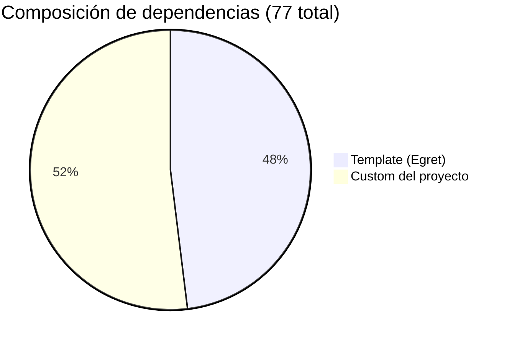
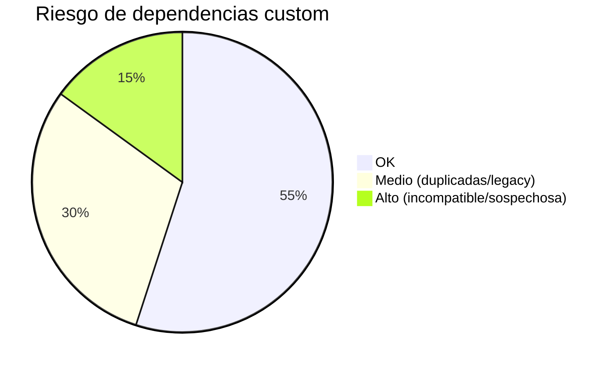

# Dependencias: Template (Egret) vs Custom

> **Proyecto:** Muvinapp (app-panel)
> **Última revisión:** 2026-04-16
> **Total:** 37 template · 40+ custom · 6 conflictos severos

---

## Resumen visual

---

## 1. Dependencias del template Egret (37)

Estas vienen preconfiguradas con Egret v6.0.1. Son las dependencias "base" del template.

### 1.1 Angular Core (10)

| Paquete | Versión | Rol |
|---|---|---|
| `@angular/animations` | 6.0.1 | Animaciones |
| `@angular/cdk` | ^6.4.7 | CDK Material |
| `@angular/common` | 6.0.1 | CommonModule |
| `@angular/compiler` | 6.0.1 | Compilador JIT |
| `@angular/core` | 6.0.1 | Core framework |
| `@angular/forms` | 6.0.1 | FormsModule, ReactiveFormsModule |
| `@angular/http` | 6.0.1 | HttpModule (deprecated → use HttpClient) |
| `@angular/material` | ^6.4.7 | UI components |
| `@angular/platform-browser` | 6.0.1 | DOM rendering |
| `@angular/router` | 6.0.1 | Router |

### 1.2 Egret Feature Deps (27)

| Paquete | Versión | Propósito |
|---|---|---|
| `@angular/flex-layout` | 6.0.0-beta.18 | Grid y flex responsivo |
| `@angular/platform-browser-dynamic` | 6.0.1 | Bootstrap JIT |
| `@ngrx/store` | ^8.4.0 | State management (⚠️ NO SE USA) |
| `@swimlane/ngx-datatable` | ^13.1.0 | Tablas de datos |
| `angular-calendar` | ^0.26.0-beta.1 | Calendario |
| `angular-in-memory-web-api` | ^0.7.0 | Mock API |
| `chart.js` | ^2.7.2 | Gráficos |
| `classlist.js` | ^1.1.20150312 | Polyfill classList |
| `core-js` | ^2.5.7 | Polyfills ES6+ |
| `hammerjs` | ^2.0.8 | Gestos táctiles |
| `hopscotch` | ^0.3.1 | Tours guiados |
| `ng2-charts` | ^1.6.0 | Wrapper chart.js para Angular |
| `ng2-dragula` | ^2.1.1 | Drag & drop |
| `ng2-file-upload` | ^1.3.0 | Upload de archivos |
| `ng2-pipes` | ^1.5.2 | Pipes utilitarios |
| `ngx-color-picker` | ^6.2.0 | Color picker |
| `ngx-pagination` | ^3.2.1 | Paginación |
| `perfect-scrollbar` | ^1.4.0 | Scrollbar custom |
| `ngx-quill` | ^3.0.0 | Editor rich text |
| `quill` | ^1.3.6 | Base de ngx-quill |
| `rxjs` | 6.1.0 | Observables |
| `rxjs-compat` | 6.1.0 | Compatibilidad rxjs 5→6 |
| `web-animations-js` | ^2.3.1 | Polyfill Web Animations |
| `zone.js` | ^0.8.26 | Zones Angular |
| `@ngx-translate/core` | ^10.0.2 | i18n |
| `@ngx-translate/http-loader` | ^3.0.1 | i18n HTTP loader |
| `date-fns` | ^1.29.0 | Utilidades de fecha |

---

## 2. Dependencias custom del proyecto (40+)

Agregadas por el equipo de Muvinapp sobre el template.

### 2.1 Firebase (3 paquetes)

| Paquete | Versión | Nota |
|---|---|---|
| `angularfire2` | ^5.0.0-rc.11 | Wrapper Angular para Firebase (legacy) |
| `@angular/fire` | ^5.0.0 | Wrapper Angular para Firebase (nuevo) |
| `firebase` | ^5.3.0 | SDK Firebase |

> [!warning] Doble wrapper Firebase
> `angularfire2` y `@angular/fire` son **el mismo paquete renombrado**. Ambos están instalados. `angularfire2` es el nombre legacy; `@angular/fire` es el nombre actual. Solo debería haber uno.

### 2.2 Google Maps (4 paquetes)

| Paquete | Versión | Propósito |
|---|---|---|
| `@agm/core` | ^1.0.0-beta.3 | Mapas Google |
| `@agm/js-marker-clusterer` | ^1.0.0-beta.3 | Clusters de marcadores |
| `@agm/snazzy-info-window` | ^1.1.1 | Info windows custom |
| `js-marker-clusterer` | ^1.0.0 | Peer dependency |

### 2.3 Kendo UI (8 paquetes)

| Paquete | Versión | Propósito |
|---|---|---|
| `@progress/kendo-angular-grid` | ^3.14.0 | Grid avanzado |
| `@progress/kendo-angular-l10n` | ^1.3.0 | Localización |
| `@progress/kendo-angular-intl` | ^1.7.0 | Internacionalización |
| `@progress/kendo-data-query` | ^1.3.1 | Query helpers |
| `@progress/kendo-angular-inputs` | ^4.0.0 | Inputs |
| `@progress/kendo-angular-dropdowns` | ^3.3.0 | Dropdowns |
| `@progress/kendo-angular-dialog` | ^3.2.1 | Diálogos |
| `@progress/kendo-theme-default` | ^2.56.0 | Tema |

### 2.4 PDF y exportación (5 paquetes)

| Paquete | Versión | Propósito |
|---|---|---|
| `jspdf` | ^1.4.1 | Generación PDF |
| `html2canvas` | ^1.0.0-alpha.12 | Screenshot → canvas |
| `ng2-pdf-viewer` | ^5.0.1 | Visor PDF |
| `pdfjs-dist` | ^2.0.943 | Motor PDF |
| `file-saver` | ^1.3.8 | Descarga de archivos |

### 2.5 Excel (3 paquetes — duplicados)

| Paquete | Versión | Propósito | Nota |
|---|---|---|---|
| `xlsx` | ^0.14.0 | Lectura/escritura Excel | Usado por ExelService |
| `xlsx-styles` | sin versión | Excel con estilos | Fork community |
| `exceljs` | ^1.10.0 | Excel avanzado | Tercera librería Excel |

> [!danger] 3 librerías de Excel
> Hay **tres** librerías de Excel instaladas. `xlsx` y `xlsx-styles` hacen casi lo mismo. `exceljs` es una alternativa completa. Consolidar a una sola (recomendación: `exceljs`).

### 2.6 Socket.IO (1)

| Paquete | Versión | Propósito |
|---|---|---|
| `ngx-socket-io` | ^2.1.1 | Wrapper Socket.IO para Angular |

### 2.7 Momento y fechas (3 paquetes)

| Paquete | Versión | Propósito | Nota |
|---|---|---|---|
| `moment` | ^2.22.2 | Manejo de fechas | |
| `@angular/material-moment-adapter` | ^11.2.10 | Adapter moment para MatDatepicker | 🔴 **v11 en Angular 6** |
| `saturn-datepicker` | ^1.0.3 | Datepicker de rango | |

### 2.8 Time pickers (2 — duplicados)

| Paquete | Versión | Nota |
|---|---|---|
| `amazing-time-picker` | ^2.0.3 | Time picker #1 |
| `ngx-material-timepicker` | ^2.10.0 | Time picker #2 |

> [!warning] 2 time pickers
> Ambos cumplen la misma función. Consolidar a uno.

### 2.9 Pipes (2 — duplicados)

| Paquete | Versión | Nota |
|---|---|---|
| `ng2-pipes` | ^1.5.2 | Template Egret |
| `ngx-pipes` | ^2.3.0 | Custom (mismo paquete renombrado) |

> [!warning] ng2-pipes y ngx-pipes son el mismo paquete
> `ngx-pipes` es la versión renombrada de `ng2-pipes`. Solo debería haber uno.

### 2.10 Utilidades adicionales

| Paquete | Versión | Propósito |
|---|---|---|
| `sweetalert2` | ^7.33.1 | Alertas modales |
| `ng-recaptcha` | ^4.2.1 | reCAPTCHA en login |
| `handsontable-pro` | ^5.0.0 | Spreadsheet en-browser (licencia PRO) |
| `@nicecactus/ngx-socket-io-entities` | (sin versión) | Socket entities |
| `ngx-bar-rating` | ^1.1.0 | Rating stars |
| `ngx-countdown` | ^4.2.3 | Countdown timer |

### 2.11 Paquetes AngularJS (LEGACY)

| Paquete | Versión | Nota |
|---|---|---|
| `angular-moment` | ^1.3.0 | 🔴 Requiere AngularJS (v1), NO Angular 6 |
| `angular-md5` | ^0.1.10 | 🔴 Requiere AngularJS (v1), NO Angular 6 |

> [!danger] Librerías AngularJS en proyecto Angular 6
> `angular-moment` y `angular-md5` son para AngularJS (v1.x). No funcionan en Angular 2+. Probablemente son residuos de una migración o instalación errónea.

### 2.12 Paquetes sospechosos (server-side)

| Paquete | Versión | Nota |
|---|---|---|
| `cors` | ^2.8.5 | 🔴 Middleware Express — no tiene sentido en frontend |
| `http` | ^0.0.1-security | 🔴 Placeholder de seguridad npm |
| `http-proxy` | ^1.17.0 | 🔴 Proxy server — no tiene sentido en frontend |

> [!danger] Paquetes de servidor en proyecto frontend
> Estos 3 paquetes son server-side (Express/Node). No deberían estar en las dependencias de un proyecto Angular. Probablemente fueron instalados por error.

---

## 3. DevDependencies (template)

| Paquete | Versión | Rol |
|---|---|---|
| `@angular/compiler-cli` | 6.0.1 | AOT compiler |
| `@angular-devkit/build-angular` | ~0.6.8 | Build |
| `@angular/cli` | ~6.0.8 | CLI |
| `@angular/language-service` | 6.0.1 | IDE support |
| `@types/jasmine` | ~2.8.8 | Types Jasmine |
| `@types/jasminewd2` | ~2.0.3 | Types Jasmine wd |
| `@types/node` | ~10.9.3 | Types Node |
| `codelyzer` | ~4.3.0 | Linter Angular |
| `jasmine-core` | ~3.1.0 | Test framework |
| `jasmine-spec-reporter` | ~4.2.1 | Reporter |
| `karma` | ~2.0.4 | Test runner |
| `karma-chrome-launcher` | ~2.2.0 | Chrome launcher |
| `karma-coverage-istanbul-reporter` | ~2.0.1 | Coverage |
| `karma-jasmine` | ~1.1.2 | Karma + Jasmine |
| `karma-jasmine-html-reporter` | ^1.1.0 | HTML reporter |
| `protractor` | ~5.3.2 | E2E testing |
| `ts-node` | ~7.0.0 | TS execution |
| `tslint` | ~5.10.0 | Linter |
| `typescript` | ~2.7.2 | Compilador TS |

**Custom devDeps agregados:**
| Paquete | Versión | Nota |
|---|---|---|
| `@types/googlemaps` | ^3.30.16 | Types para AGM |
| `@types/jspdf` | ^1.2.2 | ⚠️ Debería ser devDep (está en deps) |
| `@types/pdfjs-dist` | ^2.0.0 | ⚠️ Debería ser devDep (está en deps) |

---

## 4. Conflictos severos

| # | Severidad | Paquete(s) | Problema |
|---|---|---|---|
| 1 | 🔴 Critical | `@angular/material-moment-adapter` v11 | v11 requiere Angular 11+. Instalado en Angular 6. Puede fallar silenciosamente. |
| 2 | 🔴 Critical | `@ngrx/store` v8 | v8 requiere Angular 8+. Instalado en Angular 6. No se usa (dead dep). |
| 3 | 🔴 Critical | `angular-moment`, `angular-md5` | Librerías AngularJS (v1), incompatibles con Angular 2+. |
| 4 | 🔴 Critical | `cors`, `http`, `http-proxy` | Paquetes server-side en proyecto frontend. |
| 5 | 🟠 High | `angularfire2` + `@angular/fire` | Duplicado: mismo paquete con nombre viejo y nuevo. |
| 6 | 🟠 High | 3 librerías Excel (`xlsx` + `xlsx-styles` + `exceljs`) | Redundancia, aumenta bundle size innecesariamente. |

---

## 5. Plan de limpieza recomendado

| Prioridad | Acción | Paquetes | Impacto bundle |
|---|---|---|---|
| 🔴 P0 | Remover dead deps | `@ngrx/store`, `angular-moment`, `angular-md5`, `cors`, `http`, `http-proxy` | ~500KB |
| 🔴 P0 | Desduplicar Firebase | Remover `angularfire2`, mantener `@angular/fire` | ~100KB |
| 🟠 P1 | Consolidar Excel libs | Remover `xlsx` + `xlsx-styles`, mantener `exceljs` | ~600KB |
| 🟠 P1 | Consolidar pipes | Remover `ng2-pipes` o `ngx-pipes` | ~50KB |
| 🟠 P1 | Consolidar time pickers | Remover `amazing-time-picker` o `ngx-material-timepicker` | ~100KB |
| 🟡 P2 | Fix `material-moment-adapter` | Downgrade a v6 compatible | Estabilidad |
| 🟡 P2 | Mover `@types/*` a devDeps | `@types/jspdf`, `@types/pdfjs-dist` | Limpieza |
| 🟡 P2 | Evaluar `handsontable-pro` | Verificar licencia PRO vigente | Legal |

---

## Referencias

- [[stack-tecnologico]] — Análisis completo de versiones y riesgo
- [[arquitectura-alto-nivel]] — Cómo se usan estas dependencias
- [[cross-module-dependencies]] — Qué módulos usan qué
- [[depends-matrix]] — Matriz de dependencias entre módulos
