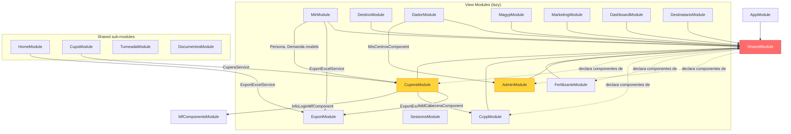
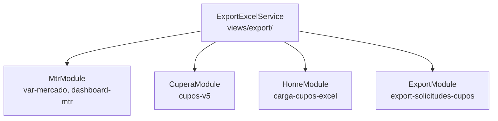
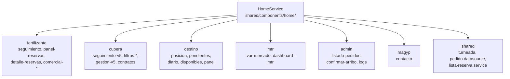
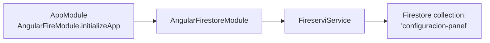

# Dependencias Cruzadas entre Módulos

> **Proyecto:** Muvinapp (app-panel)
> **Última revisión:** 2026-04-16
> **Severidad global:** 🔴 Hay acoplamiento bidireccional SharedModule ↔ view modules

---

## 1. Grafo de dependencias

---

## 2. Acoplamiento bidireccional SharedModule ↔ View Modules

> [!danger] Problema arquitectónico crítico
> `SharedModule` declara componentes que pertenecen a view modules lazy-loaded. Esos mismos view modules importan `SharedModule`. Esto crea **dependencia circular** y anula el lazy loading para esos componentes.

### Componentes de views declarados en SharedModule

| View module de origen | Componentes declarados en SharedModule |
|---|---|
| **views/admin** | `InfoPersonaComponent`, `AddPersonaComponent`, `VincularEntregadorComponent`, `SubirLogoCentroComponent` |
| **views/fertilizante** | `DetalleCuposComponent`, `TitleComponentComponent`, `DetallesReservaComponent`, `DetallesReservaProductosComponent`, `DetallesReservaCuposComponent`, `DetallesReservaAsignarComponent` |
| **views/ccpp** | `AddCabeceraComponent`, `VerCcppComponent`, `VerCabeceraComponent`, `ViewsCcpComponent` |
| **views/cupera** | `MotivoComponent` |

**Impacto:**
- Estos componentes se cargan con el **bundle inicial** (SharedModule), no con su lazy chunk.
- AdminModule tiene 95 rutas pero 4 de sus componentes ya están en memoria antes de cargar `/admin`.
- Imposibilita extraer SharedModule sin refactorización profunda.

---

## 3. Importaciones cross-view (view → view)

| Módulo origen | Importa de | Qué importa | Severidad |
|---|---|---|---|
| **CuperaModule** | `views/export` | `ExportExcelService` | 🟡 |
| **CuperaModule** | `views/ccpp` | `AddCabeceraComponent` | 🟠 |
| **CuperaModule** | `views/mf-components` | `InfoLoginMfComponent` | 🟡 |
| **MtrModule** | `views/export` | `ExportExcelService` | 🟡 |
| **MtrModule** | `views/cupera` | `Persona`, `Demanda` (modelos) | 🟠 |
| **DadorModule** | `views/admin` | `MisCentrosComponent` | 🟠 |
| **AdminModule** | `shared/components/home` | `FlotaIntermediarioComponent`, `PorEvaluarComponent` | 🟡 |

### ExportExcelService — servicio sin hogar

`ExportExcelService` vive en `views/export/` pero es consumido por **4 módulos**:

> [!info] Candidato a extracción
> `ExportExcelService` debería moverse a `shared/services/` o usar `providedIn: 'root'` para eliminar las importaciones cruzadas.

---

## 4. HomeService — servicio hub

`HomeService` es el servicio más consumido del sistema. Está en `shared/components/home/` pero lo usan **7+ módulos**:

---

## 5. CuperaService — leak de módulo

`CuperaService` está proveído en `CuperaModule` (`providers: [CuperaService]`) pero se importa directamente desde componentes shared:

| Componente shared | Importa |
|---|---|
| `shared/components/cupo/cuponera/cuponera.component.ts` | `CuperaService` from `views/cupera/services` |
| `shared/components/cupo/informacion-cupo-v2/informacion-cupo-v2.component.ts` | `CuperaService` from `views/cupera/services` |
| `shared/components/cupo/cupera3/asignacion-c3/asignacion-c3.component.ts` | `CuperaService` + `views/destino` + `views/fertilizante` + `views/ccpp` |

> [!danger] Rompe el encapsulamiento de módulos
> `CuperaService` debería ser `providedIn: 'root'` si lo necesitan componentes fuera de `CuperaModule`, o los componentes de cupo que lo usan deberían moverse a `CuperaModule`.

---

## 6. FertilizantesService — alcance extenso

`FertilizantesService` (en `shared/services/`) es consumido por:

| Módulo | Componentes |
|---|---|
| **fertilizante** | `seguimiento`, `tabla-horario`, `buscar`, `comercial-*` (5+), `editar-fecha-cupo`, `admin-bandas` |
| **export** | `export-solicitudes-cupos` |
| **shared/home** | `seguimiento-reserva`, `pedido-turneada-*` (5), `patentes-chofer`, `asignar-directo-v1` |
| **shared/services** | `lista-reserva.service` |

---

## 7. WebsocketService — consumo limitado

| Componente | Estado | Ubicación |
|---|---|---|
| `FooterSocketComponent` | ✅ Activo | `shared/components/footer-socket/` |
| `SidebarSideComponent` | ✅ Activo | `shared/components/sidebar-side/` |
| `SidenavComponent` | ✅ Activo | `shared/components/sidenav/` |
| `SidebarTopComponent` | ✅ Activo | `shared/components/sidebar-top/` |
| `HeaderSideComponent` | ❌ Comentado | `shared/components/header-side/` |
| `admin/consultas` | ❌ Comentado | `views/admin/consultas/` |
| `ConsultasService` | ❌ Comentado | `shared/services/consultas.service.ts` |

---

## 8. Firebase — alcance mínimo

Solo un servicio (`FireserviService`) accede a Firebase. No se usa Firebase Auth ni Realtime Database.

---

## 9. Módulos importando SharedModule

| Módulo | Importa SharedModule | Importa SharedMaterialModule | Notas |
|---|:---:|:---:|---|
| AdminModule | ✅ (×2) | ❌ | **Importa SharedModule dos veces** |
| CuperaModule | ✅ | ❌ | |
| MtrModule | ✅ | ❌ | |
| FertilizanteModule | ✅ | ❌ | |
| DestinoModule | ✅ | ❌ | |
| DadorModule | ✅ | ❌ | |
| DestinatarioModule | ✅ | ❌ | |
| MagypModule | ✅ | ❌ | |
| CcppModule | ✅ | ❌ | |
| MarketingModule | ✅ | ❌ | |
| DashboardModule | ✅ | ❌ | |
| HomeModule | ✅ | ❌ | |
| CupoModule | ✅ | ❌ | |
| TurneadaModule | ✅ | ❌ | |
| DocumentosModule | ✅ | ❌ | |
| SessionsModule | ❌ | ❌ | Standalone (solo CommonModule) |
| ExportModule | ❌ | ❌ | Solo CommonModule |
| MfComponentsModule | ❌ | ❌ | Solo CommonModule |

> [!info] SharedMaterialModule no se usa
> `SharedMaterialModule` importa 30+ `Mat*Modules` pero no exporta nada y ningún módulo lo importa. Es dead code. Los módulos de Material se importan directamente en `SharedModule` y `AppModule`.

---

## 10. Hallazgos críticos (resumen)

| # | Severidad | Hallazgo | Impacto |
|---|---|---|---|
| 1 | 🔴 | SharedModule ↔ admin/fertilizante/ccpp/cupera bidireccional | Anula lazy loading, impide refactorización |
| 2 | 🔴 | CuperaService importado por shared/cupo sin DI formal | Rompe encapsulamiento de módulo |
| 3 | 🟠 | ExportExcelService usado por 4 módulos sin `providedIn` | Importaciones frágiles cross-módulo |
| 4 | 🟠 | DadorModule usa MisCentrosComponent de admin | Componente compartido en dos lazy chunks |
| 5 | 🟠 | MtrModule depende de modelos de cupera | Acoplamiento entre módulos lazy |
| 6 | 🟡 | AdminModule importa SharedModule dos veces | Redundancia sin efecto funcional |
| 7 | 🟡 | SharedMaterialModule no se usa | Dead code |
| 8 | 🟡 | WebsocketService: 3 de 7 consumidores están comentados | Código muerto parcial |

---

## Referencias

- [[arquitectura-alto-nivel]] — Arquitectura del sistema
- [[functional-classification]] — Clasificación funcional de módulos
- [[depends-matrix]] — Matriz de dependencias
- [[data-files-index]] — Índice de servicios
