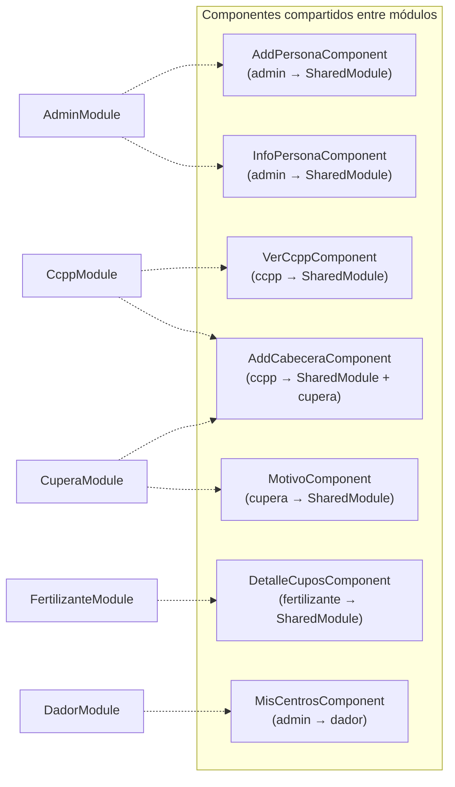

# Matriz de Dependencias entre Módulos

> **Proyecto:** Muvinapp (app-panel)
> **Última revisión:** 2026-04-16
> **Lectura:** Fila = módulo que importa. Columna = módulo del que importa. ● = dependencia directa.

---

## Matriz módulo → módulo

|  | SharedModule | Admin | Cupera | MTR | Fertil. | Destino | CCPP | Export | MfComp | Home | Cupo |
|---|:---:|:---:|:---:|:---:|:---:|:---:|:---:|:---:|:---:|:---:|:---:|
| **SharedModule** | — | ● | ● | | ● | | ● | ● | | | |
| **Admin** | ● | — | | | | | | | | ● | |
| **Cupera** | ● | | — | | | | ● | ● | ● | | |
| **MTR** | ● | | ● | — | | | | ● | | | |
| **Fertilizante** | ● | | | | — | | | | | | |
| **Destino** | ● | | | | | — | | | | | |
| **Dador** | ● | ● | | | | | | | | | |
| **Destinatario** | ● | | | | | | | | | | |
| **MAGyP** | ● | | | | | | | | | | |
| **CCPP** | ● | | | | | | — | | | | |
| **Marketing** | ● | | | | | | | | | | |
| **Dashboard** | ● | | | | | | | | | | |
| **Sessions** | | | | | | | | | | | |
| **Export** | | | | | | | | — | | | |
| **MfComponents** | | | | | | | | | — | | |
| **Home** | ● | | | | | | | ● | | — | |
| **Cupo** | ● | | ● | | | | | | | | — |
| **Turneada** | ● | | | | | | | | | | |
| **Documentos** | ● | | | | | | | | | | |

---

## Leyenda

- **●** = Importación directa (componente, servicio o modelo)
- Fila = módulo que consume
- Columna = módulo del que se importa
- `SharedModule` aparece como columna porque todos lo importan, y como fila porque él importa de views

---

## Servicios compartidos — matriz de consumo

| Servicio | Admin | Cupera | MTR | Fertil. | Destino | MAGyP | Home | Cupo | Turneada | Export |
|---|:---:|:---:|:---:|:---:|:---:|:---:|:---:|:---:|:---:|:---:|
| **HomeService** | ● | ● | ● | ● | ● | ● | ● | | ● | |
| **FertilizantesService** | | | | ● | | | ● | | | ● |
| **CentrosService** | ● | ● | | | ● | | ● | | | |
| **GlobalService** | ● | ● | ● | | ● | | ● | ● | | |
| **AuthService** | ● | ● | | | | | ● | | | |
| **WebsocketService** | | | | | | | | | | |
| **ListaReservaService** | | | | ● | | | ● | | | |
| **ExelService** | ● | | | | | | ● | | | ● |
| **DestinosService** | ● | ● | | | ● | | ● | | | |
| **ProductosService** | ● | ● | | ● | | | ● | ● | | |

> [!info] HomeService es el servicio más acoplado
> Es consumido por 7+ módulos. Contiene CRUD de pedidos, listados por rol, asignación de viajes. Es el candidato principal para descomposición si se refactoriza.

---

## Servicios de módulo — consumo fuera de su módulo

| Servicio | Módulo de origen | Consumidores externos | Problema |
|---|---|---|---|
| `CuperaService` | CuperaModule | shared/cupo (cuponera, informacion-cupo-v2, asignacion-c3) | 🔴 Leak de módulo |
| `ExportExcelService` | ExportModule | MTR, Cupera, Home | 🟠 Sin `providedIn` |
| `CaratulasService` | MtrModule | Solo MTR | ✅ OK |
| `CupoService` | CupoModule | Solo Cupo | ✅ OK |
| `SolicitudesService` | CupoModule | Solo Cupo | ✅ OK |

---

## Dependencias de componentes cross-módulo

---

## Índice de acoplamiento por módulo

| Módulo | Deps entrantes | Deps salientes | Total | Nivel |
|---|:---:|:---:|:---:|---|
| **SharedModule** | 15 | 5 | 20 | 🔴 Muy alto |
| **Admin** | 2 | 2 | 4 | 🟠 Alto |
| **Cupera** | 3 | 4 | 7 | 🔴 Muy alto |
| **MTR** | 0 | 3 | 3 | 🟡 Medio |
| **Export** | 4 | 0 | 4 | 🟠 Alto (pasivo) |
| **CCPP** | 2 | 1 | 3 | 🟡 Medio |
| **Fertilizante** | 1 | 1 | 2 | 🟢 Bajo |
| **Home** | 2 | 2 | 4 | 🟡 Medio |
| **Cupo** | 0 | 2 | 2 | 🟢 Bajo |
| **Destino** | 0 | 1 | 1 | 🟢 Bajo |
| **Dador** | 0 | 2 | 2 | 🟢 Bajo |
| **MAGyP** | 0 | 1 | 1 | 🟢 Bajo |
| **Sessions** | 0 | 0 | 0 | 🟢 Aislado |
| **Marketing** | 0 | 1 | 1 | 🟢 Bajo |
| **Dashboard** | 0 | 1 | 1 | 🟢 Bajo |
| **Destinatario** | 0 | 1 | 1 | 🟢 Bajo |
| **Turneada** | 0 | 1 | 1 | 🟢 Bajo |
| **Documentos** | 0 | 1 | 1 | 🟢 Bajo |

---

## Recomendaciones de desacoplamiento

| Prioridad | Acción | Impacto |
|---|---|---|
| 🔴 P0 | Extraer componentes de views fuera de SharedModule → crear SharedBusinessModule | Elimina acoplamiento bidireccional |
| 🔴 P0 | Mover CuperaService a `providedIn: 'root'` o mover los componentes de cupo que lo usan a CuperaModule | Elimina leak de módulo |
| 🟠 P1 | Mover ExportExcelService a `shared/services/` con `providedIn: 'root'` | Elimina 4 cross-module imports |
| 🟠 P1 | Crear componente shared `MisCentrosComponent` en lugar de reutilizar el de admin | Desacopla DadorModule de AdminModule |
| 🟡 P2 | Descomponer HomeService en servicios de dominio (PedidoService, ViajeService, etc.) | Reduce coupling hub |
| 🟡 P2 | Eliminar SharedMaterialModule (dead code) | Limpieza |

---

## Referencias

- [[arquitectura-alto-nivel]] — Arquitectura del sistema
- [[cross-module-dependencies]] — Análisis detallado de dependencias
- [[data-files-index]] — Índice de servicios
- [[core-vs-custom-dependencies]] — Dependencias npm template vs custom
