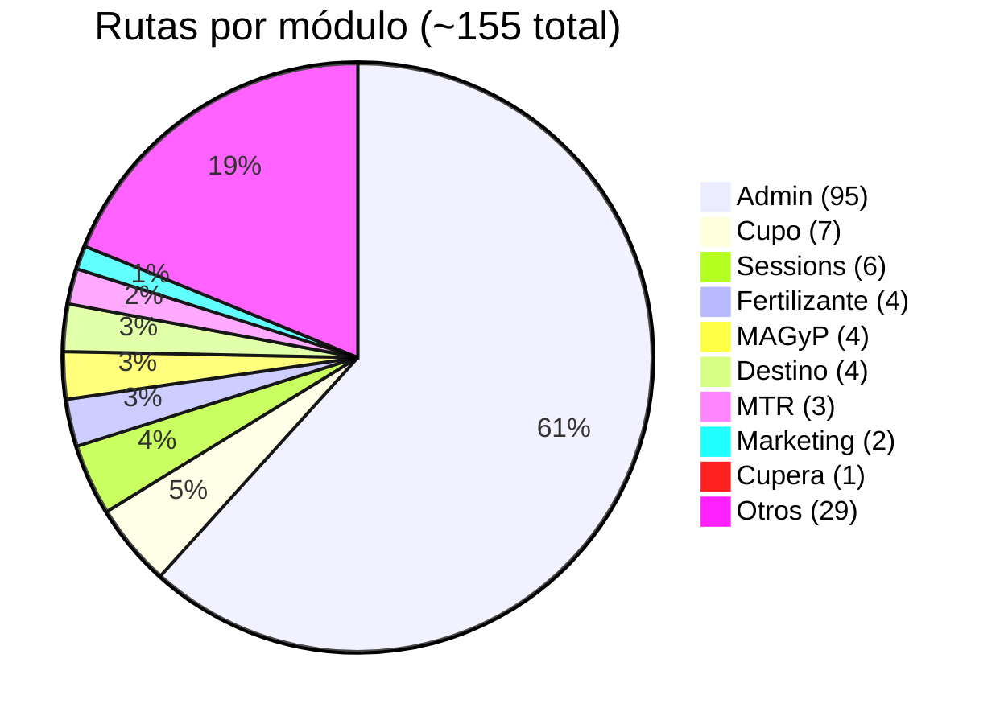
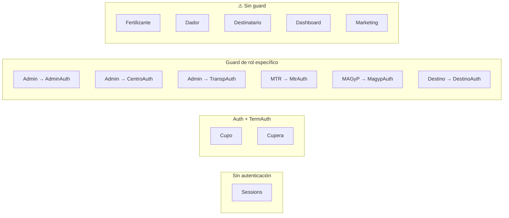

# Índice de Módulos

> **Proyecto:** Muvinapp (app-panel)
> **Última revisión:** 2026-04-16
> **Total módulos feature:** 18 · **Rutas totales:** ~155

---

## Módulos prioritarios

| # | Módulo | Descripción | Componentes | Rutas | Guard | Criticidad | Doc |
|---|---|---|:---:|:---:|---|:---:|---|
| 1 | **Admin** | ABM de entidades, configuración, auditoría, vinculaciones, mapas | 194 | 95 | AdminAuth / CentroAuth / TranspAuth / Auth | 🔴 | [[modulo-admin]] |
| 2 | **Cupera** | Gestión de cupos v5 — asignación, seguimiento, gestión, contratos | 24 | 1 (tabs) | Auth + TermAuth | 🔴 | [[modulo-cupera]] |
| 3 | **Cupo** | Gestión de cupos v1-v3 — cuponera, asignación, panel, solicitudes | 54 | 7 | Auth + TermAuth | 🔴 | [[modulo-cupo]] |
| 4 | **Fertilizante** | Reservas, seguimiento y comercial de fertilizantes | 20 | 4 | ⚠️ Sin guard | 🟡 | [[modulo-fertilizante]] |
| 5 | **Destino** | Panel destino, turnos, plantas, posición | 24 | 4 | DestinoAuth | 🟡 | [[modulo-destino]] |
| 6 | **MAGyP** | Gestión y administración MAGyP — cadenas, autoridades, contacto | 14 | 4 | MagypAuth | 🟡 | [[modulo-magyp]] |

---

## Módulos secundarios

| # | Módulo | Descripción | Componentes | Rutas | Guard | Doc |
|---|---|---|:---:|:---:|---|---|
| 7 | MTR | Carátulas MTR y variables de mercado | 4 | 3 | MtrAuth | 🚧 |
| 8 | Dador | Portal dador — solo MisCentros (de admin) | 1 | 1 | — | 🚧 |
| 9 | Destinatario | Panel destinatario | 1 | 1 | — | 🚧 |
| 10 | Dashboard | Dashboard principal | 1 | 1 | — | 🚧 |
| 11 | Sessions | Login, signup, forgot-password, lockscreen | 6 | 6 | — | 🚧 |
| 12 | Marketing | Configuración y notificaciones manuales | 4 | 2 | — | 🚧 |
| 13 | Reports | Librería de servicios de reportes (sin NgModule) | 0 | — | — | 🚧 |
| 14 | Export | 💀 Módulo vacío — todo comentado | 0 | 0 | — | 🚧 |

---

## Módulos compartidos (en `shared/`)

| # | Módulo | Ubicación | Descripción | Componentes |
|---|---|---|---|:---:|
| 15 | Home | `shared/components/home/` | Pedidos, turneada, seguimiento, asignación | ~30 |
| 16 | Turneada | `shared/components/turneada/` | Gestión de turneadas | ~10 |
| 17 | Documentos | `shared/components/documentos/` | Gestión documental | ~5 |
| 18 | Combustible | `shared/components/combustible/` | Gestión de combustible | ~5 |

---

## Módulos excluidos de documentación detallada

| Módulo | Razón |
|---|---|
| Others | Módulo genérico sin funcionalidad propia relevante |
| Política de Privacidad | Página estática legal |
| Términos y Condiciones | Página estática legal |
| MfComponents | Módulo micro-frontend auxiliar |

---

## Distribución de rutas por módulo

---

## Arquitectura de guards por módulo

> [!warning] Módulos sin guards
> `FertilizanteModule`, `DadorModule`, `DestinatarioModule`, `DashboardModule` y `MarketingModule` no tienen guards en sus rutas. Verificar si es intencional o un gap de seguridad.

---

## Servicios compartidos — distribución

| Servicio | Ubicación | Módulos consumidores |
|---|---|---|
| `HomeService` | `shared/components/home/` | Admin, Cupera, Fertilizante, Destino, MAGyP, MTR, Home |
| `CentrosService` | `shared/services/` | Admin, Cupera, Destino, Home |
| `FertilizantesService` | `shared/services/` | Fertilizante, Export, Home |
| `MagypService` | `shared/services/` | MAGyP |
| `DestinosService` | `shared/services/` | Admin, Cupera, Destino, Home |
| `ProductosService` | `shared/services/` | Admin, Cupera, Fertilizante, Home, Cupo |
| `CupoService` | `shared/components/cupo/` | Cupo, Admin |
| `CuperaService` | `views/cupera/` | Cupera, Cupo (shared) ⚠️ |
| `ExportExcelService` | `views/export/` | MTR, Cupera, Home ⚠️ |

---

## Referencias

- [[arquitectura-alto-nivel]] — Cómo se integran los módulos
- [[cross-module-dependencies]] — Dependencias entre módulos
- [[functional-classification]] — Clasificación por tipo funcional
- [[depends-matrix]] — Matriz de acoplamiento
