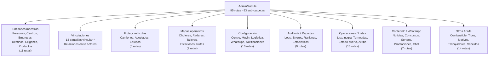

# Módulo: Admin

> **Ruta:** `src/app/views/admin/`
> **Criticidad:** 🔴 Alta
> **Estado:** Activo — módulo más grande del sistema
> **Componentes:** 194 archivos · ~175 declarados · 97 entryComponents
> **Rutas:** 95 (todas flat, sin nesting)
> **Servicios locales:** 0 — depende 100% de `shared/services/`

---

## Propósito

Módulo monolítico que concentra la gestión administrativa del sistema: ABM de todas las entidades maestras (personas, centros, empresas, destinos, orígenes, productos), vinculaciones entre actores de la cadena logística, configuración de centros, mapas operativos, auditoría, reportes, gestión de WhatsApp y contenido (noticias, sorteos, concursos, promociones). Es el módulo más grande del proyecto con 93 sub-carpetas.

---

## Funcionalidades que expone

### Entidades maestras (ABM)

| # | Funcionalidad | Ruta | Descripción |
|---|---|---|---|
| 1.1 | Usuarios | `users` | ABM de usuarios del panel |
| 1.2 | Roles y permisos | `roles`, `roles-permisos` | Gestión de roles y permisos |
| 1.3 | Personas | `personas` | ABM de personas físicas/jurídicas |
| 1.4 | Centros | `centros` | ABM de centros de operación |
| 1.5 | Empresas | `empresas` | ABM de empresas |
| 1.6 | Orígenes | `origenes` | ABM de orígenes de carga |
| 1.7 | Destinos | `destinos` | ABM de destinos de descarga |
| 1.8 | Productos | `productos` | ABM de productos (granos/fertilizantes) |
| 1.9 | Playas intermedias | `playas-intermedias` | ABM de playas de transferencia |
| 1.10 | Localidades | `localidad` | ABM de localidades |
| 1.11 | País / Provincia | `pais`, `provincia` | ABM geográfico |

### Vinculaciones (13 pantallas)

| # | Funcionalidad | Ruta | Descripción |
|---|---|---|---|
| 2.1 | Vincular centro-cliente | `vincular-centro-cliente` | Relaciona centros con clientes |
| 2.2 | Vincular centro-corredor | `vincular-centro-corredor` | Relaciona centros con corredores |
| 2.3 | Vincular centro-operador | `vincular-centro-operador` | Relaciona centros con operadores |
| 2.4 | Vincular centro-transporte | `vincular-centro-transporte` | Relaciona centros con transportistas |
| 2.5 | Vincular centro-destinatario | `vincular-centro-destinatario` | Relaciona centros con destinatarios |
| 2.6 | Vincular centro-entregador | `vincular-centro-entregador` | Relaciona centros con entregadores |
| 2.7 | Vincular centro-empresa | `vincular-centro-empresa` | Relaciona centros con empresas |
| 2.8 | Vincular centro-intermediario | `vincular-centro-intermediario` | Relaciona centros con intermediarios |
| 2.9 | Vincular transporte-chofer | `vincular-transporte-chofer` | Relaciona transportistas con choferes |
| 2.10 | Vincular zona-chofer | `vincular-zona-chofer` | Asigna zonas a choferes |
| 2.11 | Bajada masiva | `bajada-masiva` | Operación masiva sobre vinculaciones |
| 2.12 | Nuevos proveedores | `nuevos-proveedores` | Gestión de proveedores nuevos |
| 2.13 | Flota intermediario | `flota-intermediario` | 📦 Componente de shared/home |

### Flota y vehículos

| # | Funcionalidad | Ruta | Descripción |
|---|---|---|---|
| 3.1 | Camiones | `camiones` | ABM de camiones |
| 3.2 | Acoplados | `acoplados` | ABM de acoplados |
| 3.3 | Equipos | `equipos` | ABM de equipos (camión+acoplado) |
| 3.4 | Búsqueda de flota | `busqueda-flota` | Buscador de flota |
| 3.5 | Gestionar búsqueda | `gestionarBusqueda/:id` | Detalle de búsqueda de flota |
| 3.6 | Hoja de ruta | `hoja-ruta` | Hoja de ruta de vehículos |

### Mapas operativos

| # | Funcionalidad | Ruta | Descripción |
|---|---|---|---|
| 4.1 | Mapa chofer libre | `mapa-chofer-libre` | Ubicación de choferes libres |
| 4.2 | Mapa radares | `mapa-radares` | Mapa con radares |
| 4.3 | Mapa talleres | `mapa-talleres` | Ubicación de talleres |
| 4.4 | Mapa rutas | `mapa-ruta` | Rutas de transporte |
| 4.5 | Mapa estaciones | `mapa-estaciones` | Estaciones de servicio |
| 4.6 | Mapa oficinas | `mapa-oficina` | Oficinas |
| 4.7 | Zona destino | `zona-destino` | Zonas de destino en mapa |
| 4.8 | Zona choferes libres | `zona-choferes-libres` | Zonas de choferes |
| 4.9 | Zona centro | `zona-centro` | Zona del centro |

### Configuración

| # | Funcionalidad | Ruta | Descripción |
|---|---|---|---|
| 5.1 | Configurar centro | `configurar-centro` | Config general del centro |
| 5.2 | Configurar Muvin | `configurar-muvin` | Config general de la plataforma |
| 5.3 | Config tipo turneado | `configuracion-tipo-turneado` | Tipos de turneada |
| 5.4 | Config usuario WhatsApp | `configuracion-usuario-whatsapp` | WhatsApp por usuario |
| 5.5 | Config logística | `configuracion-logistica` | Parámetros logísticos |
| 5.6 | Config notificaciones | `configuracion-notificaciones` | Notificaciones del centro |
| 5.7 | Config stop | `configuracion-stop` | Config de stops/paradas |
| 5.8 | Config productos-centro | `configuracion-productos-centro` | Productos por centro |
| 5.9 | Config dadores | `configuracion-dadores` | Config de dadores del centro |
| 5.10 | Config línea WhatsApp | `configuracion-linea-whatsapp` | Líneas WhatsApp |

### Auditoría y reportes

| # | Funcionalidad | Ruta | Descripción |
|---|---|---|---|
| 6.1 | Auditoría | `auditoria` | Log de auditoría general |
| 6.2 | Auditoría interna | `auditoria-interna` | Auditoría interna del sistema |
| 6.3 | Error log | `errorlog` | Log de errores |
| 6.4 | Error interno | `error-interno` | Errores internos |
| 6.5 | Mostrar logs | `mostrar-logs` | Visor de logs |
| 6.6 | Estadísticas | `estadistica` | Dashboard de estadísticas |
| 6.7 | Reportes centro | `reportes/centro` | Reportes por centro |
| 6.8 | Rankings | `rankings` | Rankings de actores |
| 6.9 | Reporte turneadas | `reporte-turneadas` | Reporte de turneadas |

### Operaciones y listas

| # | Funcionalidad | Ruta | Descripción |
|---|---|---|---|
| 7.1 | Lista negra | `listanegra` | Gestión de lista negra |
| 7.2 | Viajes rechazados | `lista-viajes-rechazados` | Listado de viajes rechazados |
| 7.3 | Confirmar arribo | `confirmar-arribo` | Confirmación de arribo de camiones |
| 7.4 | Lista turneada | `lista-turneada` | Listado de turneadas |
| 7.5 | Lista choferes-estados | `lista-choferes-estados` | Estados de choferes |
| 7.6 | Choferes uninstall | `choferes-unistall` | Choferes que desinstalaron app |
| 7.7 | Chofer perdido | `chofer-perdido` | Seguimiento de choferes perdidos |
| 7.8 | Estado puerto | `estado-puerto` | Estado del puerto/planta |
| 7.9 | Situación puerto | `situacionpuerto` | Situación actual del puerto |
| 7.10 | Gestionar motivos | `gestionar-motivos` | ABM de motivos de rechazo |

### Contenido y comunicación

| # | Funcionalidad | Ruta | Descripción |
|---|---|---|---|
| 8.1 | Noticias | `noticia` | Gestión de noticias |
| 8.2 | Concursos | `concurso` | Gestión de concursos |
| 8.3 | Sorteos | `sorteo` | Gestión de sorteos |
| 8.4 | Promociones | `promociones` | Gestión de promociones |
| 8.5 | WhatsApp propios | `whatsapp-propios` | Mensajes WhatsApp del centro |
| 8.6 | WhatsApp clientes | `whatsapp-clientes` | Mensajes WhatsApp a clientes |
| 8.7 | Parámetro chat | `parametro-chat` | Config del chat |

### Otros

| # | Funcionalidad | Ruta | Descripción |
|---|---|---|---|
| 9.1 | Inteligencia | `inteligencia` | Módulo de inteligencia |
| 9.2 | Combustible | `combustible` | Gestión de combustible |
| 9.3 | Tipo destino | `tipo-destino` | ABM tipos de destino |
| 9.4 | Desvío motivo | `desvio-motivo` | ABM motivos de desvío |
| 9.5 | Motivo lista negra | `motivo-lista-negra` | ABM motivos de lista negra |
| 9.6 | Razón rechazo | `razon-rechazo` | ABM razones de rechazo |
| 9.7 | Manual | `manual` | Manual de usuario |
| 9.8 | Documento | `documento` | Gestión de documentos |
| 9.9 | Estándar | `estandar` | Configuración estándar |
| 9.10 | Boca | `boca` | ABM de bocas (puntos de carga/descarga) |
| 9.11 | Trabajadores | `trabajadores` | ABM de trabajadores |
| 9.12 | Vencidos | `vencidos` | Listado de vencimientos |
| 9.13 | Consulta | `consulta/:id_chofer` | Consulta individual de chofer |
| 9.14 | Por evaluar | `por-evaluar` | 📦 Componente de shared/home |

---

## Dependencias

- **Depende de:** [[modulo-cupo|SharedModule]] (×2 — duplicado), `shared/services/*` (~20+ servicios)
- **Es usado por:** [[modulo-dador]] (importa `MisCentrosComponent`)
- **Componentes en SharedModule:** `InfoPersonaComponent`, `AddPersonaComponent`, `VincularEntregadorComponent`, `SubirLogoCentroComponent` → declarados en SharedModule, no en AdminModule

---

## Diagrama de áreas funcionales

---

## Guards — carga lazy multi-rol

AdminModule se carga **20 veces** bajo diferentes rutas padre en `app.routing.ts`:

| Ruta padre | Guard |
|---|---|
| `/admin` | `AdminAuthGuard` (roles 1, 12) |
| `/centro` | `CentroAuthGuard` (roles 3, 11, 16) |
| `/transportista` | `TranspAuthGuard` + `TermAuthGuard` (rol 4) |
| `/vincular-centro-*`, `/bajada-masiva`, `/nuevos-proveedores` | `AuthGuard` + `TermAuthGuard` |
| `/corredor`, `/entregador` | `AuthGuard` + `TermAuthGuard` |
| `/chofer-libre`, `/chofer-perdido` | `AuthGuard` + `TermAuthGuard` |

> [!warning] Mismo módulo, 20 loadChildren
> El `AdminModule` se referencia como `loadChildren` 20 veces en `app.routing.ts`. Angular lazy-loading carga el bundle una sola vez, pero la repetición en routing es un code smell significativo. Lo correcto sería usar un único `loadChildren` con rutas hijas diferenciadas por guard.

---

## Servicios backend consumidos

Admin no tiene servicios propios. Consume servicios de `shared/services/`:

| Servicio | Propósito |
|---|---|
| `CentrosService` | CRUD de centros, vinculaciones, configuraciones |
| `PersonasService` | CRUD de personas |
| `AuthService` | Gestión de sesión y menú |
| `HomeService` | Pedidos, listados, asignación |
| `DestinosService` | CRUD de destinos |
| `ProductosService` | CRUD de productos |
| `GlobalService` | URL base API |
| `ExelService` | Exportación Excel |
| `UserService` | Datos de usuario |
| `SendsmsService` | Envío de SMS/WhatsApp |
| `AppLoaderService` | Loading overlay |
| `AppConfirmService` | Diálogos de confirmación |
| `AppErrorService` | Diálogos de error |
| `AppAlertService` | Alertas |
| `AppAtencionService` | Diálogos de atención |

---

## Riesgos y deuda técnica detectados

| # | Severidad | Hallazgo |
|---|---|---|
| 1 | 🔴 | **Módulo monolítico**: 194 componentes y 95 rutas en un solo módulo. Debería dividirse en sub-módulos (masters, vinculaciones, mapas, config, audit) |
| 2 | 🔴 | **SharedModule importado 2 veces** (`imports: [SharedModule, SharedModule]`) — redundante |
| 3 | 🔴 | **20 loadChildren** al mismo módulo en app.routing.ts — anti-patrón de routing |
| 4 | 🟠 | **0 servicios locales** — toda la lógica de negocio en shared/services, sin encapsulamiento |
| 5 | 🟠 | **4 componentes movidos a SharedModule** (InfoPersona, AddPersona, VincularEntregador, SubirLogoCentro) — acoplamiento bidireccional |
| 6 | 🟡 | **97 entryComponents** — la mayoría son modals que se abren con MatDialog. En Angular 9+ no serían necesarios |
| 7 | 🟡 | **Rutas todas flat** sin agrupación ni nesting — dificulta lazy-load de sub-áreas |

---

## Archivos fuente relevantes

- `src/app/views/admin/admin.module.ts` — Definición del módulo
- `src/app/views/admin/admin-routing.module.ts` — 95 rutas
- `src/app/app.routing.ts` — 20 loadChildren hacia AdminModule
- `src/app/shared/services/centros.service.ts` — Servicio principal (~120 endpoints)
- `src/app/shared/services/personas.service.ts` — CRUD personas

---

## Referencias

- [[_indice-modulos]] — Índice general
- [[cross-module-dependencies]] — Dependencias cruzadas
- [[modulo-cupo]] — Cupo (comparte componentes con admin)
- [[modulo-dador]] — Dador (importa MisCentros de admin)
