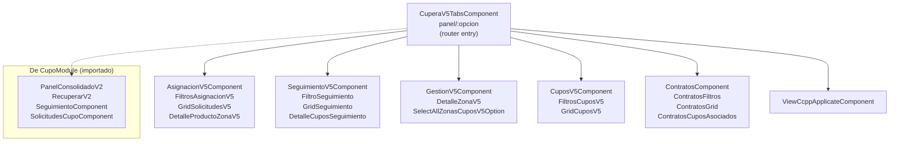

# Módulo: Cupera (Cupos v5)

> **Ruta:** `src/app/views/cupera/`
> **Criticidad:** 🔴 Alta
> **Estado:** Activo — evolución v5 del sistema de cupos
> **Componentes:** 24 · **Rutas:** 1 (navegación por tabs internas)
> **Servicios locales:** 1 (`CuperaService` — 857 líneas)
> **Guard:** `AuthGuard` + `TermAuthGuard`

---

## Propósito

Módulo de gestión de cupos versión 5. Implementa la asignación, seguimiento, gestión (aprobación/rechazo/anulación) y contratos de cupos de descarga. Es la evolución del [[modulo-cupo|módulo Cupo]] (v1-v3), con una arquitectura de tab-navigation dentro de un único componente raíz (`CuperaV5TabsComponent`). Importa `CupoModule` como dependencia directa para reutilizar componentes de versiones anteriores.

---

## Funcionalidades que expone

| # | Funcionalidad | Tab/Sección | Descripción |
|---|---|---|---|
| 1.1 | Asignación v5 | `asignacion-v5` | Asignación de cupos por zona y producto con filtros avanzados |
| 1.2 | Seguimiento v5 | `seguimiento-v5` | Seguimiento de cupos asignados con filtros y detalle |
| 1.3 | Gestión v5 | `gestion-v5` | Aprobación, rechazo, anulación de solicitudes de cupos |
| 1.4 | Cupos v5 | `cupos-v5` | Listado y grilla de cupos con exportación Excel |
| 1.5 | Contratos | `contratos` | Gestión de contratos de cupos con cupos asociados |
| 1.6 | Carta de Porte | `view-ccpp-applicate` | Visualización de CCPP aplicadas a cupos |

---

## Dependencias

- **Depende de:** [[modulo-cupo]] (NgModule import), `SharedModule`, `views/export/ExportExcelService`, `views/mf-components/InfoLoginMfComponent`
- **Es usado por:** `SharedModule` (declara `MotivoComponent` de cupera)
- **Consume servicios backend:** `CuperaService` (local) + servicios de `shared/services/`

---

## Diagrama de componentes internos

---

## Ruta y navegación

| Ruta | Componente | Guard |
|---|---|---|
| `cupera/panel/:opcion` | `CuperaV5TabsComponent` | `AuthGuard`, `TermAuthGuard` |

La navegación interna se maneja por parámetro `:opcion`, que determina qué tab se muestra. Esto permite que todo el módulo tenga una única ruta con múltiples vistas.

---

## Servicios backend consumidos

### CuperaService (local — 857 líneas, ~40+ métodos HTTP)

| Verbo | Ruta (relativa a `URL_SERVICIOS`) | Propósito |
|---|---|---|
| GET | `/v3/cupos/centro/:id/zona` | Cupos por zona del centro |
| GET | `/v3/cupos/centro/:id/asignacion` | Cupos disponibles para asignación |
| POST | `/v3/cupos/asignar` | Asignar cupo a solicitud |
| PUT | `/v3/cupos/:id/aprobar` | Aprobar solicitud de cupo |
| PUT | `/v3/cupos/:id/rechazar` | Rechazar solicitud de cupo |
| PUT | `/v3/cupos/:id/anular` | Anular cupo asignado |
| GET | `/v3/cupos/centro/:id/seguimiento` | Seguimiento de cupos |
| POST | `/v3/cupos/recuperar` | Recuperar cupo |
| GET | `/v3/cupos/centro/:id/contratos` | Listado de contratos |
| GET | `/v3/ccpp/aplicadas` | CCPP aplicadas a cupos |

> [!info] API v3 (nueva)
> CuperaService usa `URL_SERVICIOS` (API nueva) en lugar de `apiHost` (API principal). Los endpoints son v3, indicando una migración parcial del backend.

### Servicios shared consumidos

| Servicio | Uso en Cupera |
|---|---|
| `HomeService` | Datos de centros, productos, zonas |
| `AppLoaderService` | Overlay de carga |
| `AppConfirmService` | Confirmaciones |
| `AppErrorService` | Errores |
| `AppAlertService` | Alertas |
| `ExportExcelService` ⚠️ | Exportación Excel (cross-module de views/export) |

---

## Modelos de datos

Cupera tiene 13 modelos propios en `views/cupera/models/`:

| Modelo | Propósito |
|---|---|
| `filtro.ts` | Modelo de filtros para grillas |
| `estados.ts` | Enum/constantes de estados de cupo |
| `estado-anulacion.ts` | Estados de anulación |
| `config-centro.ts` | Configuración de centro para cupera |
| `centro-sin-email.ts` | Centros sin email configurado |
| `dia-semana.ts` | Días de la semana |
| `item-tabs.ts` | Items de tabs |
| `items.ts` | Items genéricos |
| `options-multi.ts` | Opciones de multi-select |
| `producto-centro.ts` | Productos por centro |
| `response-permisos.ts` | Respuesta de permisos |
| `screen.ts` | Configuración de pantalla |

---

## Utilidades (5 archivos)

| Archivo | Propósito |
|---|---|
| `arrays-iguales.ts` | Comparación profunda de arrays |
| `dia-semana.ts` | Utilidades de días |
| `validate-services.ts` | Validación de servicios antes de operar |
| `work-tables.ts` | Utilidades para tablas de trabajo |

---

## Material (módulo propio)

`CuperaMaterialModule` (`cupera-material/`) importa los módulos de Angular Material necesarios para Cupera. A diferencia de otros módulos que dependen del conjunto completo vía SharedModule.

---

## Riesgos y deuda técnica detectados

| # | Severidad | Hallazgo |
|---|---|---|
| 1 | 🔴 | **CuperaService importado fuera del módulo**: componentes en `shared/components/cupo/` importan `CuperaService` directamente, violando el encapsulamiento del módulo. Ver [[cross-module-dependencies]] |
| 2 | 🟠 | **ExportExcelService cross-module**: importa servicio de `views/export/` sin DI formal |
| 3 | 🟠 | **MotivoComponent en SharedModule**: `MotivoComponent` (de cupera) está declarado en SharedModule en lugar de en CuperaModule |
| 4 | 🟡 | **Dependencia de CupoModule**: importa el módulo Cupo v1-v3 completo para reutilizar 4 componentes — podría extraerse a un módulo shared más pequeño |
| 5 | 🟡 | **Pipes declarados en módulo**: `SmartNumberPipe` e `IntegerOnlyPipe` se declaran en CuperaModule pero se definen en shared |

---

## Archivos fuente relevantes

- `src/app/views/cupera/cupera.module.ts` — Definición del módulo
- `src/app/views/cupera/cupera-routing.module.ts` — Routing (1 ruta)
- `src/app/views/cupera/services/cupera.service.ts` — Servicio principal (857 líneas)
- `src/app/views/cupera/models/` — 13 modelos
- `src/app/views/cupera/utils/` — 5 utilidades
- `src/app/views/cupera/components/cupera-v5-tabs/` — Componente raíz

---

## Referencias

- [[_indice-modulos]] — Índice general
- [[modulo-cupo]] — Cupo v1-v3 (módulo padre)
- [[cross-module-dependencies]] — CuperaService leak
- [[core-vs-custom-dependencies]] — Kendo, Handsontable
