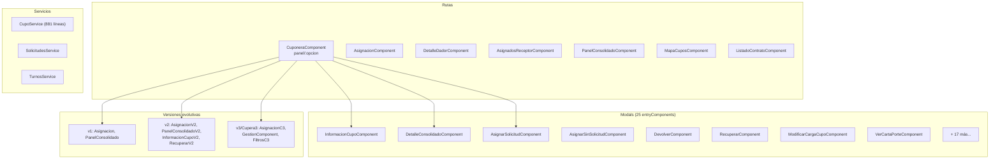

# Módulo: Cupo (v1–v3)

> **Ruta:** `src/app/shared/components/cupo/`
> **Criticidad:** 🔴 Alta
> **Estado:** Activo — versiones legacy v1/v2/v3 coexisten
> **Componentes:** 54 archivos · 40 declarados · 25 entryComponents
> **Rutas:** 7
> **Servicios locales:** 3 (`CupoService`, `SolicitudesService`, `TurnosService`)
> **Guard:** `AuthGuard` + `TermAuthGuard`

---

## Propósito

Módulo de gestión de cupos de descarga versiones 1 a 3. Concentra la cuponera (panel principal), asignación de cupos, panel consolidado, mapas de cupos, solicitudes y listado de contratos. Es el módulo fundacional del circuito de cupos y es importado por [[modulo-cupera|CuperaModule (v5)]] como dependencia directa. Exporta 4 componentes clave para reutilización.

> [!info] Ubicación atípica
> CupoModule vive en `shared/components/cupo/` en lugar de `views/cupo/`. A pesar de estar en `shared/`, tiene routing propio, servicios propios y 54 componentes — es un feature module completo.

---

## Funcionalidades que expone

| # | Funcionalidad | Ruta | Descripción |
|---|---|---|---|
| 1.1 | Cuponera | `panel/:opcion` | Panel principal de cupos con tabs (asignación, solicitudes, seguimiento, consolidado) |
| 1.2 | Asignación | `asignacion` | Asignación de cupos a solicitudes |
| 1.3 | Detalle dador | `detalle-dador` | Vista detallada por dador de carga |
| 1.4 | Asignados receptor | `asignados-receptor` | Cupos asignados por receptor |
| 1.5 | Panel consolidado | `panel-consolidado` | Vista consolidada de cupos |
| 1.6 | Mapa cupos | `mapa-cupos` | Visualización geográfica de cupos |
| 1.7 | Listado contrato | `listado-contrato` | Contratos/fijaciones |

---

## Dependencias

- **Depende de:** `SharedModule`, `shared/services/*`
- **Es importado por:** [[modulo-cupera]] (NgModule dependency)
- **Exporta componentes:** `PanelConsolidadoV2Component`, `RecuperarV2Component`, `SeguimientoComponent`, `SolicitudesCupoComponent`

---

## Diagrama de componentes internos

---

## Servicios backend consumidos

### CupoService (local — 881 líneas, ~40+ métodos)

| Verbo | Ruta (relativa a `apiHost`) | Propósito |
|---|---|---|
| GET | `/cupo/centro/:id` | Cupos por centro |
| GET | `/cupo/centro/:id/disponibles` | Cupos disponibles |
| POST | `/cupo/asignar` | Asignar cupo |
| PUT | `/cupo/:id/devolver` | Devolver cupo |
| PUT | `/cupo/:id/recuperar` | Recuperar cupo |
| GET | `/cupo/centro/:id/solicitudes` | Solicitudes de cupos |
| POST | `/cupo/solicitud` | Crear solicitud |
| PUT | `/cupo/solicitud/:id/aprobar` | Aprobar solicitud |
| PUT | `/cupo/solicitud/:id/rechazar` | Rechazar solicitud |
| GET | `/cupo/centro/:id/consolidado` | Panel consolidado |
| GET | `/cupo/centro/:id/seguimiento` | Seguimiento |
| GET | `/cupo/centro/:id/contratos` | Contratos |
| POST | `/cupo/notificar` | Notificación de cupo |

> [!info] API v1 (principal)
> CupoService usa `apiHost` (API principal), a diferencia de CuperaService que usa `URL_SERVICIOS` (API nueva v3).

### TurnosService (local — 123 líneas)

| Verbo | Ruta | Propósito |
|---|---|---|
| GET | `/turno/centro/:id` | Turnos por centro |
| GET | `/turno/centro/:id/fecha/:fecha` | Turnos por fecha |

### SolicitudesService (local — 16 líneas)

No HTTP — solo `BehaviorSubject` para comunicar cambios de estado de solicitudes entre componentes.

---

## Proliferación de versiones

| Componente | v1 | v2 | v3/C3 |
|---|:---:|:---:|:---:|
| Asignación | `AsignacionComponent` | `AsignacionV2Component` | `AsignacionC3Component` |
| Panel consolidado | `PanelConsolidadoComponent` | `PanelConsolidadoV2Component` | — |
| Información cupo | `InformacionCupoComponent` | `InformacionCupoV2Component` | — |
| Recuperar | `RecuperarComponent` | `RecuperarV2Component` | — |

> [!warning] 3 generaciones sin limpieza
> Existen componentes v1, v2 y v3 sin que se hayan eliminado las versiones anteriores. Los v2 son los exportados y reutilizados por CuperaModule. Los v1 probablemente sean dead code.

---

## 38 sub-carpetas

Organizadas por funcionalidad:

| Categoría | Sub-carpetas |
|---|---|
| **Core** | `cuponera/`, `asignacion/`, `panel-consolidado/`, `mapa-cupos/`, `solicitudes-cupo/`, `seguimiento/`, `listado-contrato/` |
| **v2** | `asignacion-v2/`, `panel-consolidado-v2/`, `informacion-cupo-v2/`, `recuperar-v2/` |
| **v3 (Cupera3)** | `cupera3/` (asignacion-c3, filtros, detalle-producto-zona, detalle-zona, grid-solicitudes, gestion, select-all-option) |
| **Modals** | `add-cupos-disponibles/`, `asignar-solicitud/`, `asignar-sin-solicitud/`, `devolver/`, `recuperar/`, `informacion-cupo/`, `informacion-demanda/`, `cambiar-demanda/`, `modificar-carga-cupo/`, `ver-carta-porte/`, `rechazar-solicitud/`, `rechazar-cupos/`, `edit-cupo/`, `usuario-sin-email/`, `motivo-rechazo/` |
| **CCPP** | `aplicar-cabecera/`, `editar-cabecera/`, `info-aplicar-cabecera/`, `add-alfanumerico/`, `nueva-cabecera/`, `confeccion-ccpp/` |
| **Otros** | `add-cupos-solicitados/`, `add-cupos-solicitados-v2/`, `add-pedido-rapido/`, `detalle-consolidado/`, `detalle-dador/`, `asignados-receptor/`, `turnos/`, `muvin-datepicker/`, `modals/`, `services/` |

---

## Riesgos y deuda técnica detectados

| # | Severidad | Hallazgo |
|---|---|---|
| 1 | 🔴 | **Ubicación incorrecta**: Feature module completo (54 componentes, routing, servicios) viviendo en `shared/components/` en vez de `views/` |
| 2 | 🔴 | **Importa CuperaService de otro módulo**: `cuponera.component.ts` y `asignacion-c3.component.ts` importan `CuperaService` de `views/cupera/` — leak de encapsulamiento inverso |
| 3 | 🟠 | **3 generaciones de componentes** (v1, v2, v3/C3) sin limpieza. Los v1 probablemente sean dead code |
| 4 | 🟠 | **25 entryComponents** — todos modals de MatDialog |
| 5 | 🟡 | **Typo en pipe**: `OrderrByPipe` (doble r) declarado en CupoModule |
| 6 | 🟡 | **CupoService (881 líneas)** — servicio muy largo, candidato a descomposición |

---

## Archivos fuente relevantes

- `src/app/shared/components/cupo/cupo.module.ts` — Módulo
- `src/app/shared/components/cupo/cupo-routing.module.ts` — 7 rutas
- `src/app/shared/components/cupo/services/cupo.service.ts` — 881 líneas
- `src/app/shared/components/cupo/services/turnos.service.ts` — 123 líneas
- `src/app/shared/components/cupo/cuponera/cuponera.component.ts` — Componente raíz

---

## Referencias

- [[_indice-modulos]] — Índice general
- [[modulo-cupera]] — Cupera v5 (importa este módulo)
- [[cross-module-dependencies]] — CuperaService leak bidireccional
