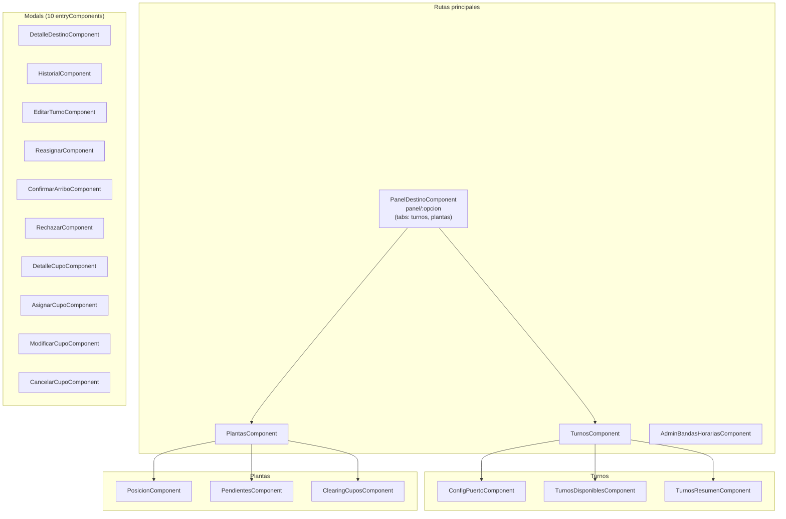
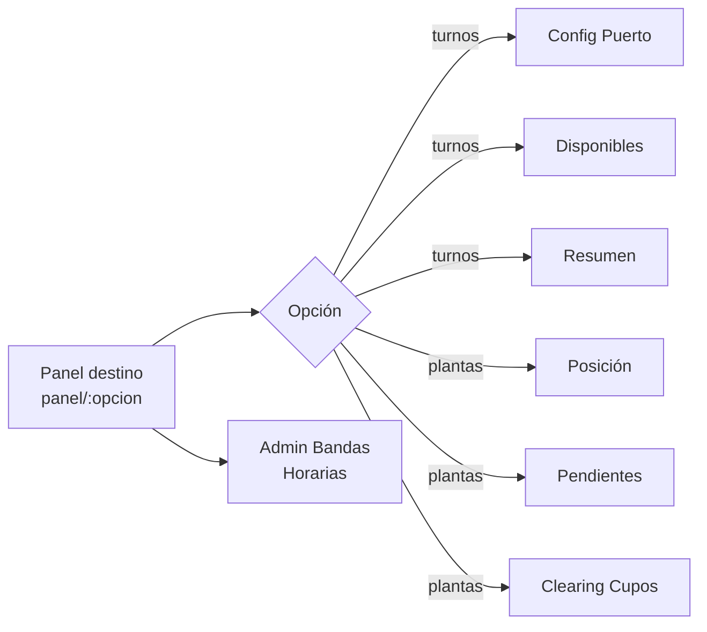

# Módulo: Destino

> **Ruta:** `src/app/views/destino/`
> **Criticidad:** 🟡 Media
> **Estado:** Activo
> **Componentes:** 24 · 10 entryComponents
> **Rutas:** 4 (todas protegidas)
> **Servicios locales:** 0 — usa `DestinosService` de shared
> **Guard:** `DestinoAuthGuard` (rol 5) · 2 rutas con `DestinosResolverService`

---

## Propósito

Módulo para la gestión de destinos de descarga (puertos, plantas, terminales). Cubre el panel operativo del destino, gestión de turnos (configuración de puerto, disponibles, resumen), posición de plantas, cupos pendientes y clearing de cupos. Incluye administración de bandas horarias propias. Orientado a operadores de planta/puerto.

---

## Funcionalidades que expone

| # | Funcionalidad | Ruta | Descripción |
|---|---|---|---|
| 1.1 | Panel destino | `panel/:opcion` | Dashboard operativo del destino con tabs |
| 1.2 | Turnos | `turnos/config-puerto`, `turnos/disponibles`, `turnos/resumen` | Config de puerto, turnos disponibles y resumen |
| 1.3 | Plantas | `plantas/posicion`, `plantas/pendientes`, `plantas/clearing-cupos` | Posición de plantas, pendientes y clearing de cupos |
| 1.4 | Admin bandas | `admin-bandas-horarias` | Administración de bandas horarias del destino |

---

## Dependencias

- **Depende de:** `SharedModule`, `DestinosService` (shared), `CentrosService` (shared), `HomeService` (shared)
- **Es usado por:** Ningún otro módulo lo importa directamente
- **Servicios cross:** `AppLoaderService`, `AppConfirmService`, `AppErrorService`, `AppAlertService`

---

## Diagrama de componentes internos

---

## Guards y resolvers

| Ruta | Guard | Resolver |
|---|---|---|
| `destino/panel/:opcion` | `DestinoAuthGuard` (rol 5) | `DestinosResolverService` |
| `destino/turnos/*` | `DestinoAuthGuard` (rol 5) | — |
| `destino/plantas/*` | `DestinoAuthGuard` (rol 5) | `DestinosResolverService` |
| `destino/admin-bandas-horarias` | `DestinoAuthGuard` (rol 5) | — |

> [!info] Resolver pre-fetch
> `DestinosResolverService` pre-carga los datos del destino (centro, productos, configuración) antes de renderizar las rutas que lo requieren, evitando pantallas vacías.

---

## Servicios backend consumidos

Destino no tiene servicios propios. Usa `DestinosService` de `shared/services/`:

| Verbo | Ruta (relativa a `apiHost`) | Propósito |
|---|---|---|
| GET | `/destino/:id` | Datos del destino |
| GET | `/destino/:id/turnos` | Turnos del destino |
| GET | `/destino/:id/turnos/config` | Configuración del puerto |
| PUT | `/destino/:id/turnos/config` | Actualizar config de puerto |
| GET | `/destino/:id/turnos/disponibles` | Turnos disponibles |
| GET | `/destino/:id/turnos/resumen` | Resumen de turnos |
| GET | `/destino/:id/plantas/posicion` | Posición de plantas |
| GET | `/destino/:id/plantas/pendientes` | Plantas pendientes |
| GET | `/destino/:id/plantas/clearing` | Clearing de cupos |
| GET | `/destino/:id/bandas` | Bandas horarias |
| PUT | `/destino/:id/bandas` | Actualizar bandas horarias |
| PUT | `/destino/:id/turno/:turnoId/reasignar` | Reasignar turno |
| PUT | `/destino/:id/turno/:turnoId/confirmar` | Confirmar arribo |
| PUT | `/destino/:id/turno/:turnoId/rechazar` | Rechazar turno |
| PUT | `/destino/:id/cupo/:cupoId/asignar` | Asignar cupo |
| PUT | `/destino/:id/cupo/:cupoId/modificar` | Modificar cupo |
| PUT | `/destino/:id/cupo/:cupoId/cancelar` | Cancelar cupo |

---

## Navegación interna

---

## Riesgos y deuda técnica detectados

| # | Severidad | Hallazgo |
|---|---|---|
| 1 | 🟡 | **10 entryComponents** — modals de MatDialog, eliminables en Angular 9+ |
| 2 | 🟡 | **0 servicios locales** — sin encapsulamiento de lógica de negocio |
| 3 | 🟡 | **Overlap con admin-bandas de Fertilizante**: `admin-bandas-horarias` en Destino y `admin-bandas` en Fertilizante podrían compartir componente |

---

## Archivos fuente relevantes

- `src/app/views/destino/destino.module.ts` — Módulo
- `src/app/views/destino/destino-routing.module.ts` — 4 rutas
- `src/app/shared/services/destinos.service.ts` — Servicio principal
- `src/app/shared/services/auth/destino-auth.guard.ts` — Guard (rol 5)
- `src/app/shared/services/resolvers/destinos-resolver.service.ts` — Resolver

---

## Referencias

- [[_indice-modulos]] — Índice general
- [[modulo-admin]] — Admin gestiona ABM de destinos
- [[modulo-fertilizante]] — Fertilizante tiene admin-bandas similar
