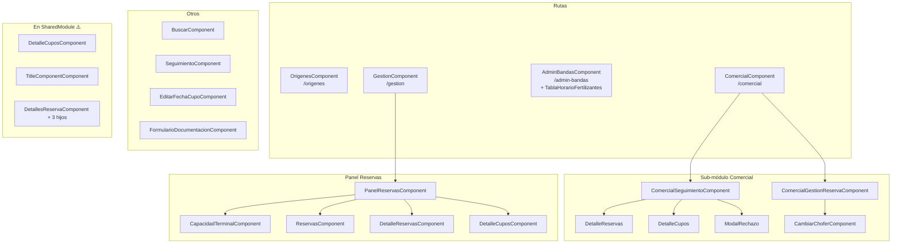

# Módulo: Fertilizante

> **Ruta:** `src/app/views/fertilizante/`
> **Criticidad:** 🟡 Media
> **Estado:** Activo
> **Componentes:** 20 declarados (26 archivos)
> **Rutas:** 4
> **Servicios locales:** 0 — usa `FertilizantesService` de shared
> **Guard:** ⚠️ Sin guard (a pesar de existir `FertilizantesAuthGuard`)

---

## Propósito

Módulo para la gestión del vertical de fertilizantes. Cubre el circuito comercial de reservas de fertilizantes: orígenes, gestión de bandas horarias, panel de reservas con capacidad terminal, seguimiento y el sub-módulo comercial con gestión de reservas, seguimiento y aprobación/rechazo. Es el módulo de mayor complejidad funcional del vertical fertilizantes.

---

## Funcionalidades que expone

| # | Funcionalidad | Ruta | Descripción |
|---|---|---|---|
| 1.1 | Orígenes | `origenes` | ABM de orígenes de fertilizantes con popup de alta |
| 1.2 | Gestión | `gestion` | Gestión principal de operaciones de fertilizante |
| 1.3 | Admin bandas | `admin-bandas` | Administración de bandas horarias con tabla interactiva |
| 1.4 | Comercial | `comercial` | Sub-módulo comercial: seguimiento, gestión de reservas, detalle |

---

## Dependencias

- **Depende de:** `SharedModule`, `FertilizantesService` (shared), `HomeService` (shared)
- **Componentes en SharedModule:** `DetalleCuposComponent`, `TitleComponentComponent`, `DetallesReservaComponent`, `DetallesReservaProductosComponent`, `DetallesReservaCuposComponent`, `DetallesReservaAsignarComponent` → declarados en SharedModule en vez de FertilizanteModule
- **Consume servicios backend:** `FertilizantesService`, `HomeService`, `DestinosService`, `ProductosService`

---

## Diagrama de componentes internos



---

## Servicios backend consumidos

Fertilizante no tiene servicios propios. Usa `FertilizantesService` de `shared/services/`:

| Verbo | Ruta (relativa a `apiHost`) | Propósito |
|---|---|---|
| GET | `/fertilizante/origenes` | Listado de orígenes |
| POST | `/fertilizante/origen` | Alta de origen |
| PUT | `/fertilizante/origen/:id` | Edición de origen |
| DELETE | `/fertilizante/origen/:id` | Baja de origen |
| GET | `/fertilizante/centro/:id/bandas` | Bandas horarias del centro |
| PUT | `/fertilizante/centro/:id/bandas` | Actualizar bandas horarias |
| GET | `/fertilizante/centro/:id/reservas` | Listado de reservas |
| POST | `/fertilizante/reserva` | Crear reserva |
| PUT | `/fertilizante/reserva/:id/aprobar` | Aprobar reserva |
| PUT | `/fertilizante/reserva/:id/rechazar` | Rechazar reserva |
| GET | `/fertilizante/centro/:id/seguimiento` | Seguimiento de reservas |
| GET | `/fertilizante/centro/:id/capacidad` | Capacidad de la terminal |
| GET | `/fertilizante/centro/:id/comercial` | Panel comercial |

> [!info] Endpoints por verificar
> Las rutas exactas de los endpoints necesitan verificación contra el backend. Los paths listados son inferidos del código del servicio.

---

## Providers especiales

FertilizanteModule configura el adapter de fechas para usar Moment:

```typescript
providers: [
  { provide: DateAdapter, useClass: MomentDateAdapter, deps: [MAT_DATE_LOCALE] },
  { provide: MAT_DATE_FORMATS, useValue: MAT_MOMENT_DATE_FORMATS }
]
```

> [!warning] material-moment-adapter v11 en Angular 6
> El `@angular/material-moment-adapter` instalado es v11.2.10, incompatible con Angular 6. Puede causar errores silenciosos en el datepicker de reservas.

---

## Entidades de datos implicadas

- Orígenes de fertilizante
- Bandas horarias
- Reservas de fertilizante (con estados: pendiente, aprobada, rechazada)
- Cupos de fertilizante
- Capacidad terminal
- Productos fertilizantes

---

## Riesgos y deuda técnica detectados

| # | Severidad | Hallazgo |
|---|---|---|
| 1 | 🔴 | **Sin guard en rutas**: Las 4 rutas NO tienen guard, a pesar de que `FertilizantesAuthGuard` (rol 15) existe en `shared/services/auth/`. Cualquier usuario autenticado puede acceder |
| 2 | 🔴 | **6 componentes en SharedModule**: Componentes del vertical fertilizante están declarados en SharedModule en vez de en FertilizanteModule — acoplamiento bidireccional |
| 3 | 🟠 | **6 archivos .ts no declarados**: Existen 26 archivos .component.ts pero solo 20 están declarados en el módulo. Los 6 restantes podrían ser dead code o sub-componentes no registrados |
| 4 | 🟡 | **MomentDateAdapter v11**: Adapter incompatible con Angular 6 |
| 5 | 🟡 | **0 servicios locales**: Toda la lógica en shared/services |

---

## Archivos fuente relevantes

- `src/app/views/fertilizante/fertilizante.module.ts` — Módulo
- `src/app/views/fertilizante/comercial/` — Sub-módulo comercial (7 sub-carpetas)
- `src/app/views/fertilizante/panel-reservas/` — Panel de reservas (4 sub-componentes)
- `src/app/views/fertilizante/admin-bandas/` — Admin de bandas horarias
- `src/app/shared/services/fertilizantes.service.ts` — Servicio principal

---

## Referencias

- [[_indice-modulos]] — Índice general
- [[cross-module-dependencies]] — Componentes en SharedModule
- [[modulo-admin]] — Admin tiene admin-bandas similar
