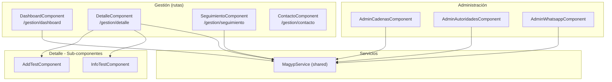

# Módulo: Magyp

> **Ruta:** `src/app/views/magyp/`
> **Criticidad:** 🟡 Media
> **Estado:** Activo
> **Componentes:** 14
> **Rutas:** 4 (todas protegidas)
> **Servicios locales:** 0 — usa `MagypService` de shared
> **Guard:** `MagypAuthGuard`

---

## Propósito

Módulo de integración con el Ministerio de Agricultura, Ganadería y Pesca (MAGyP). Gestiona la interacción con el sistema de Cartas de Porte electrónicas de MAGyP: dashboard de seguimiento, detalle de CCPP con tests de validación, seguimiento de estado, contacto con soporte, y administración de cadenas, autoridades y canal WhatsApp.

---

## Funcionalidades que expone

| # | Funcionalidad | Ruta | Descripción |
|---|---|---|---|
| 1.1 | Dashboard | `gestion/dashboard` | Vista general del estado de CCPP con MAGyP |
| 1.2 | Detalle | `gestion/detalle` | Detalle de CCPP con validaciones (add-test, info-test) |
| 1.3 | Seguimiento | `gestion/seguimiento` | Seguimiento de estado de trámites |
| 1.4 | Contacto | `gestion/contacto` | Canal de contacto con soporte MAGyP |

### Administración

| # | Funcionalidad | Componente | Descripción |
|---|---|---|---|
| 2.1 | Cadenas | `AdminCadenasComponent` | ABM de cadenas productivas |
| 2.2 | Autoridades | `AdminAutoridadesComponent` | ABM de autoridades MAGyP |
| 2.3 | WhatsApp | `AdminWhatsappComponent` | Configuración de canal WhatsApp MAGyP |

---

## Dependencias

- **Depende de:** `SharedModule`, `MagypService` (shared)
- **Es usado por:** Ningún otro módulo lo importa directamente
- **Directiva cross:** `CuitValidator2` de `shared/directives/` (validación CUIT en formularios)

---

## Diagrama de componentes internos

---

## Guards

| Ruta | Guard |
|---|---|
| `magyp/gestion/dashboard` | `MagypAuthGuard` |
| `magyp/gestion/detalle` | `MagypAuthGuard` |
| `magyp/gestion/seguimiento` | `MagypAuthGuard` |
| `magyp/gestion/contacto` | `MagypAuthGuard` |

> [!info] Guard consistente
> A diferencia de FertilizanteModule, MAGyP tiene guard en todas las rutas. `MagypAuthGuard` está en `shared/services/auth/`.

---

## Servicios backend consumidos

Magyp no tiene servicios propios. Usa `MagypService` de `shared/services/`:

| Verbo | Ruta (relativa a `apiHost`) | Propósito |
|---|---|---|
| GET | `/magyp/dashboard` | Dashboard general |
| GET | `/magyp/ccpp/:id` | Detalle de CCPP |
| GET | `/magyp/ccpp/:id/tests` | Tests de validación de CCPP |
| POST | `/magyp/ccpp/:id/test` | Ejecutar test de validación |
| GET | `/magyp/seguimiento` | Seguimiento de trámites |
| POST | `/magyp/contacto` | Enviar contacto a soporte |
| GET | `/magyp/cadenas` | Listado de cadenas |
| POST | `/magyp/cadena` | Alta de cadena |
| PUT | `/magyp/cadena/:id` | Editar cadena |
| DELETE | `/magyp/cadena/:id` | Baja de cadena |
| GET | `/magyp/autoridades` | Listado de autoridades |
| POST | `/magyp/autoridad` | Alta de autoridad |
| PUT | `/magyp/autoridad/:id` | Editar autoridad |
| DELETE | `/magyp/autoridad/:id` | Baja de autoridad |
| GET | `/magyp/whatsapp/config` | Config WhatsApp MAGyP |
| PUT | `/magyp/whatsapp/config` | Actualizar config WhatsApp |

---

## Contexto de dominio

> [!info] MAGyP — Ministerio de Agricultura, Ganadería y Pesca
> El sistema de Cartas de Porte Electrónicas (CPE) de MAGyP es el organismo regulador que emite y controla las cartas de porte para el transporte de granos en Argentina. Este módulo interactúa con las APIs de MAGyP para validar CCPP, realizar tests de conformidad y gestionar autoridades y cadenas productivas.

**Términos clave:**
- **CCPP**: Carta de Porte (documento de transporte de granos)
- **Cadena**: Cadena productiva registrada en MAGyP
- **Autoridad**: Entidad reguladora en la cadena
- **Test de validación**: Verificación de conformidad de datos de CCPP contra MAGyP

---

## Riesgos y deuda técnica detectados

| # | Severidad | Hallazgo |
|---|---|---|
| 1 | 🟡 | **0 servicios locales** — MagypService está en shared pero es específico de este módulo, podría moverse a views/magyp/ |
| 2 | 🟡 | **14 componentes** razonable — módulo bien dimensionado |
| 3 | ⚪ | **CuitValidator2** importada directamente — podría exponerse vía SharedModule formalmente |

---

## Archivos fuente relevantes

- `src/app/views/magyp/magyp.module.ts` — Módulo
- `src/app/views/magyp/magyp-routing.module.ts` — 4 rutas
- `src/app/shared/services/magyp.service.ts` — Servicio principal
- `src/app/shared/services/auth/magyp-auth.guard.ts` — Guard
- `src/app/views/magyp/gestion/` — Sub-carpeta con 4 componentes + sub-componentes
- `src/app/views/magyp/administracion/` — Sub-carpeta con 3 componentes

---

## Referencias

- [[_indice-modulos]] — Índice general
- [[modulo-admin]] — Admin gestiona entidades referenciadas por MAGyP
- [[data-files-index]] — MagypService en inventario de servicios
