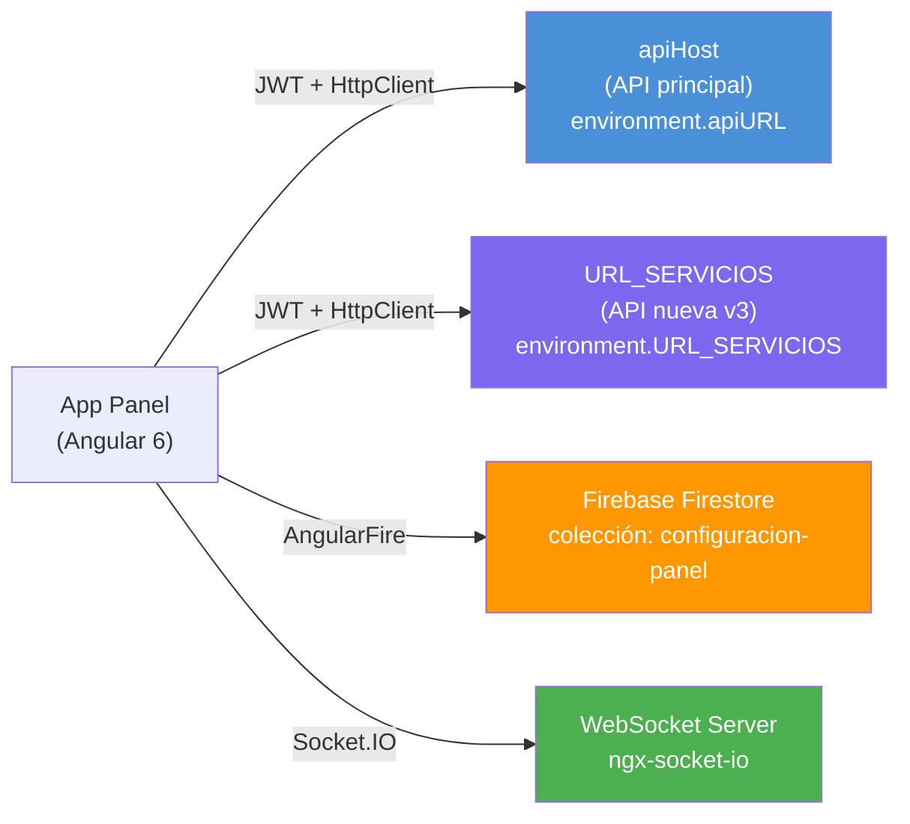
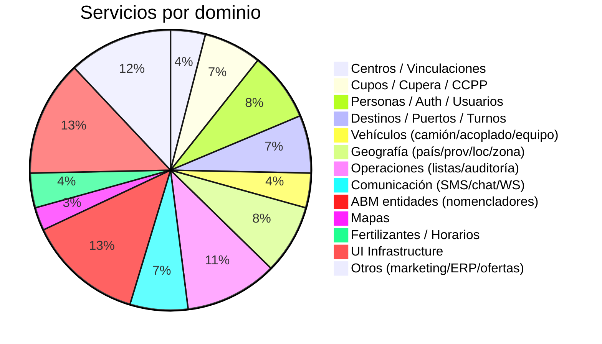

# Índice de Servicios Backend

> **Última revisión:** 2026-04-16
> **Total de servicios:** ~75 archivos en `shared/services/` + 4 locales en módulos
> **Canales backend:** 2 APIs REST + 1 Firebase + 1 WebSocket
> **Patrón:** Todos los servicios usan `HttpClient` con `GlobalService.apiHost` o `URL_SERVICIOS`

---

## Canales de comunicación con backend

| Canal | Variable | Uso | Servicios que lo usan |
|---|---|---|---|
| API principal | `apiHost` (de `GlobalService`) | ~90% de endpoints | Casi todos |
| API nueva v3 | `URL_SERVICIOS` | Endpoints v3 de cupos y listas | `CuperaService`, `CcppService`, `ListaTurneadaService`, `ConsultasService` |
| Firebase | `AngularFirestore` | Configuración de panel | `FireserviService` (único) |
| WebSocket | Socket.IO | Notificaciones en tiempo real | `WebsocketService` |

---

## Distribución de servicios por dominio

---

## Catálogo de servicios — por dominio

### 🏢 Centros y vinculaciones

| Servicio | Archivo | Endpoints | API | Detalle |
|---|---|---|---|---|
| `CentrosService` | `centros.service.ts` | ~70 | apiHost | [[centros-endpoints]] |
| `AdminService` | `admin.service.ts` | 4 GET | apiHost | Paginación de roles por centro |
| `CentroProductoService` | `centro-producto.service.ts` | 4 | apiHost | [[abm-endpoints#centro-producto]] |

### 📦 Cupos y Cupera

| Servicio | Archivo | Endpoints | API | Detalle |
|---|---|---|---|---|
| `CupoService` | `shared/components/cupo/services/cupo.service.ts` | ~40 | apiHost | [[cupos-endpoints#cupo-v1-v3]] |
| `CuperaService` | `views/cupera/services/cupera.service.ts` | ~25 | URL_SERVICIOS | [[cupos-endpoints#cupera-v5]] |
| `CcppService` | `ccpp.service.ts` | ~17 | apiHost + URL_SERVICIOS | [[cupos-endpoints#ccpp]] |
| `SolicitudesService` | `shared/components/cupo/services/solicitudes.service.ts` | 0 HTTP | — | BehaviorSubject local |
| `TurnosService` | `shared/components/cupo/services/turnos.service.ts` | ~3 | apiHost | [[cupos-endpoints#turnos-cupo]] |

### 👤 Personas, Auth y Usuarios

| Servicio | Archivo | Endpoints | API | Detalle |
|---|---|---|---|---|
| `PersonasService` | `personas.service.ts` | ~48 | apiHost | [[personas-endpoints]] |
| `AuthService` | `auth.service.ts` | ~6 | apiHost | [[auth-endpoints]] |
| `UserService` | `user.service.ts` | ~10 | apiHost | [[personas-endpoints#user]] |
| `TransporteChoferService` | `transporte-chofer.service.ts` | ~8 | apiHost | [[logistica-endpoints#transporte-chofer]] |
| `ChoferService` | `chofer.service.ts` | 2 POST | apiHost | [[logistica-endpoints#chofer-asignar]] |
| `EstadosChoferService` | `estados-chofer.service.ts` | 4 | apiHost | [[abm-endpoints#estados-chofer]] |

### 🏭 Destinos, Puertos y Turnos

| Servicio | Archivo | Endpoints | API | Detalle |
|---|---|---|---|---|
| `DestinosService` | `destinos.service.ts` | ~21 | apiHost | [[logistica-endpoints#destinos]] |
| `SituacionPuertoService` | `situacion-puerto.service.ts` | ~6 | apiHost | [[logistica-endpoints#situacion-puerto]] |
| `HorarioPuertoService` | `horario-puerto.service.ts` | ~6 | apiHost | [[logistica-endpoints#horario-puerto]] |
| `DestinosResolverService` | `destinos-resolver.service.ts` | Resolve | — | Router resolver |
| `DestinatarioService` | `destinatario.service.ts` | ~8 | apiHost | [[logistica-endpoints#destinatario]] |

### 🚛 Vehículos

| Servicio | Archivo | Endpoints | API | Detalle |
|---|---|---|---|---|
| `CamionService` | `camion.service.ts` | 8 | apiHost | [[logistica-endpoints#camion]] |
| `AcopladosService` | `acoplados.service.ts` | 8 | apiHost | [[logistica-endpoints#acoplado]] |
| `EquiposService` | `equipos.service.ts` | 7 | apiHost | [[logistica-endpoints#equipo]] |

### 🌍 Geografía

| Servicio | Archivo | Endpoints | API | Detalle |
|---|---|---|---|---|
| `PaisService` | `pais.service.ts` | 4 | apiHost | [[abm-endpoints#pais]] |
| `ProvinciaService` | `provincia.service.ts` | 4 | apiHost | [[abm-endpoints#provincia]] |
| `LocalidadService` | `localidad.service.ts` | 4 | apiHost | [[abm-endpoints#localidad]] |
| `ZonasService` | `zonas.service.ts` | ~6 | apiHost | [[abm-endpoints#zonas]] |
| `ZonaDestinoService` | `zona-destino.service.ts` | ~4 | apiHost | [[abm-endpoints#zona-destino]] |
| `ZonaChoferesLibresService` | `zona-choferes-libres.service.ts` | ~3 | apiHost | [[abm-endpoints#zona-choferes]] |

### 📋 Operaciones y listas

| Servicio | Archivo | Endpoints | API | Detalle |
|---|---|---|---|---|
| `ListaTurneadaService` | `lista-turneada.service.ts` | ~8 | URL_SERVICIOS | [[logistica-endpoints#lista-turneada]] |
| `ListaReservaService` | `lista-reserva.service.ts` | 0 HTTP | — | Transformación local |
| `ListaNegraMotivosService` | `lista-negra-motivos.service.ts` | 5 | apiHost | [[abm-endpoints#lista-negra]] |
| `AuditoriasService` | `auditorias.service.ts` | ~8 | apiHost | [[centros-endpoints#auditorias]] |
| `AuditoriaCentroService` | `auditoria-centro.service.ts` | 3 | apiHost | [[centros-endpoints#auditoria-centro]] |
| `ErrorLogCentroService` | `errorlog-centro.service.ts` | 1 | apiHost | [[centros-endpoints#errorlog]] |
| `ReportesService` | `reportes.service.ts` | ~8 | apiHost | [[centros-endpoints#reportes]] |
| `NomencladoresService` | `nomencladores.service.ts` | ~12 | apiHost | [[abm-endpoints#nomencladores]] |

### 💬 Comunicación

| Servicio | Archivo | Endpoints | API | Detalle |
|---|---|---|---|---|
| `SendsmsService` | `sendsms.service.ts` | 3 POST | apiHost | Envío SMS/WhatsApp |
| `MessageService` | `message.service.ts` | 1 POST | apiHost | Mensajes transitorios |
| `OperadorChatService` | `operador-chat.service.ts` | ~4 | apiHost | Chat operador |
| `ParametroChatService` | `parametro-chat.service.ts` | ~4 | apiHost | Config de chat |
| `WebsocketService` | `websocket.service.ts` | 0 HTTP | Socket.IO | Eventos real-time |

### 🗺️ Mapas

| Servicio | Archivo | Endpoints | API | Detalle |
|---|---|---|---|---|
| `MapaCuposService` | `mapa-cupos.service.ts` | 0 💀 | — | Stub vacío |
| `MapaOficinaService` | `mapa-oficina.service.ts` | ~4 | apiHost | Ubicación oficinas |

### 🌿 Fertilizantes y MAGyP

| Servicio | Archivo | Endpoints | API | Detalle |
|---|---|---|---|---|
| `FertilizantesService` | `fertilizantes.service.ts` | ~15 | apiHost | [[fertilizantes-endpoints]] |
| `HorarioFertilizantesService` | `horario-fertilizantes.service.ts` | ~6 | apiHost | [[fertilizantes-endpoints#horarios]] |
| `MagypService` | `magyp.service.ts` | ~16 | apiHost | [[magyp-endpoints]] |

### 🔧 ABM de nomencladores

| Servicio | Archivo | Endpoints | API | Detalle |
|---|---|---|---|---|
| `BocaService` | `boca.service.ts` | 5 | apiHost | [[abm-endpoints#boca]] |
| `TipoDestinoService` | `tipo-destino.service.ts` | 4 | apiHost | [[abm-endpoints#tipo-destino]] |
| `DesvioMotivoService` | `desvio-motivo.service.ts` | 4 | apiHost | [[abm-endpoints#desvio-motivo]] |
| `RazonRechazoService` | `razon-rechazo.service.ts` | 4 | apiHost | [[abm-endpoints#razon-rechazo]] |
| `EstandarService` | `estandar.service.ts` | 4 | apiHost | [[abm-endpoints#estandar]] |
| `TrabajadoresService` | `trabajadores.service.ts` | 4 | apiHost | [[abm-endpoints#trabajadores]] |
| `DocumentoService` | `documento.service.ts` | ~6 | apiHost | [[abm-endpoints#documento]] |
| `OrigenesService` | `origenes.service.ts` | 5 | apiHost | [[abm-endpoints#origenes]] |
| `ProductosService` | `productos.service.ts` | 6 | apiHost | [[abm-endpoints#productos]] |

### 🖥️ UI Infrastructure (sin HTTP)

| Servicio | Archivo | Propósito |
|---|---|---|
| `AppLoaderService` | `app-loader/` | Overlay de carga global |
| `AppConfirmService` | `app-confirm/` | Diálogos de confirmación |
| `AppErrorService` | `app-error/` | Diálogos de error |
| `AppAlertService` | `app-alert/` | Alertas |
| `AppAtencionService` | `app-atencion/` | Diálogos de atención |
| `LayoutService` | `layout.service.ts` | Estado del layout |
| `NavigationService` | `navigation.service.ts` | Estructura de menú |
| `ThemeService` | `theme.service.ts` | Cambio de tema |
| `ExelService` | `exel.service.ts` | Exportación Excel |
| `EntityMapperService` | `entity-mapper.service.ts` | Mapeo Excel ↔ entidades |

### 📦 Otros

| Servicio | Archivo | Endpoints | API | Propósito |
|---|---|---|---|---|
| `MarketingService` | `marketing.service.ts` | ~4 | apiHost | Campañas y marketing |
| `LandingPageService` | `landing-page.service.ts` | ~3 | apiHost | Contenido landing page |
| `OfertasService` | `ofertas.service.ts` | ~4 | apiHost | Gestión de ofertas |
| `CombustibleService` | `combustible.service.ts` | ~6 | apiHost | Gestión combustible |
| `IntegracionErpService` | `integracion-erp.service.ts` | ~8 | apiHost | Integración ERP |
| `ManualService` | `manual.service.ts` | ~3 | apiHost | Manual de usuario |
| `PromocionesService` | `promociones.service.ts` | ~5 | apiHost | Promociones |
| `ReservasService` | `reservas.service.ts` | ~8 | apiHost | Reservas |
| `RespuestasService` | `respuestas.service.ts` | ~6 | apiHost | Códigos de respuesta |

---

## Guards de autenticación

Ubicados en `shared/services/auth/`:

| Guard | Rol(es) | Módulos protegidos |
|---|---|---|
| `AuthGuard` | Cualquier usuario autenticado | Base para todos |
| `TermAuthGuard` | Requiere aceptar T&C | Combinado con otros |
| `AdminAuthGuard` | Roles 1, 12 | [[modulo-admin]] |
| `CentroAuthGuard` | Roles 3, 11, 16 | [[modulo-admin]] (rutas /centro) |
| `TranspAuthGuard` | Rol 4 | [[modulo-admin]] (rutas /transportista) |
| `DadorAuthGuard` | Rol dador | [[modulo-dador]] |
| `DestinoAuthGuard` | Rol 5 | [[modulo-destino]] |
| `MagypAuthGuard` | Rol MAGyP | [[modulo-magyp]] |
| `MtrAuthGuard` | Rol MTR | MtrModule |
| `FertilizantesAuthGuard` | Rol 15 | ⚠️ Existe pero NO se usa en rutas |

---

## Utilidades de servicios

| Archivo | Propósito |
|---|---|
| `shared/services/utils/delete-local-storage.ts` | Limpieza de localStorage |
| `shared/services/utils/set-local-storage.ts` | Seteo de localStorage |
| `shared/services/index.ts` | Barrel exports |
| `shared/models/global.service.ts` | `GlobalService` — apiHost, URL base |
| `shared/services/cookies.service.ts` | Gestión de cookies |

---

## Patrones observados

> [!info] Patrón de servicios
> - **extractData()**: extrae `response.json()` o `response.data`
> - **handleError()**: captura errores HTTP y los transforma
> - **Paginación**: parámetros `page` + `per_page` / `per-page`
> - **Búsqueda**: patrón `Search[campo]=valor` en query params
> - **Caching**: `PersonasService` usa `Map<string, {data, lastPage}>` para comprador/vendedor
> - **RxJS**: `map`, `catch`, `tap`, `shareReplay(1)` en AuthService

---

## Referencias

- [[stack-tecnologico]] — Dependencias del proyecto
- [[arquitectura-alto-nivel]] — Interceptores HTTP y flujo de autenticación
- [[data-files-index]] — Inventario previo de servicios y modelos
