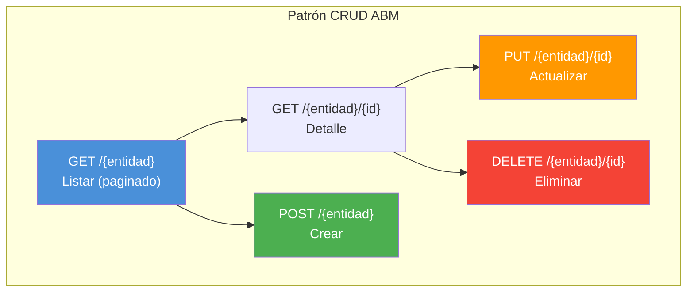

# Endpoints: ABM de Nomencladores y Geografía

> **Patrón común:** CRUD estándar (GET list + GET by id + POST + PUT + DELETE)
> **API:** `GlobalService.apiHost`
> **Consumido por:** [[modulo-admin]] y como dropdown en otros módulos

---

## Geografía

### PaisService {#pais}

> **Archivo:** `pais.service.ts`

| Verbo | Ruta | Propósito |
|---|---|---|
| GET | `pais` | Listar países |
| GET | `pais/{id}` | Detalle |
| POST | `pais` | Crear |
| PUT | `pais/{id}` | Actualizar |

### ProvinciaService {#provincia}

> **Archivo:** `provincia.service.ts`

| Verbo | Ruta | Propósito |
|---|---|---|
| GET | `provincia` | Listar provincias |
| GET | `provincia/{id}` | Detalle |
| POST | `provincia` | Crear |
| PUT | `provincia/{id}` | Actualizar |

### LocalidadService {#localidad}

> **Archivo:** `localidad.service.ts`

| Verbo | Ruta | Propósito |
|---|---|---|
| GET | `localidad` | Listar localidades (paginado, filtrable por provincia) |
| GET | `localidad/{id}` | Detalle |
| POST | `localidad` | Crear |
| PUT | `localidad/{id}` | Actualizar |

### ZonasService {#zonas}

> **Archivo:** `zonas.service.ts` · ~6 endpoints

| Verbo | Ruta | Propósito |
|---|---|---|
| GET | `zona` | Listar zonas (paginado) |
| GET | `zona/select` | Dropdown de zonas |
| GET | `zona/{id}` | Detalle |
| POST | `zona` | Crear |
| PUT | `zona/{id}` | Actualizar |
| DELETE | `zona/{id}` | Eliminar |

### ZonaDestinoService {#zona-destino}

> **Archivo:** `zona-destino.service.ts`

| Verbo | Ruta | Propósito |
|---|---|---|
| GET | `zona-destino` | Listar relaciones zona-destino |
| POST | `zona-destino` | Crear relación |
| PUT | `zona-destino/{id}` | Actualizar |
| DELETE | `zona-destino/{id}` | Eliminar |

### ZonaChoferesLibresService {#zona-choferes}

> **Archivo:** `zona-choferes-libres.service.ts`

| Verbo | Ruta | Propósito |
|---|---|---|
| GET | `zona-choferes-libres` | Choferes libres por zona |
| GET | `zona-choferes-libres/{zona_id}` | Detalle por zona |

---

## Productos y Orígenes

### ProductosService {#productos}

> **Archivo:** `productos.service.ts` · ~76 líneas · 6 endpoints

| Verbo | Ruta | Propósito |
|---|---|---|
| GET | `producto` | Listar productos (paginado) |
| GET | `producto/codigo-select` | Dropdown de productos por código |
| GET | `destino/producto-destino` | Productos por destino |
| POST | `producto` | Crear producto |
| PUT | `producto/{id}` | Actualizar producto |
| DELETE | `producto/{id}` | Eliminar producto |

### OrigenesService {#origenes}

> **Archivo:** `origenes.service.ts` · ~94 líneas · 5 endpoints

| Verbo | Ruta | Propósito |
|---|---|---|
| GET | `origen` | Listar orígenes (paginado) |
| GET | `origen/{id}` | Detalle |
| POST | `origen` | Crear |
| PUT | `origen/{id}` | Actualizar |
| DELETE | `origen/{id}` | Eliminar |

---

## Entidades de negocio

### BocaService {#boca}

> **Archivo:** `boca.service.ts`

| Verbo | Ruta | Propósito |
|---|---|---|
| GET | `boca` | Listar bocas de descarga |
| GET | `boca/{id}` | Detalle |
| POST | `boca` | Crear |
| PUT | `boca/{id}` | Actualizar |
| DELETE | `boca/{id}` | Eliminar |

### CentroProductoService {#centro-producto}

> **Archivo:** `centro-producto.service.ts`

| Verbo | Ruta | Propósito |
|---|---|---|
| GET | `centro-producto` | Listar relaciones centro-producto |
| POST | `centro-producto` | Crear relación |
| PUT | `centro-producto/{id}` | Actualizar |
| DELETE | `centro-producto/{id}` | Eliminar |

### TipoDestinoService {#tipo-destino}

> **Archivo:** `tipo-destino.service.ts`

| Verbo | Ruta | Propósito |
|---|---|---|
| GET | `tipo-destino` | Listar tipos |
| POST | `tipo-destino` | Crear |
| PUT | `tipo-destino/{id}` | Actualizar |
| DELETE | `tipo-destino/{id}` | Eliminar |

### EstandarService {#estandar}

> **Archivo:** `estandar.service.ts`

| Verbo | Ruta | Propósito |
|---|---|---|
| GET | `estandar` | Listar estándares |
| POST | `estandar` | Crear |
| PUT | `estandar/{id}` | Actualizar |
| DELETE | `estandar/{id}` | Eliminar |

---

## Estados y motivos

### EstadosChoferService {#estados-chofer}

> **Archivo:** `estados-chofer.service.ts`

| Verbo | Ruta | Propósito |
|---|---|---|
| GET | `estado-chofer` | Listar estados de chofer |
| POST | `estado-chofer` | Crear |
| PUT | `estado-chofer/{id}` | Actualizar |
| DELETE | `estado-chofer/{id}` | Eliminar |

### DesvioMotivoService {#desvio-motivo}

> **Archivo:** `desvio-motivo.service.ts`

| Verbo | Ruta | Propósito |
|---|---|---|
| GET | `desvio-motivo` | Listar motivos de desvío |
| POST | `desvio-motivo` | Crear |
| PUT | `desvio-motivo/{id}` | Actualizar |
| DELETE | `desvio-motivo/{id}` | Eliminar |

### RazonRechazoService {#razon-rechazo}

> **Archivo:** `razon-rechazo.service.ts`

| Verbo | Ruta | Propósito |
|---|---|---|
| GET | `razon-rechazo` | Listar razones de rechazo |
| POST | `razon-rechazo` | Crear |
| PUT | `razon-rechazo/{id}` | Actualizar |
| DELETE | `razon-rechazo/{id}` | Eliminar |

### ListaNegraMotivosService {#lista-negra}

> **Archivo:** `lista-negra-motivos.service.ts`

| Verbo | Ruta | Propósito |
|---|---|---|
| GET | `lista-negra-motivo` | Listar motivos |
| GET | `lista-negra-motivo/{id}` | Detalle |
| POST | `lista-negra-motivo` | Crear |
| PUT | `lista-negra-motivo/{id}` | Actualizar |
| DELETE | `lista-negra-motivo/{id}` | Eliminar |

---

## Trabajadores y documentos

### TrabajadoresService {#trabajadores}

> **Archivo:** `trabajadores.service.ts`

| Verbo | Ruta | Propósito |
|---|---|---|
| GET | `trabajador` | Listar trabajadores |
| POST | `trabajador` | Crear |
| PUT | `trabajador/{id}` | Actualizar |
| DELETE | `trabajador/{id}` | Eliminar |

### DocumentoService {#documento}

> **Archivo:** `documento.service.ts` · ~6 endpoints

| Verbo | Ruta | Propósito |
|---|---|---|
| GET | `documento` | Listar tipos de documento |
| GET | `documento/{id}` | Detalle |
| POST | `documento` | Crear |
| PUT | `documento/{id}` | Actualizar |
| DELETE | `documento/{id}` | Eliminar |

---

## NomencladoresService {#nomencladores}

> **Archivo:** `nomencladores.service.ts` · ~12 endpoints
> Servicio centralizado para múltiples nomencladores secundarios.

| Verbo | Ruta | Propósito |
|---|---|---|
| GET | `nomenclador/tipo-camion` | Tipos de camión |
| GET | `nomenclador/tipo-acoplado` | Tipos de acoplado |
| GET | `nomenclador/marca-camion` | Marcas de camión |
| GET | `nomenclador/marca-acoplado` | Marcas de acoplado |
| GET | `nomenclador/tipo-combustible` | Tipos de combustible |
| GET | `nomenclador/estado-viaje` | Estados de viaje |
| GET | `nomenclador/tipo-documento` | Tipos de documento |
| GET | `nomenclador/estado-descarga` | Estados de descarga |
| GET | `nomenclador/moneda` | Monedas |

---

## Patrón de servicios ABM

---

## Archivos fuente

- `src/app/shared/services/pais.service.ts`
- `src/app/shared/services/provincia.service.ts`
- `src/app/shared/services/localidad.service.ts`
- `src/app/shared/services/zonas.service.ts`
- `src/app/shared/services/zona-destino.service.ts`
- `src/app/shared/services/zona-choferes-libres.service.ts`
- `src/app/shared/services/productos.service.ts`
- `src/app/shared/services/origenes.service.ts`
- `src/app/shared/services/boca.service.ts`
- `src/app/shared/services/centro-producto.service.ts`
- `src/app/shared/services/tipo-destino.service.ts`
- `src/app/shared/services/estandar.service.ts`
- `src/app/shared/services/estados-chofer.service.ts`
- `src/app/shared/services/desvio-motivo.service.ts`
- `src/app/shared/services/razon-rechazo.service.ts`
- `src/app/shared/services/lista-negra-motivos.service.ts`
- `src/app/shared/services/trabajadores.service.ts`
- `src/app/shared/services/documento.service.ts`
- `src/app/shared/services/nomencladores.service.ts`

---

## Referencias

- [[_indice-servicios]] — Índice general
- [[modulo-admin]] — Pantallas ABM
- [[diagrama-er-global]] — Modelo de datos
