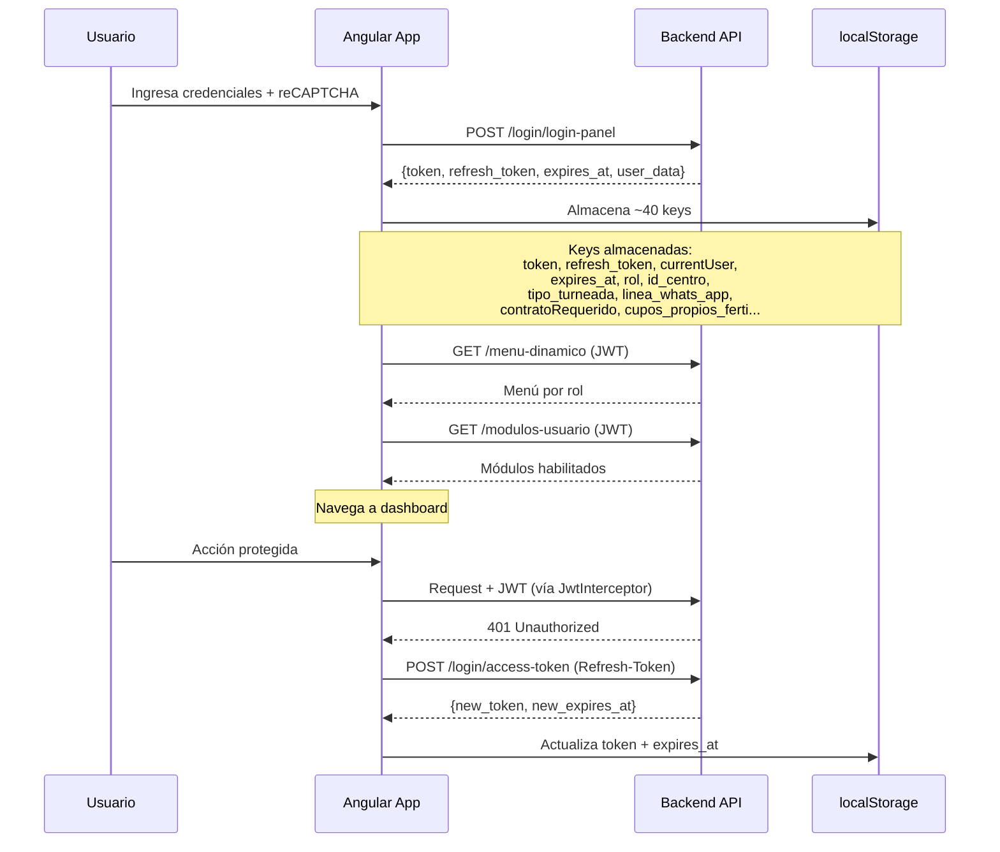
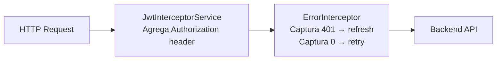

# Endpoints: Autenticación y Sesión

> **Servicio:** `AuthService` (`shared/services/auth.service.ts`)
> **Líneas:** ~180
> **API:** `GlobalService.apiHost`
> **Consumido por:** Toda la aplicación

---

## Propósito

Gestión del ciclo de vida de sesión: login con reCAPTCHA, refresh de token, menú dinámico por rol, módulos de usuario y logout. Mantiene estado observable vía `BehaviorSubject` para menú y sistema de módulos.

---

## Endpoints

| Verbo | Ruta | Propósito | Autenticación |
|---|---|---|---|
| POST | `login/login-panel` | Login con credenciales + captcha | Ninguna (público) |
| POST | `login/access-token` | Activar/refrescar token | Refresh-Token header |
| GET | `menu-dinamico` | Menú dinámico por rol de usuario | JWT |
| GET | `modulos-usuario` | Módulos habilitados para el usuario | JWT |
| POST | `login/logout` | Cerrar sesión | JWT + Refresh-Token |
| PUT | `usuario/change-password` | Cambiar contraseña | JWT |

---

## Flujo de autenticación

---

## Estado reactivo (BehaviorSubjects)

| Observable | Tipo | Propósito |
|---|---|---|
| `_menuSubject$` | `BehaviorSubject<MenuItem[]>` | Menú dinámico del usuario actual |
| `_moduleSystemSubject$` | `BehaviorSubject<ModuleSystem[]>` | Módulos del sistema |
| `usersSubject` | `Observable` | Stream de datos de usuario |

Patrón de caching: `shareReplay(1)` en las llamadas de menú y módulos para evitar duplicación de requests.

---

## localStorage — Claves de sesión

> [!warning] ~40 claves en localStorage
> La sesión almacena ~40 keys en localStorage. No usa sessionStorage ni cookies HttpOnly. Riesgo XSS: un script malicioso podría leer todas las claves.

| Clave | Tipo | Descripción |
|---|---|---|
| `token` | string | JWT access token |
| `refresh_token` | string | Refresh token |
| `currentUser` | JSON | Datos del usuario logueado |
| `expires_at` | string | Momento de expiración del token |
| `rol` | number | ID del rol activo |
| `id_centro` | number | Centro activo |
| `razon_social` | string | Razón social del centro |
| `tipo_turneada` | string | Tipo de turneada habilitada |
| `linea_whats_app` | string | Línea de WhatsApp del centro |
| `contratoRequerido` | boolean | Si el centro requiere contrato |
| `cupos_propios_ferti` | boolean | Si tiene cupos propios de fertilizante |
| ... | ... | ~30 claves más |

---

## Guards de ruta

Todos en `shared/services/auth/`:

| Guard | Archivo | Roles | Validación |
|---|---|---|---|
| `AuthGuard` | `auth.guard.ts` | Cualquier autenticado | Token válido |
| `TermAuthGuard` | `term-auth.guard.ts` | — | Aceptó T&C |
| `AdminAuthGuard` | `admin-auth.guard.ts` | 1, 12 | Token + rol |
| `CentroAuthGuard` | `centro-auth.guard.ts` | 3, 11, 16 | Token + rol |
| `TranspAuthGuard` | `transp-auth.guard.ts` | 4 | Token + rol |
| `DadorAuthGuard` | `dador-auth.guard.ts` | Dador | Token + rol |
| `DestinoAuthGuard` | `destino-auth.guard.ts` | 5 | Token + rol |
| `MagypAuthGuard` | `magyp-auth.guard.ts` | MAGyP | Token + rol |
| `MtrAuthGuard` | `mtr-auth.guard.ts` | MTR | Token + rol |
| `FertilizantesAuthGuard` | `fertilizantes-auth.guard.ts` | 15 | ⚠️ Existe pero NO se usa |

---

## Interceptores HTTP

Cadena de interceptores en `AppModule`:

| Interceptor | Archivo | Propósito |
|---|---|---|
| `JwtInterceptorService` | `shared/services/auth/jwt-interceptor.service.ts` | Agrega `Authorization: Bearer {token}` a cada request |
| `ErrorInterceptor` | `shared/services/auth/error-interceptor.service.ts` | 401 → intenta refresh. Error 0 → retry. Otros → redirige a login |

---

## Utilidades de localStorage

| Archivo | Propósito |
|---|---|
| `shared/services/utils/set-local-storage.ts` | Setea múltiples keys del response de login |
| `shared/services/utils/delete-local-storage.ts` | Limpia todas las keys al hacer logout |

---

## Riesgos de seguridad

| # | Severidad | Hallazgo |
|---|---|---|
| 1 | 🔴 | **Token JWT en localStorage**: vulnerable a XSS. Debería usar HttpOnly cookies |
| 2 | 🔴 | **~40 claves en localStorage**: superficie de ataque amplia |
| 3 | 🔴 | **Firebase API keys en environment.ts**: hardcodeadas en el bundle |
| 4 | 🟠 | **FertilizantesAuthGuard sin uso**: guard existe pero las rutas no lo referencian |
| 5 | 🟠 | **Token refresh sin mecanismo de lock**: múltiples requests simultáneos podrían disparar múltiples refreshes |

---

## Archivos fuente

- `src/app/shared/services/auth.service.ts`
- `src/app/shared/services/auth/jwt-interceptor.service.ts`
- `src/app/shared/services/auth/error-interceptor.service.ts`
- `src/app/shared/services/auth/*.guard.ts` (10 guards)
- `src/app/shared/services/utils/set-local-storage.ts`
- `src/app/shared/services/utils/delete-local-storage.ts`

---

## Referencias

- [[_indice-servicios]] — Índice general
- [[arquitectura-alto-nivel]] — Flujo de bootstrap y auth
- [[security-inventory]] 🚧 — Inventario de seguridad (pendiente)
