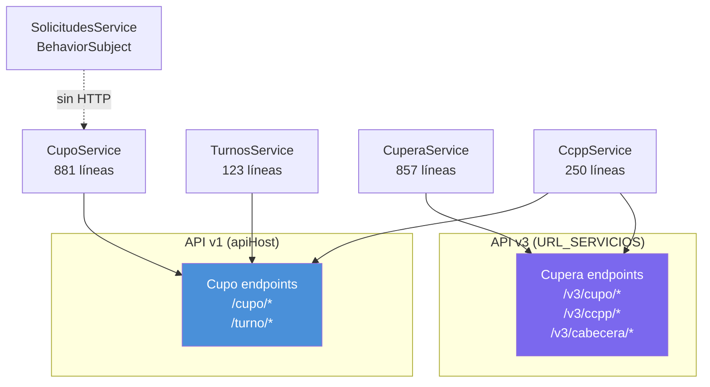

# Endpoints: Cupos, Cupera y CCPP

> **Servicios:** `CupoService`, `CuperaService`, `CcppService`, `TurnosService`
> **APIs:** `apiHost` (v1) + `URL_SERVICIOS` (v3)
> **Consumido por:** [[modulo-cupo]], [[modulo-cupera]], [[modulo-admin]]

---

## CupoService (v1–v3) {#cupo-v1-v3}

> **Archivo:** `src/app/shared/components/cupo/services/cupo.service.ts`
> **Líneas:** ~881
> **API:** `GlobalService.apiHost`
> **Endpoints:** ~40

### Cupos — CRUD y asignación

| Verbo | Ruta | Propósito |
|---|---|---|
| GET | `cupo/centro/{id}` | Cupos por centro |
| GET | `cupo/centro/{id}/disponibles` | Cupos disponibles para asignar |
| POST | `cupo/asignar` | Asignar cupo a solicitud |
| PUT | `cupo/{id}/devolver` | Devolver cupo asignado |
| PUT | `cupo/{id}/recuperar` | Recuperar cupo devuelto |
| GET | `cupo/centro/{id}/consolidado` | Panel consolidado |
| GET | `cupo/centro/{id}/seguimiento` | Seguimiento de cupos |
| GET | `cupo/centro/{id}/contratos` | Listado de contratos |

### Solicitudes

| Verbo | Ruta | Propósito |
|---|---|---|
| GET | `cupo/centro/{id}/solicitudes` | Solicitudes de cupos |
| POST | `cupo/solicitud` | Crear solicitud de cupo |
| PUT | `cupo/solicitud/{id}/aprobar` | Aprobar solicitud |
| PUT | `cupo/solicitud/{id}/rechazar` | Rechazar solicitud |

### Notificaciones

| Verbo | Ruta | Propósito |
|---|---|---|
| POST | `cupo/notificar` | Enviar notificación de cupo |

---

## CuperaService (v5) {#cupera-v5}

> **Archivo:** `src/app/views/cupera/services/cupera.service.ts`
> **Líneas:** ~857
> **API:** `URL_SERVICIOS` (API nueva v3)
> **Endpoints:** ~25

> [!info] API v3
> CuperaService es el único servicio de cupos que usa la API nueva (`URL_SERVICIOS`). Todos los endpoints son prefijados con `v3/`.

### Cupos v5 — Asignación y gestión

| Verbo | Ruta | Propósito |
|---|---|---|
| GET | `v3/cupo/listado` | Listado de cupos (paginado) |
| GET | `v3/cupo/listado/centro/{id}` | Cupos por centro |
| GET | `v3/cupo/centro/{id}/zona` | Cupos por zona |
| GET | `v3/cupo/centro/{id}/asignacion` | Cupos disponibles para asignación v5 |
| POST | `v3/cupo/asignar` | Asignar cupo v5 |
| PUT | `v3/cupo/{id}/aprobar` | Aprobar solicitud v5 |
| PUT | `v3/cupo/{id}/rechazar` | Rechazar solicitud v5 |
| PUT | `v3/cupo/{id}/anular` | Anular cupo v5 |
| POST | `v3/cupo/recuperar` | Recuperar cupo v5 |

### Seguimiento y contratos

| Verbo | Ruta | Propósito |
|---|---|---|
| GET | `v3/cupo/centro/{id}/seguimiento` | Seguimiento de cupos v5 |
| GET | `v3/cupo/centro/{id}/contratos` | Contratos v5 |
| GET | `v3/cupo/destinados/{fecha}` | Cupos destinados por fecha |

### CCPP aplicadas

| Verbo | Ruta | Propósito |
|---|---|---|
| GET | `v3/ccpp/aplicadas` | CCPP aplicadas a cupos |
| POST | `v3/cupo/aplicar-cabecera` | Aplicar cabecera CCPP a cupo |
| GET | `v3/cupo/obtener-cupo-pdf` | Obtener PDF del cupo |

### Productos y relaciones

| Verbo | Ruta | Propósito |
|---|---|---|
| GET | `centro-producto/listar-relaciones` | Relaciones centro-producto |

---

## CcppService {#ccpp}

> **Archivo:** `src/app/shared/services/ccpp.service.ts`
> **Líneas:** ~250
> **API:** `GlobalService.apiHost` + algunos endpoints en `URL_SERVICIOS`
> **Endpoints:** ~17

### Cabeceras CCPP

| Verbo | Ruta | Propósito |
|---|---|---|
| GET | `v3/cabecera` | Listar cabeceras (paginado) |
| GET | `v3/cabecera/select` | Dropdown de cabeceras |
| GET | `v3/ccpp/{id}` | Detalle de CCPP |
| POST | `v3/ccpp` | Crear CCPP |
| PUT | `v3/ccpp/{id}` | Actualizar CCPP |

### Auditoría CCPP

| Verbo | Ruta | Propósito |
|---|---|---|
| GET | `v3/auditoria/inconsistencia` | Inconsistencias en CCPP |
| GET | `v3/auditoria/ccpp` | Historial de auditoría CCPP |
| POST | `v3/auditoria/send-mensaje` | Enviar mensaje con adjuntos |

### PDF

| Verbo | Ruta | Propósito |
|---|---|---|
| GET | `v3/cupo/obtener-cupo-pdf` | Generar PDF de cupo |

> [!warning] Headers hardcodeados
> CcppService agrega headers manualmente en algunos métodos (`headers.append()`), en lugar de usar el interceptor JWT. Potencial inconsistencia de seguridad.

---

## TurnosService (Cupo) {#turnos-cupo}

> **Archivo:** `src/app/shared/components/cupo/services/turnos.service.ts`
> **Líneas:** ~123
> **API:** `GlobalService.apiHost`
> **Endpoints:** ~3

| Verbo | Ruta | Propósito |
|---|---|---|
| GET | `turno/centro/{id}` | Turnos por centro |
| GET | `turno/centro/{id}/fecha/{fecha}` | Turnos por centro y fecha |

---

## SolicitudesService

> **Archivo:** `src/app/shared/components/cupo/services/solicitudes.service.ts`
> **Líneas:** ~16
> **HTTP:** Ninguno

Servicio local sin HTTP. Usa `BehaviorSubject` para comunicar cambios de estado de solicitudes entre componentes del módulo Cupo.

---

## Diagrama de servicios de cupos

---

## Archivos fuente

- `src/app/shared/components/cupo/services/cupo.service.ts`
- `src/app/views/cupera/services/cupera.service.ts`
- `src/app/shared/services/ccpp.service.ts`
- `src/app/shared/components/cupo/services/turnos.service.ts`
- `src/app/shared/components/cupo/services/solicitudes.service.ts`

---

## Referencias

- [[_indice-servicios]] — Índice general
- [[modulo-cupo]] — Consumidor de CupoService
- [[modulo-cupera]] — Consumidor de CuperaService
