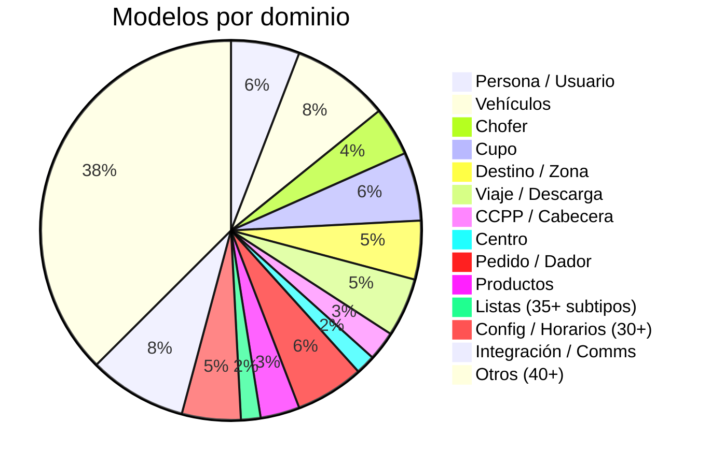

# Índice de Entidades (Modelo de Datos)

> **Última revisión:** 2026-04-16
> **Archivos de modelos:** ~115 en `shared/models/`
> **Dominios:** 13 categorías
> **Patrón:** Interfaces TypeScript sin validación runtime

---

## Distribución por dominio

---

## Catálogo por dominio

### 👤 Persona / Usuario (7 archivos)

| Modelo | Archivo | Descripción |
|---|---|---|
| `PersonaRol` | `persona-rol.ts` | Persona con su rol asignado |
| `PersonRazonSocial` | `person-razon-social.ts` | Razón social de persona (jurídica) |
| `Person` | `person.ts` | Entidad persona base |
| `User` | `user.ts` | Usuario del sistema |
| `UserLog` | `user-log.ts` | Log de actividad de usuario |
| `PostUser` | `post-user.ts` | Payload para crear/editar usuario |
| `Corredor` | `corredor.ts` | Corredor (broker) |

### 🚛 Vehículos (10 archivos)

| Modelo | Archivo | Descripción |
|---|---|---|
| `Camion` | `camion.ts` | Camión (vehículo principal) |
| `CamionDisponibles` | `camion-disponibles.ts` | Camiones disponibles para asignar |
| `Acoplado` | `acoplado.ts` | Acoplado (remolque) |
| `TipoCamion` | `tipo-camion.ts` | Tipo de camión |
| `TipoAcoplado` | `tipo-acoplado.ts` | Tipo de acoplado |
| `MarcaCamion` | `marca-camion.ts` | Marca de camión |
| `MarcaAcoplado` | `marca-acoplado.ts` | Marca de acoplado |
| `ChoferEquipo` | `chofer-equipo.ts` | Relación chofer-equipo |
| `Equipo` | `equipo.ts` | Equipo (camión + acoplado) |
| `TipoCombustible` | `tipo-combustible.ts` | Tipo de combustible |

### 🧑‍✈️ Chofer (5 archivos)

| Modelo | Archivo | Descripción |
|---|---|---|
| `Chofer` (3 variantes) | `chofer.ts` | Chofer base + variantes búsqueda |
| `ChoferPremium` | `chofer-premium.ts` | Chofer premium con score |
| `ChoferZona` | `chofer-zona.ts` | Chofer por zona geográfica |
| `ChoferPorEvaluar` | `chofer-por-evaluar.ts` | Chofer pendiente de evaluación |
| `TransporteChofer` | `transporte-chofer.ts` | Relación transporte ↔ chofer |

### 📦 Cupo (7 archivos)

| Modelo | Archivo | Descripción |
|---|---|---|
| `Cupo` (4 variantes) | `cupo.ts` | Cupo, CupoV3, CupoDisponible, CupoRecuperarV2 |
| `CuposDisponiblesContrato` | `cupos-disponibles-contrato.ts` | Cupos por contrato |
| `CuposDisponibles` (7 variantes) | `cupos-disponibles.ts` | Múltiples vistas de cupos |
| `CupoVinculado` | `cupo-vinculado.ts` | Cupo vinculado a solicitud |
| `DetalleCupo` | `detalle-cupo.ts` | Detalle expandido del cupo |
| `DemandaCupo` | `demanda-cupo.ts` | Demanda de cupo |

### 🏭 Destino / Zona (6 archivos)

| Modelo | Archivo | Descripción |
|---|---|---|
| `Destino` | `destino.ts` | Destino (planta, puerto, acopio) |
| `DestinoPlanta` | `destino-planta.ts` | Destino tipo planta |
| `ZonaDestino` | `zona-destino.ts` | Relación zona ↔ destino |
| `TipoDestino` | `tipo-destino.ts` | Tipo de destino |
| `Localidad` | `localidad.ts` | Localidad geográfica |
| `Zona` | `zona.ts` | Zona geográfica |

### 🚚 Viaje / Descarga (6 archivos)

| Modelo | Archivo | Descripción |
|---|---|---|
| `Viaje` | `viaje.ts` | Viaje de transporte |
| `ViajeLista` | `viaje-lista.ts` | Viaje en listados |
| `EstadoViaje` | `estado-viaje.ts` | Estado del viaje |
| `ViajeEstadoDescarga` | `viaje-estado-descarga.ts` | Estado descarga del viaje |
| `Descarga` | `descarga.ts` | Registro de descarga |
| `EstadoDescarga` | `estado-descarga.ts` | Estado de descarga |

### 📋 CCPP / Cabecera (3 archivos)

| Modelo | Archivo | Descripción |
|---|---|---|
| `Ccpp` + `BooleanCcpp` | `ccpp.ts` | Carta de porte / CP electrónica |
| `Cabecera` | `cabecera.ts` | Cabecera de CCPP |
| `Inconsistencia` + `Auditoria` | `inconsistencia.ts` | Inconsistencias en CCPP |

### 🏢 Centro (2 archivos)

| Modelo | Archivo | Descripción |
|---|---|---|
| `Centro` (9 variantes) | `centro.ts` | Centro, CentroCliente, CentroCorredor, etc. |
| `CentroProducto` | `centro-producto.ts` | Relación centro ↔ producto |

### 📝 Pedido / Dador (7 archivos)

| Modelo | Archivo | Descripción |
|---|---|---|
| `Pedido` (2 variantes) | `pedido.ts` | Pedido base y extendido |
| `PedidoDifundido` | `pedido-difundido.ts` | Pedido difundido a transportes |
| `PedidoDifusion` | `pedido-difusion.ts` | Registro de difusión |
| `Dador` (2 variantes) | `dador.ts` | Dador de carga |
| `Prepedido` | `prepedido.ts` | Pre-pedido |
| `Entregador` | `entregador.ts` | Entregador de mercadería |

### 🌾 Productos (4 archivos)

| Modelo | Archivo | Descripción |
|---|---|---|
| `Producto` | `producto.ts` | Producto (grano, semilla) |
| `ProductoFertilizante` | `producto-fertilizante.ts` | Producto fertilizante |
| `InsertLote` | `insert-lote.ts` | Lote para inserción |
| `Busqueda` | `busqueda.ts` | Criterios de búsqueda |

### 📊 Listas (2 archivos, 35+ subtipos)

| Modelo | Archivo | Descripción |
|---|---|---|
| `ListaTurneadaModels` (15+) | `lista-turneada.ts` | Turneada, TurnoItem, EstadoTurno, etc. |
| `ListaReservaModels` (20+) | `lista-reserva.ts` | Reserva, ReservaItem, TipoReserva, etc. |

### ⚙️ Config / Horarios (6 archivos, 30+ subtipos)

| Modelo | Archivo | Descripción |
|---|---|---|
| `HorarioFertilizantes` (8 tipos) | `horario-fertilizantes.ts` | Horarios de recepción fertis |
| `HorarioPuerto` (8 tipos) | `horario-puerto.ts` | Horarios de puerto |
| `FertilizantesModel` (16+) | `fertilizantes.ts` | Lotes, stocks, movimientos |
| `SituacionPuerto` | `situacion-puerto.ts` | Situación del puerto |
| `PlayaIntermedia` | `playa-intermedia.ts` | Playa intermedia |
| `Puerto` | `puerto.ts` | Puerto |

### 🔗 Integración / Comunicaciones (10 archivos)

| Modelo | Archivo | Descripción |
|---|---|---|
| `OperadorChat` | `operador-chat.ts` | Operador de chat |
| `ParametroChat` | `parametro-chat.ts` | Configuración de chat |
| `Notificacion` | `notificacion.ts` | Notificación push |
| `TerminalesModel` | `terminales.ts` | Terminales portuarias |
| `ModuleSystem` | `module-system.ts` | Sistema de módulos |
| `ResponseBody` | `response-body.ts` | Cuerpo de respuesta genérico |
| `Response` | `response.ts` | Respuesta HTTP tipada |
| `RespuestaHttp` | `respuesta-http.ts` | Respuesta HTTP legacy |
| `PagedData<T>` | `paged-data.ts` | Datos paginados genérico |
| `Page` | `page.ts` | Metadatos de página |

### 📎 Otros (40+ archivos)

| Modelo | Archivo | Descripción |
|---|---|---|
| `GlobalService` | `global.service.ts` | Servicio global (apiHost) |
| `Auditoria` | `auditoria.ts` | Registro de auditoría |
| `Boca` | `boca.ts` | Boca de descarga |
| `Seguimiento` | `seguimiento.ts` | Seguimiento de envío |
| `Siniestro` | `siniestro.ts` | Siniestro vial |
| `Estado` | `estado.ts` | Estado genérico |
| `Ranking` | `ranking.ts` | Ranking de actores |
| `Origen` | `origen.ts` | Origen de carga |
| `Terms` | `terms.ts` | Términos y condiciones |
| `Documento` | `documento.ts` | Tipo de documento |
| `HojaRuta` | `hoja-ruta.ts` | Hoja de ruta |
| `MonitorComercial` | `monitor-comercial.ts` | Monitor comercial |
| `MagypCadena` | `magyp-cadena.ts` | Cadena MAGyP |
| `MagypContacto` | `magyp-contacto.ts` | Contacto MAGyP |
| `MapaOficina` | `mapa-oficina.ts` | Ubicación oficina en mapa |
| ... | ... | ~25 archivos más |

---

## Patrones observados

> [!info] Convenciones de modelos
> - **Solo interfaces**: ninguna clase. No hay validación runtime
> - **Sin decoradores**: no usan `class-validator` ni `class-transformer`
> - **Variantes por sufijo**: `Cupo`, `CupoV3`, `CupoDisponible`, `CupoRecuperarV2`
> - **Modelos "god"**: `centro.ts` contiene 9 interfaces distintas
> - **Duplicación**: algunos campos se repiten entre variantes sin herencia
> - **Tipos opcionales**: uso inconsistente de `?` vs `| null`
> - **Genéricos**: `PagedData<T>` es el único uso de genéricos

---

## Referencias

- [[diagrama-er-global]] — Diagrama ER global
- [[_indice-servicios]] — Servicios que consumen estos modelos
- [[data-files-index]] — Inventario de archivos de datos
