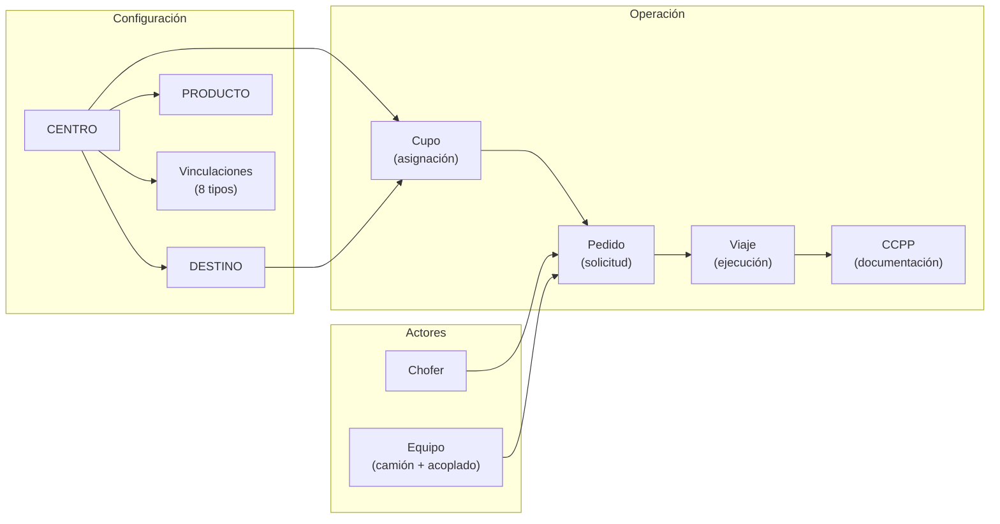

# Diagrama ER Global — Muvinapp

> **Última revisión:** 2026-04-16
> **Fuente:** Interfaces TypeScript en `shared/models/`
> **Nota:** Este diagrama reconstruye relaciones implícitas desde el frontend. El esquema real de la DB del backend puede diferir.

---

## Diagrama principal

```mermaid
erDiagram
    CENTRO {
        int id PK
        string razon_social
        string cuit
        int tipo_turneada
        boolean contrato_requerido
        string linea_whatsapp
        boolean cupos_propios_ferti
        boolean activo
    }

    PERSONA {
        int id PK
        string nombre
        string apellido
        string cuit_cuil
        string email
        string telefono
        int tipo_documento
    }

    PERSONA_ROL {
        int id PK
        int persona_id FK
        int rol_id
        string tipo
    }

    USUARIO {
        int id PK
        int persona_id FK
        string username
        string password_hash
        int rol
        int id_centro FK
        boolean activo
        datetime ultimo_login
    }

    CHOFER {
        int id PK
        int persona_id FK
        string licencia
        datetime vencimiento_licencia
        boolean premium
        int zona_id FK
        string estado
        float score
    }

    CAMION {
        int id PK
        string patente
        int tipo_camion_id FK
        int marca_id FK
        boolean bloqueado
        int tipo_combustible_id
    }

    ACOPLADO {
        int id PK
        string patente
        int tipo_acoplado_id FK
        int marca_id FK
        boolean bloqueado
    }

    EQUIPO {
        int id PK
        int camion_id FK
        int acoplado_id FK
        int transporte_id FK
        boolean bloqueado
    }

    DESTINO {
        int id PK
        string nombre
        int tipo_destino_id FK
        int localidad_id FK
        int zona_id FK
        boolean activo
    }

    PRODUCTO {
        int id PK
        string nombre
        string codigo
        boolean activo
    }

    CUPO {
        int id PK
        int centro_id FK
        int destino_id FK
        int producto_id FK
        date fecha
        int cantidad
        string estado
        int version
    }

    PEDIDO {
        int id PK
        int centro_id FK
        int dador_id FK
        int chofer_id FK
        int equipo_id FK
        int destino_id FK
        int producto_id FK
        int cupo_id FK
        string estado
        datetime fecha_creacion
    }

    VIAJE {
        int id PK
        int pedido_id FK
        int chofer_id FK
        int equipo_id FK
        int destino_id FK
        string estado
        datetime fecha_salida
        datetime fecha_llegada
    }

    CCPP {
        int id PK
        int cabecera_id FK
        int centro_id FK
        string numero
        string tipo
        boolean electronic
    }

    CABECERA {
        int id PK
        int centro_id FK
        int producto_id FK
        date fecha
        string estado
    }

    ZONA {
        int id PK
        string nombre
        int provincia_id FK
    }

    LOCALIDAD {
        int id PK
        string nombre
        int provincia_id FK
    }

    PROVINCIA {
        int id PK
        string nombre
        int pais_id FK
    }

    ORIGEN {
        int id PK
        string nombre
        int localidad_id FK
    }

    RESERVA {
        int id PK
        int centro_id FK
        int pedido_id FK
        string estado
        datetime fecha
    }

    TURNEADA {
        int id PK
        int centro_id FK
        int destino_id FK
        date fecha
        string estado
        int tipo
    }

    %% ===== RELACIONES =====

    CENTRO ||--o{ USUARIO : "tiene"
    CENTRO ||--o{ CUPO : "ofrece"
    CENTRO ||--o{ PEDIDO : "gestiona"
    CENTRO ||--o{ CCPP : "emite"
    CENTRO ||--o{ CABECERA : "genera"
    CENTRO ||--o{ RESERVA : "recibe"
    CENTRO ||--o{ TURNEADA : "configura"

    PERSONA ||--o{ PERSONA_ROL : "tiene"
    PERSONA ||--o| USUARIO : "es"
    PERSONA ||--o| CHOFER : "actúa como"

    CHOFER ||--o{ PEDIDO : "asignado a"
    CHOFER ||--o{ VIAJE : "conduce"
    CHOFER }o--|| ZONA : "pertenece a"

    CAMION ||--o| EQUIPO : "integra"
    ACOPLADO ||--o| EQUIPO : "integra"
    EQUIPO ||--o{ PEDIDO : "transporta"
    EQUIPO ||--o{ VIAJE : "usado en"

    DESTINO ||--o{ CUPO : "recibe"
    DESTINO ||--o{ PEDIDO : "destino de"
    DESTINO ||--o{ VIAJE : "arriba a"
    DESTINO ||--o{ TURNEADA : "turneada para"
    DESTINO }o--|| ZONA : "ubicado en"
    DESTINO }o--|| LOCALIDAD : "localizado en"

    PRODUCTO ||--o{ CUPO : "asignado a"
    PRODUCTO ||--o{ PEDIDO : "transporta"
    PRODUCTO ||--o{ CABECERA : "referenciado en"

    CUPO ||--o{ PEDIDO : "consume"
    PEDIDO ||--o| VIAJE : "genera"
    PEDIDO ||--o| RESERVA : "reservado en"

    CCPP }o--|| CABECERA : "pertenece a"

    ZONA }o--|| PROVINCIA : "dentro de"
    LOCALIDAD }o--|| PROVINCIA : "dentro de"
    ORIGEN }o--|| LOCALIDAD : "ubicado en"
```

---

## Relaciones Centro ↔ Actores (vinculaciones)

```mermaid
erDiagram
    CENTRO ||--o{ CENTRO_CLIENTE : ""
    CENTRO ||--o{ CENTRO_CORREDOR : ""
    CENTRO ||--o{ CENTRO_TRANSPORTE : ""
    CENTRO ||--o{ CENTRO_OPERADOR : ""
    CENTRO ||--o{ CENTRO_ENTREGADOR : ""
    CENTRO ||--o{ CENTRO_INTERMEDIARIO : ""
    CENTRO ||--o{ CENTRO_DESTINATARIO : ""
    CENTRO ||--o{ CENTRO_EMPRESA : ""
    CENTRO ||--o{ CENTRO_PRODUCTO : ""
    CENTRO ||--o{ LISTA_NEGRA : ""

    CENTRO_CLIENTE {
        int id PK
        int centro_id FK
        int persona_id FK
    }

    CENTRO_CORREDOR {
        int id PK
        int centro_id FK
        int persona_id FK
    }

    CENTRO_TRANSPORTE {
        int id PK
        int centro_id FK
        int persona_id FK
    }

    CENTRO_OPERADOR {
        int id PK
        int centro_id FK
        int persona_id FK
    }

    CENTRO_ENTREGADOR {
        int id PK
        int centro_id FK
        int persona_id FK
    }

    CENTRO_INTERMEDIARIO {
        int id PK
        int centro_id FK
        int persona_id FK
    }

    CENTRO_DESTINATARIO {
        int id PK
        int centro_id FK
        int persona_id FK
    }

    CENTRO_EMPRESA {
        int id PK
        int centro_id FK
        int persona_id FK
    }

    CENTRO_PRODUCTO {
        int id PK
        int centro_id FK
        int producto_id FK
    }

    LISTA_NEGRA {
        int id PK
        int centro_id FK
        int persona_id FK
        int motivo_id FK
        datetime fecha
    }
```

---

## Flujo de datos principal

---

## Nomencladores (tablas de lookup)

| Nomenclador | Usado por |
|---|---|
| `TipoCamion` | Camion |
| `TipoAcoplado` | Acoplado |
| `MarcaCamion` | Camion |
| `MarcaAcoplado` | Acoplado |
| `TipoCombustible` | Camion |
| `TipoDestino` | Destino |
| `EstadoViaje` | Viaje |
| `EstadoDescarga` | Descarga |
| `EstadoChofer` | Chofer |
| `DesvioMotivo` | Viaje (desvíos) |
| `RazonRechazo` | Pedido (rechazos) |
| `Estandar` | Producto |
| `Moneda` | Cupo, Pedido |
| `TipoDocumento` | Persona |
| `ListaNegraMotivo` | ListaNegra |

---

## Notas sobre el modelo

> [!warning] Modelo reconstruido desde frontend
> Este diagrama se infiere de las interfaces TypeScript del frontend. El esquema real de la base de datos puede tener:
> - Campos adicionales no expuestos al frontend
> - Tablas intermedias no modeladas como interfaces
> - Restricciones (UNIQUE, CHECK) no visibles desde el código Angular
> - Índices y triggers del lado servidor

> [!info] Patrones de variantes
> Múltiples interfaces para la misma entidad (`Cupo`, `CupoV3`, `CupoDisponible`) indican endpoints que devuelven diferentes proyecciones del mismo registro según el contexto de uso.

---

## Referencias

- [[_indice-entidades]] — Catálogo completo de modelos
- [[_indice-servicios]] — Servicios que producen/consumen estos modelos
- [[centros-endpoints]] — Endpoints de centros y vinculaciones
- [[cupos-endpoints]] — Endpoints de cupos
- [[logistica-endpoints]] — Endpoints de logística
