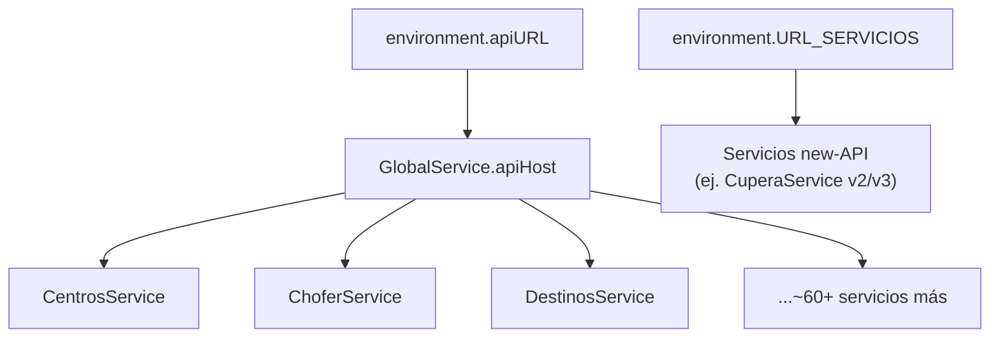
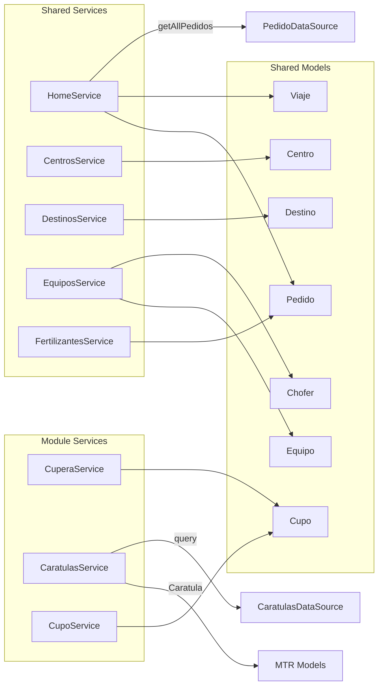

# Índice de Archivos de Datos

> **Proyecto:** Muvinapp (app-panel)
> **Última revisión:** 2026-04-16
> **Total modelos shared:** ~97 | **Servicios shared:** ~70+ | **Datasources:** 3 | **Mappers:** 4+1 base

---

## 1. Modelos de dominio (`shared/models/`)

### Entidades principales

| Archivo | Tipo | Campos clave | Uso principal |
|---|---|---|---|
| `pedido.ts` | `class Pedido` | `id`, `fecha_desde`, `fecha_hasta`, `id_origen`, `id_zona_destino`, `id_cliente`, `id_centro`, `id_destinatario`, `cantidad`, `id_producto` | Entidad central del dominio — un pedido de transporte |
| `viaje.ts` | `class Viaje` | `id`, `id_pedido`, `id_chofer_equipo`, `fecha`, `fecha_cupo`, `carta_porte`, `id_destino`, `id_estado`, `id_entregador`, `nombre_chofer` | Viaje asignado a un pedido |
| `chofer.ts` | `class Chofer` | `id`, `id_rol`, `id_usuario`, `nombre_persona`, `latitud`, `longitud`, `patente`, `id_chofer_equipo`, `celular` | Chofer de camión |
| `camion.ts` | `class Camion` | `id`, `id_marca_camion`, `anno`, `patente`, `id_tipo_camion`, `id_transporte`, `bloqueado`, `carga_peligrosa` | Camión del equipo |
| `acoplado.ts` | `class Acoplado` | `id`, `id_marca_acoplado`, `anno`, `patente`, `id_tipo_acoplado`, `id_transporte`, `bloqueado`, `carga_peligrosa` | Acoplado del equipo |
| `equipo.ts` | `class Equipo` | `id`, `id_camion`, `id_acoplado`, `latitud`, `longitud`, `bloqueado`, `patente_camion`, `patente_acoplado`, `nombre_transportista` | Equipo = camión + acoplado |
| `cupo.ts` | `class Cupo` | `id`, `idCupoTerminal`, `fechaCupo`, `destinatarioCuit`, `cartaPorte`, `numeroCTG`, `estadoCTG`, `id_pedido`, `estado`, `id_producto`, `id_destino` | Cupo de descarga en terminal |
| `ccpp.ts` | `interface Ccpp` | `id`, `cartaPorte`, `fechaCarga`, `fechaVencimiento`, `nombreTitular`, `idCuitTitula`, `nombreRemitente`, `nombreDestinatario`, `nombreDestino`, `nombreTransportista` | Carta de Porte Provisoria |
| `centro.ts` | `class Centro` + `CentroCliente` + `CentroCorredor` | `id`, `id_rol`, `id_usuario`, `nombre_persona`, `cliente_muvin`, `ve_choferes_libres`, `km`, `cargarTotalizadorChofer` | Centro de acopio + vinculaciones |
| `destino.ts` | `class Destino` | `id`, `id_localidad`, `descripcion`, `direccion`, `telefono`, `bloqueado`, `solucion_muvin`, `longitud`, `latitud`, `id_zona_destino`, `id_tipo_destino` | Planta de destino / terminal |
| `producto.ts` | `class Producto` | `id`, `descripcion`, `cupo_obligatorio`, `codigo` | Producto (grano, fertilizante) |

### Tipos de respuesta / paginación

| Archivo | Tipo | Campos | Notas |
|---|---|---|---|
| `response.ts` | `class ResponseLog` | `status`, `data` | Wrapper genérico |
| `response-body.ts` | `class ResponseBody` | `status: number`, `success: boolean`, `data: any` | Wrapper tipado |
| `respuestaHttp.ts` | `class RespuestaHttp` | `success: boolean`, `status: number`, `data: any` | Duplicado de ResponseBody con nombre en español |
| `paged-data.ts` | `class PagedData<T>` | `data: T[]`, `page: Page` | Respuesta paginada genérica |
| `page.ts` | `class Page` | `size`, `totalElements`, `totalPages`, `pageNumber` | Metadatos de página |

> [!warning] Tres wrappers de respuesta HTTP
> `ResponseLog`, `ResponseBody` y `RespuestaHttp` hacen esencialmente lo mismo con nombres distintos. Candidato a consolidación.

### Entidades auxiliares

| Archivo | Tipo | Descripción |
|---|---|---|
| `estado.ts` | `class Estado` | Constantes de estado: `A_Km_de_origen`, `Cargado`, `Conforme`, `Descargado`, `En_destino`, `Esperando`, `Pendiente`, `Rechazado` |
| `estadoViaje.ts` | `class EstadoViaje` | `id`, `descripcion` |
| `estadoDescarga.ts` | `class EstadoDescarga` | `id`, `descripcion` |
| `documento.ts` | `class Documento` | `id`, `descripcion`, `fecha`, `pdf` |
| `roles.ts` | `class Roles` | `id`, `name`, `description` |

### Índice completo de re-exports (`index.ts`)

Los siguientes ~97 archivos se re-exportan desde `shared/models/index.ts`:

Lista completa de modelos (expandir)

`Acoplado` · `Auditoria` · `Boca` · `Busqueda` · `Cabecera` · `Camion` · `CamionesDisponibles` · `Ccpp` · `Centro` · `CentroCliente` · `CentroCorredor` · `Chofer` · `ChoferEquipo` · `ChoferPremium` · `ChoferZona` · `Corredor` · `Cupo` · `CupoVinculado` · `CuposDisponibles` · `Dador` · `DemandaCupo` · `Descarga` · `Destinatario` · `Destino` · `DestinoPlanta` · `Desvio` · `DesvioMotivo` · `Documento` · `Entregador` · `Equipo` · `Estado` · `EstadoDescarga` · `EstadoViaje` · `Estandar` · `Fertilizantes` · `GlobalService` · `HojaRuta` · `HorarioPuerto` · `Inconsistencia` · `Inteligencia` · `ListaNegraMotivo` · `Localidad` · `Magyp*` · `MapaOficina` · `Marcador` · `MonitorComercial` · `MotivoRechazoViaje` · `Notificacion` · `Origen` · `Page` · `PagedData` · `Pais` · `Pedido` · `PedidoDifusion` · `Persona` · `PlayaIntermedia` · `Prepedido` · `Product` · `Producto` · `Promocion` · `Provincia` · `Puerto` · `Ranking` · `ResponseBody` · `ResponseLog` · `RespuestaHttp` · `RetiroCombustible` · `Roles` · `RolesPermissions` · `Seguimiento` · `Siniestro` · `SituacionPuerto` · `Terms` · `TipoAcoplado` · `TipoCamion` · `TipoCombustible` · `TipoDestino` · `Trabajador` · `TransporteChofer` · `User` · `UserLog` · `Viaje` · `ViajeLista` · `ViajeEstadoDescarga` · `Zona` · `ZonaDestino`

---

## 2. Servicios compartidos (`shared/services/`)

### Patrón base

Todos los servicios inyectan `GlobalService` + `HttpClient` y construyen URLs con `this.globalService.apiHost + 'recurso/...'`.

### Servicios de dominio (CRUD de entidades)

| Servicio | Entidad | Endpoints principales |
|---|---|---|
| `AcopladosService` | Acoplado | `acoplado/*` |
| `AdminService` | Admin | ABM admin general |
| `AuditoriasService` | Auditoria | Registros de auditoría |
| `AuthService` | User | Login, BehaviorSubject de menú/usuarios |
| `BocaService` | Boca | Bocas de carga |
| `CamionService` | Camion | `camion/*` |
| `CcppService` | Ccpp | Carta de Porte |
| `CentroProductoService` | CentroProducto | Vinculación centro-producto |
| `CentrosService` | Centro | `centro/*` |
| `ChoferService` | Chofer | `pedido/asignar-*` |
| `CombustibleService` | RetiroCombustible | Combustible |
| `ConsultaService` | Consulta | `consulta/listado` |
| `ConsultasService` | Consulta | Duplicado parcial de ConsultaService |
| `DestinatarioService` | Destinatario | Retorna `RespuestaHttp` |
| `DestinosService` | Destino | `destino/listado` |
| `DesvioMotivoService` | DesvioMotivo | Motivos de desvío |
| `DocumentoService` | Documento | `documento` |
| `EquiposService` | Equipo | `equipo/*` |
| `EstadosChoferService` | EstadoChofer | Estados de chofer |
| `EstandarService` | Estandar | Estándares |
| `FertilizantesService` | Fertilizantes | Reservas/despachos de fertilizantes |
| `HorarioFertilizantesService` | HorarioFertilizante | Bandas horarias fertilizantes |
| `HorarioPuertoService` | HorarioPuerto | Bandas horarias puerto |
| `IntegracionErpService` | — | Integración ERP |
| `ListaNegraMotivoService` | ListaNegraMotivo | Motivos de lista negra |
| `LocalidadService` | Localidad | Localidades |
| `MagypService` | Magyp | Integración MAGyP |
| `MapaCuposService` | — | Cupos en mapa |
| `MapaOficinaService` | MapaOficina | Oficinas en mapa |
| `MarketingService` | — | Marketing/notificaciones |
| `NomencladoresService` | — | Lookups de datos maestros |
| `OfertasService` | — | `oferta-rosporc/*` |
| `OrigenesService` | Origen | Orígenes |
| `PaisService` | Pais | Países |
| `PersonasService` | Persona | Personas |
| `PlayasIntermediasService` | PlayaIntermedia | Playas intermedias |
| `ProductosService` | Producto | `producto` |
| `PromocionesService` | Promocion | Promociones |
| `ProvinciaService` | Provincia | Provincias |
| `RazonRechazoService` | MotivoRechazoViaje | Razones de rechazo |
| `ReportesService` | — | Reportes genéricos |
| `ReservasService` | — | `seguimiento/*` + HomeService |
| `RespuestasService` | — | Respuestas |
| `SendsmsService` | — | Envío de SMS |
| `SituacionPuertoService` | SituacionPuerto | Situación de puerto |
| `TermsService` | Terms | Términos y condiciones |
| `TipoDestinoService` | TipoDestino | Tipos de destino |
| `TrabajadoresService` | Trabajador | Trabajadores |
| `TransporteChoferService` | TransporteChofer | Relación transporte-chofer |
| `UserService` | User | Usuarios (ref. `localhost:3000` dead code) |
| `ZonaChoferesLibresService` | — | Choferes libres por zona |
| `ZonaDestinoService` | ZonaDestino | Zonas de destino |
| `ZonasService` | Zona | `zonas` |

> [!warning] Servicios duplicados
> `ConsultaService` y `ConsultasService` coexisten. Verificar si son complementarios o duplicados.

### Servicios de infraestructura

| Servicio | Tipo | Descripción |
|---|---|---|
| `GlobalService` | Configuración | Expone `apiHost` de `environment.apiURL` a todos los servicios |
| `WebsocketService` | Tiempo real | Socket.io vía `ngx-socket-io` + `CentrosService` para eventos en vivo |
| `LayoutService` | UI | Estado del layout (sidebar abierto/cerrado, tema) |
| `NavigationService` | UI | Ítems de menú lateral |
| `ThemeService` | UI | Temas visuales |
| `RoutePartsService` | UI | Extracción de breadcrumbs desde rutas |
| `FileUploadService` | Utilidad | Subida de archivos |
| `ExelService` | Utilidad | Exportación a Excel (nombre con typo) |
| `ManualService` | Utilidad | Manuales |
| `LandingPageService` | Utilidad | Landing page |
| `MessageService` | Utilidad | Mensajería interna |
| `OperadorChatService` | Utilidad | Chat del operador |
| `ParametroChatService` | Utilidad | Parámetros de chat |
| `MatbatService` | Estado | BehaviorSubject + localStorage para parámetro MATBA |
| `CookiesService` | Utilidad | Manejo de cookies (**no exportado en index**) |

### Servicios de diálogo (UI modals)

| Servicio | Directorio | Tipo de modal |
|---|---|---|
| `AppAlertService` | `services/app-alert/` | Alerta informativa |
| `AppAtencionService` | `services/app-atencion/` | Atención / advertencia |
| `AppConfirmService` | `services/app-confirm/` | Confirmación Sí/No |
| `AppErrorService` | `services/app-error/` | Error |
| `AppLoaderService` | `services/app-loader/` | Loader / spinner overlay |

### Resolvers

| Servicio | Módulo destino | Entidad resuelta |
|---|---|---|
| `PedidoResolverService` | Home (`asignarViaje/:id`) | `Pedido` |
| `DestinosResolverService` | Destino (`turnos`, `gestion-plantas`) | `Destino[]` |

### Servicios NO exportados en `index.ts`

| Servicio | Razón probable |
|---|---|
| `CookiesService` | Uso local/puntual |
| `AuditoriaCentroService` | Servicio de centro específico |
| `DocumentacionService` | Servicio de documentación puntual |
| `ErrorlogCentroService` | Exportado aparte |

---

## 3. Servicios específicos de módulo

### Cupera (`views/cupera/services/`)

| Servicio | Patrón API | Notas |
|---|---|---|
| `CuperaService` | `apiHost + 'v3/cupo/...'` y `'v2/cupos/...'` | Mezcla dos versiones de API. Usa `GlobalService` |

### MTR (`views/mtr/services/`)

| Servicio | Patrón API | Notas |
|---|---|---|
| `CaratulasService` | `apiHost + 'caratula/...'` | Queries paginadas de carátulas de MTR |

### Cupo (`shared/components/cupo/`)

| Servicio | Patrón API | Notas |
|---|---|---|
| `CupoService` | `apiHost + '...'` | BehaviorSubject para notificaciones de cupo |
| `SolicitudesService` | *(sin HTTP)* | BehaviorSubject<boolean> toggle simple |

### Home (`shared/components/home/`)

| Servicio | Patrón API | Notas |
|---|---|---|
| `HomeService` | `apiHost + 'pedido/...'` | CRUD core de pedidos. Role-aware: `rol == '1'` → admin paths |

### Reports (`views/reports/`)

| Servicio | Librería | Notas |
|---|---|---|
| `ReportService` | ExcelJS + `environment` | Genera reportes Excel (CUPO, PROFERTIL, SEGUIMIENTO). No es injectable a nivel root |

---

## 4. Modelos específicos de módulo

### Cupera (`views/cupera/models/`)

| Archivo | Tipo | Campos clave |
|---|---|---|
| `filtro.ts` | `class Filtro` | `fecha`, `idProductos[]`, `idZonasCupo[]`, `cuitDestinatario`, `totales`, `contrato`, `cosecha[]` |
| `estados.ts` | `interface Estados` | `id`, `descripcion`, `color` |
| `config-centro.ts` | `interface ConfigCentro` | `micuit`, `soyCorredor`, `solicitaCupos`, `formularioCupera`, `posicionCentro` |
| `producto-centro.ts` | `interface ProductosCentro` | `id`, `descripcion`, `codigo`, `tipo_producto` |
| `response-permisos.ts` | `class ResponsePermisosUsuarios` | `id`, `name`, `service`, `type` |
| `centro-sin-email.ts` | Configuración | Centros sin email configurado |
| `dia-semana.ts` | Enum/constante | Días de la semana |
| `item-tabs.ts` | UI config | Configuración de tabs |
| `items.ts` | UI config | Ítems de menú |
| `options-multi.ts` | UI config | Opciones multiselect |
| `screen.ts` | UI config | Configuración de pantalla |
| `estado-anulacion.ts` | Enum/constante | Estados de anulación |

### MTR (`views/mtr/model/`)

| Archivo | Tipo | Campos clave |
|---|---|---|
| `caratulas.ts` | `interface Caratula` + `Cupo` + `FiltroCaratula` + `ResponseCaratula` | `id`, `caratula`, `mesEntrega`, `cuitComprador`, `razonSocialComprador`, `kilosIniciales`, `cupos[]` |

---

## 5. Datasources (`DataSource<T>` de CDK)

| Archivo | Clase | Entidad | Fuente de datos |
|---|---|---|---|
| `shared/services/pedido.datasource.ts` | `PedidoDataSource` | `Pedido` | `HomeService.getAllPedidos()` |
| `shared/services/provincia.datasource.ts` | `ProvinciasDataSource` | `Provincia` | `HomeService.getProvincias()` |
| `views/mtr/services/caratulas.datasource.ts` | `CaratulasDataSource` | `Caratula` | `CaratulasService`. Contiene constantes de estado: `SOLICITUD_EXPIRADA`, `APROBADA`, etc. |

Patrón compartido: `BehaviorSubject` + flag de loading + `connect()`/`disconnect()`.

---

## 6. Mappers (`shared/maps/`)

| Archivo | Clase | Transformación |
|---|---|---|
| `changeDataCamion.map.ts` | `ChangeDataCamionMap` (static) | Array raw camión/chofer → objetos planos `{id, id_usuario, celular, cuit_persona, patente, patente_acoplado}` |
| `changeDataFilter.map.ts` | `ChangeDataFilterMap` extends `MapperService` | Form UI → `FiltroReserva` (fechas, campos) |
| `InsertLoteReserva.map.ts` | `InsertLoteReservaMap` (static) | Payload masivo → array `{id_proveedor, id_origen, id_destino, id_stock, ...}` con viaje opcional |

**Base abstracta:**
| Archivo | Clase | API |
|---|---|---|
| `shared/services/mapper.service.ts` | `MapperService<S,T>` (abstract) | `transform(source: S): T` + overload para arrays |
| `shared/services/entity-mapper.service.ts` | `EntityMapperService` extends `MapperService` | Mapeo bidireccional de entidades para lectura/escritura Excel (cupos, productos, detalles) |

---

## 7. Base de datos in-memory (`shared/inmemory-db/`)

| Archivo | Clase | Registrado en API | Colecciones |
|---|---|---|---|
| `inmemory-db.service.ts` | `InMemoryDataService` | — | Registra solo `ChatDB` |
| `chat-db.ts` | `ChatDB` | **Sí** | `contacts`, `chat-collections`, `chat-user` |
| `reservas-db.ts` | `ReservasDB` | No | Mock de reservas de fertilizantes con `reservas[].productos[]` |
| `segimiento.ts` | `SeguimientoDB` | No | Mock de seguimiento (fecha, despacho, consignatario, chofer, patente) |
| `users.ts` | `UserDB` | No | Mock de perfiles de usuario |
| `calendarEvents.ts` | `CalendarEventDB` | No | Eventos de calendario con color |
| `countries.ts` | `CountryDB` | No | Lista de países |
| `inbox.ts` | `InboxDB` | No | Mock de inbox de email |
| `products.ts` | `ProductDB` | No | Mock de productos e-commerce (no relacionado al dominio) |

> [!warning] 7 de 8 DBs mock no están registradas
> Solo `ChatDB` se inyecta en `InMemoryDataService`. El resto (`ReservasDB`, `SeguimientoDB`, etc.) se importa directamente en componentes como datos de mockup. `ProductDB` e `InboxDB` son restos del template Egret original.

---

## 8. Diagrama de relación modelo-servicio-módulo

---

## 9. Resumen cuantitativo

| Categoría | Cantidad | Ubicación |
|---|:---:|---|
| Modelos shared (exportados) | ~97 | `shared/models/` |
| Servicios shared (exportados) | ~60 | `shared/services/` |
| Servicios shared (no exportados) | ~5 | `shared/services/` |
| Servicios de módulo | 6 | Cupera, MTR, Cupo, Home, Reports |
| Modelos de módulo | ~14 | Cupera (12), MTR (1) |
| Servicios de diálogo | 5 | `shared/services/app-*` |
| Datasources (CDK) | 3 | shared/services, mtr/services |
| Mappers | 3 + 1 base + 1 entity | `shared/maps/`, `shared/services/` |
| In-memory DBs | 8 (1 activa, 7 huérfanas) | `shared/inmemory-db/` |
| Resolvers | 2 | `shared/services/` |

---

## Referencias

- [[functional-classification]] — Clasificación funcional de módulos
- [[reports-and-wizards-inventory]] — Inventario de reportes y exportaciones
- [[stack-tecnologico]] — Stack tecnológico
- [[tree-estructura-archivos]] — Estructura de archivos
- [[arquitectura-alto-nivel]] — Arquitectura del sistema
