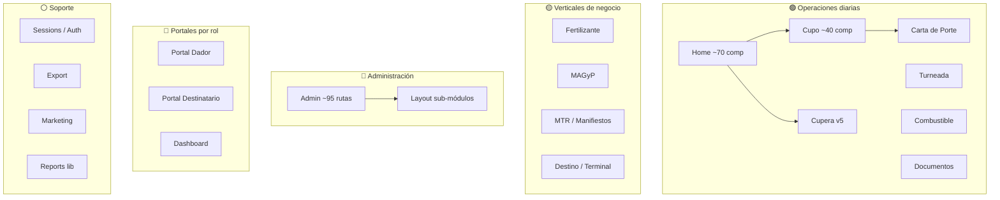
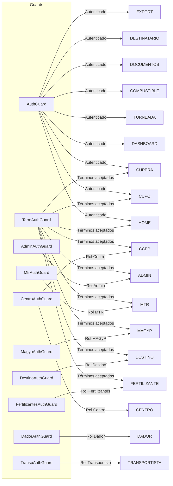

# Clasificación Funcional de Módulos

> **Proyecto:** Muvinapp (app-panel)
> **Última revisión:** 2026-04-16
> **Total de módulos lazy-loaded:** 22 (+ 5 sub-módulos en `views/layout/`)
> **Total de rutas activas:** ~155

---

## Taxonomía funcional

---

## Módulos por categoría

### 🟢 Operaciones diarias

Módulos que usa el operador de mesa central en su jornada habitual.

| Módulo | Ruta base | Guard | Rutas | Componentes | Descripción |
|---|---|---|---|---|---|
| **Home** | `/home` | `TermAuthGuard` | 19 | ~70+ | Hub principal: crear pedidos, asignar viajes, seguimiento, carga/descarga, desvíos, mapa, WhatsApp, mesa central |
| **Cupo** | `/cupo` | `AuthGuard` + `TermAuthGuard` | 7 | ~40+ | Gestión completa de cupos: cuponera, asignación, panel consolidado, mapa de cupos, contratos |
| **Cupera** | `/cupera` | `AuthGuard` + `TermAuthGuard` | 1 | ~10 | Cupera v5: vista avanzada de cupos con tabs, asignación, seguimiento, contratos |
| **CCPP** | `/ccpp` | `CentroAuthGuard` + `TermAuthGuard` | 1 | ~8 | Carta de Porte Provisoria: cabecera, consulta, auditoría, inconsistencias |
| **Turneada** | `/turneada` | `AuthGuard` + `TermAuthGuard` | 4 | ~6 | Control de turnos: turneada, lista turneado, confirmar arribo, control |
| **Combustible** | `/combustible` | `AuthGuard` + `TermAuthGuard` | 1 | ~2 | Órdenes de retiro de combustible |
| **Documentos** | `/documentacion` | `AuthGuard` + `TermAuthGuard` | 1 | ~4 | Documentación de choferes: subir, mostrar, listar |

### 🟡 Verticales de negocio

Módulos para dominios específicos del negocio con su propio guard de rol.

| Módulo | Ruta base | Guard | Rutas | Componentes | Descripción |
|---|---|---|---|---|---|
| **Fertilizante** | `/fertilizante` | `FertilizantesAuthGuard` + `TermAuthGuard` | 4 | ~15 | Gestión de fertilizantes: orígenes, gestión, bandas horarias, comercial (reservas, seguimiento), panel de reservas |
| **MAGyP** | `/magyp` | `MagypAuthGuard` + `TermAuthGuard` | 4 | ~8 | Integración con MAGyP: gestión (contacto, dashboard, detalle, seguimiento), administración (autoridades, cadenas, WhatsApp) |
| **MTR** | `/mtr` | `MtrAuthGuard` + `TermAuthGuard` | 3 | ~4 | Manifiesto de Transporte: carátulas, dashboard MTR, variables de mercado |
| **Destino** | `/destino` | `DestinoAuthGuard` + `TermAuthGuard` | 4 | ~12 | Panel de planta destino/terminal: plantas (clearing, pendientes, posición), turnos (buscar, config-puerto, disponibles, resumen), bandas horarias |

### 🔴 Administración

Módulos de configuración y ABM de entidades.

| Módulo | Ruta base | Guard | Rutas | Componentes | Descripción |
|---|---|---|---|---|---|
| **Admin** | `/admin` | `AdminAuthGuard` | 95 | ~87+ | Mega-módulo: ABM de todas las entidades, vinculaciones N:M, mapas, reportes, configuración, WhatsApp, auditoría, logs |
| **Admin (como Centro)** | `/centro` | `CentroAuthGuard` | (reutiliza Admin) | — | Mismo AdminModule con guard de centro — ven un subconjunto de rutas según permisos del backend |
| **Layout sub-módulos** | `/admin/camiones/*`, `/admin/acoplados/*` | `AdminAuthGuard` | 4 | 4 | ABM de marca/tipo de camión y acoplado. Modules separados por razones técnicas (lazy-load parcial) |

> [!warning] Admin es un God Module
> Con 95 rutas y ~87 carpetas de componentes, Admin concentra toda la administración. En una refactorización futura debería dividirse en sub-módulos por dominio: Admin-Flota, Admin-Personas, Admin-Centros, Admin-Mapa, Admin-Configuración, Admin-Reportes.

### 🔵 Portales por rol

Módulos simplificados para roles específicos (dador, destinatario).

| Módulo | Ruta base | Guard | Rutas | Componentes | Descripción |
|---|---|---|---|---|---|
| **Dador** | `/dador` | `DadorAuthGuard` | 1 | ~2 | Vista del dador de carga: "Mis centros" |
| **Destinatario** | `/destinatario` | `AuthGuard` | 1 | ~2 | Panel del destinatario |
| **Dashboard** | `/dashboard` | `AuthGuard` + `TermAuthGuard` | 1 | 1 | Panel principal con gráficos |

### ⚪ Soporte y utilidades

Módulos auxiliares no pertenecientes a un flujo operativo principal.

| Módulo | Ruta base | Guard | Rutas | Componentes | Descripción |
|---|---|---|---|---|---|
| **Sessions** | `/sessions` | — | 6 | 6 | Autenticación: login, registro, forgot password, lockscreen, error, 404 |
| **Export** | `/export/*` | `AuthGuard` + `TermAuthGuard` | 2 (directas) | 2 | Exportación de cupos/seguimiento. Usa `BroadcastChannel` para pasar filtros a ventana nueva |
| **Marketing** | `/marketing` | `AuthGuard` + `TermAuthGuard` | 2 | 2 | Configuración y notificaciones manuales |
| **Reports** | (no routed) | — | 0 | 0 | Librería de generación de Excel (ExcelJS). No es un módulo Angular routed; es importado como servicio |

---

## Mapa de guards y roles

> [!info] Guard de doble capa
> La mayoría de módulos aplica `TermAuthGuard` (verificar T&C aceptados) **más** un guard de rol. `TermAuthGuard` opera como guard global post-login; el guard de rol decide qué módulo se muestra.

---

## Rutas por módulo — resumen cuantitativo

| Módulo | Rutas | Guards propios (child) | Resolvers |
|---|:---:|---|---|
| Admin | 95 | Ninguno (guard en parent) | Ninguno |
| Home | 19 | Ninguno | `PedidoResolverService` en `asignarViaje/:id` |
| Cupo | 7 | Ninguno | Ninguno |
| Sessions | 6 | Ninguno | Ninguno |
| Destino | 4 | `DestinoAuthGuard` en cada child | `DestinosResolverService` en `turnos` y `gestion-plantas` |
| Fertilizante | 4 | Ninguno | Ninguno |
| MAGyP | 4 | `MagypAuthGuard` en cada child | Ninguno |
| Turneada | 4 | Ninguno | Ninguno |
| MTR | 3 | `MtrAuthGuard` en cada child | Ninguno |
| Marketing | 2 | Ninguno | Ninguno |
| Export | 2 | Ninguno | Ninguno |
| CCPP | 1 | `CentroAuthGuard` | Ninguno |
| Cupera | 1 | Ninguno | Ninguno |
| Dador | 1 | Ninguno | Ninguno |
| Destinatario | 1 | Ninguno | Ninguno |
| Dashboard | 1 | Ninguno | Ninguno |
| Combustible | 1 | Ninguno | Ninguno |
| Documentos | 1 | Ninguno | Ninguno |
| Layout (marca-camion) | 1 | Ninguno | Ninguno |
| Layout (marca-acoplado) | 1 | Ninguno | Ninguno |
| Layout (tipo-camion) | 1 | Ninguno | Ninguno |
| Layout (tipo-acoplado) | 1 | Ninguno | Ninguno |
| **Total** | **~155** | | |

---

## Módulos excluidos de documentación

Por decisión del usuario, los siguientes módulos NO se documentan en profundidad:

| Módulo | Razón |
|---|---|
| `views/others/` | Módulo vacío (solo `AppBlankComponent`) |
| `views/politica-de-privacidad/` | Contenido estático legal |
| `views/terminos-y-condiciones/` | Contenido estático legal |
| `views/mf-components/` | Micro-frontend wrapper (componente de info login) |

---

## Referencias

- [[tree-estructura-archivos]] — Estructura de archivos completa
- [[stack-tecnologico]] — Dependencias y riesgo
- [[arquitectura-alto-nivel]] — Arquitectura del sistema
- [[reports-and-wizards-inventory]] — Inventario de reportes y wizards
