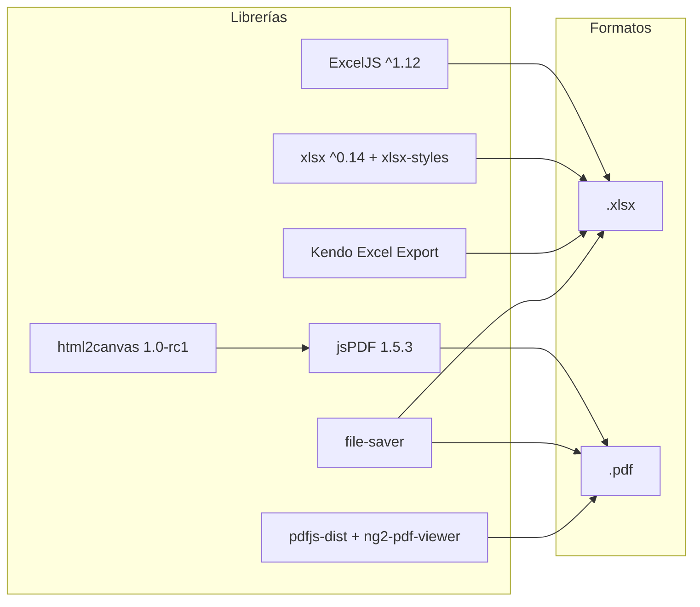

# Inventario de Reportes, Wizards y Exportaciones

> **Proyecto:** Muvinapp (app-panel)
> **Última revisión:** 2026-04-16

---

## 1. Reportes

### Reportes en Admin (`views/admin/`)

| ID | Nombre | Ruta | Componente | Tipo | Datos |
|---|---|---|---|---|---|
| R-01 | **Reporte de Centros** | `/admin/reportes/centro` | `ReportCentrosComponent` | Tabla + filtros | Métricas por centro de acopio |
| R-02 | **Reporte de Turneadas** | `/admin/reporte-turneadas` | `ReporteTurneadasComponent` | Tabla + filtros | Historial de turneadas por centro/fecha |
| R-03 | **Estadísticas** | `/admin/estadistica` | `EstadisticaComponent` | Gráficos (Chart.js) + tabla | Estadísticas de pedidos, viajes, choferes |
| R-04 | **Rankings** | `/admin/rankings` | `RankingsComponent` | Tabla ordenada | Rankings de choferes (desviados, rechazados, mejor valorados) |
| R-05 | **Auditoría global** | `/admin/auditoria-interna` | `AuditoriaMenuComponent` | Tabla paginada | Auditoría de acciones de usuarios |
| R-06 | **Error log** | `/admin/error-interno` | `ErrorLogMenuComponent` | Tabla paginada | Log de errores del sistema por centro |
| R-07 | **Mostrar logs** | `/admin/mostrar-logs` | `MostrarLogsComponent` | Tabla + detalle | Logs detallados del sistema |

### Reportes en módulos verticales

| ID | Nombre | Módulo | Componente | Tipo | Datos |
|---|---|---|---|---|---|
| R-08 | **Dashboard MTR** | MTR | `DashboardMtrComponent` | Panel + gráficos | Variables de mercado, carátulas de manifiestos |
| R-09 | **Variables de mercado** | MTR | `VarMercadoComponent` | Tabla | Variables de mercado de transporte |
| R-10 | **Dashboard MAGyP** | MAGyP | `DashboardComponent` (dentro de gestión) | Panel | Dashboard de interacción con MAGyP |
| R-11 | **Seguimiento Fertilizantes** | Fertilizante | `SeguimientoComponent` | Tabla + filtros | Seguimiento de reservas de fertilizantes |
| R-12 | **Panel reservas Fertilizantes** | Fertilizante | `PanelReservasComponent` | Panel con tabs | Capacidad terminal, detalle cupos, detalle reservas |
| R-13 | **Panel destino** | Destino | `PanelComponent` | Panel | Estado general de planta/terminal |
| R-14 | **Posición de plantas** | Destino | `PosicionComponent` (dentro de plantas) | Tabla | Posición actual de plantas de destino |

### Librería de reportes (`views/reports/`)

> [!info] No es un módulo routed
> `views/reports/` es una librería de generación de Excel, no un módulo con pantallas propias. Es importado como servicio por otros componentes.

| ID | Nombre | Archivo | Formato | Descripción |
|---|---|---|---|---|
| R-LIB-01 | **Reporte CUPO** | `service.ts` | Excel (ExcelJS) | Exportación de datos de cupos con formato |
| R-LIB-02 | **Reporte PROFERTIL** | `service.ts` | Excel (ExcelJS) | Exportación de datos de fertilizantes Profertil |
| R-LIB-03 | **Reporte SEGUIMIENTO** | `service.ts` | Excel (ExcelJS) | Exportación de seguimiento de viajes |

Archivos de soporte:
- `configurations/` — Configuraciones de columnas por tipo de reporte
- `constants/` — Constantes (headers, estilos)
- `functions/` — Funciones helper de formato
- `adapter.ts` — Adaptador de datos para ExcelJS
- `types.ts` — Tipos TypeScript para reportes

---

## 2. Exportaciones

### Exportaciones a Excel

| ID | Nombre | Ubicación | Librería | Trigger | Formato |
|---|---|---|---|---|---|
| E-01 | **Export solicitudes de cupos** | `views/export/export-solicitudes-cupos/` | ExcelJS + file-saver | Ventana nueva vía `BroadcastChannel("exportando-excel")` | `.xlsx` |
| E-02 | **Loader export cupos** | `views/export/loaderExportCupos/` | — | Componente loader que recibe filtros vía `BroadcastChannel` y lanza E-01 | Spinner + descarga |
| E-03 | **Servicio Excel genérico** | `shared/services/exel.service.ts` | ExcelJS / xlsx | Importado por múltiples componentes | `.xlsx` |
| E-04 | **Entity Mapper Excel** | `shared/services/entity-mapper.service.ts` | — | Transforma entidades para lectura/escritura Excel (cupos, productos) | Mapeo bidireccional |
| E-05 | **Kendo Excel Export** | Componentes con `GridModule` | `@progress/kendo-angular-excel-export` | Botón en grids Kendo | `.xlsx` |
| E-06 | **Carga cupos desde Excel** | `shared/components/home/carga-cupos-excel/` | xlsx / xlsx-styles | Upload + parse | `.xlsx` input |

> [!info] Patrón BroadcastChannel
> Las exportaciones pesadas de cupos (`E-01`, `E-02`) usan un patrón no convencional: el grid de seguimiento abre una ventana nueva y le envía los filtros vía `BroadcastChannel("exportando-excel")`. La ventana nueva renderiza el loader, recibe los filtros, ejecuta la query y descarga el Excel.

### Exportaciones a PDF

| ID | Nombre | Ubicación | Librería | Descripción |
|---|---|---|---|---|
| E-07 | **Generación PDF genérica** | Componentes varios | jsPDF (1.5.3) + html2canvas | Generación de PDF desde HTML (facturas, reportes visuales) |
| E-08 | **Visor de PDF** | Componentes con `ng2-pdf-viewer` | pdfjs-dist | Visualización inline de PDFs existentes |

---

## 3. Operaciones masivas (Bulk)

| ID | Nombre | Ruta | Componente | Input | Descripción |
|---|---|---|---|---|---|
| B-01 | **Bajada masiva** | `/admin/bajada-masiva` o `/bajada-masiva` | `BajadaMasivaComponent` | Excel / CSV | Bajada masiva de datos (entidades múltiples) |
| B-02 | **Empresas masivas** | `/admin/empresas` | `EmpresasMasivasComponent` | Excel | Carga masiva de empresas |
| B-03 | **Carga masiva de pedidos** | `/home/carga-masiva` | `CargaMasivaComponent` | Excel / formulario | Alta masiva de pedidos de transporte |
| B-04 | **Carga cupos desde Excel** | Dentro de Home | `CargaCuposExcelComponent` | Excel (`.xlsx`) | Importación de cupos desde planilla Excel |
| B-05 | **Nuevos proveedores** | `/admin/nuevos-proveedores` o `/nuevos-proveedores` | `NuevosProveedoresComponent` | Lista / formulario | Alta masiva de proveedores |
| B-06 | **Asignar empresa** | `/admin/asignar-empresa` | `AsignarEmpresaComponent` | Selección múltiple | Asignación masiva de empresa a entidades |

---

## 4. Wizards / Formularios multi-paso

> [!info] Sin steppers detectados
> No se encontraron componentes con `MatStepper`, `CdkStepper`, ni patrones de wizard multi-paso. Los formularios complejos (ej. `add-pedido`) son formularios de una sola pantalla con múltiples secciones desplegables, no wizards secuenciales.

| ID | Nombre | Ubicación | Patrón | Secciones |
|---|---|---|---|---|
| W-01 | **Alta de pedido** | `home/add-pedido/` | Formulario expandible (no stepper) | Origen, destino, producto, cantidades, fechas, condiciones |
| W-02 | **Alta de pedido corto** | `home/add-pedido-corto/` | Formulario simplificado | Subconjunto del pedido completo |
| W-03 | **Alta de pedido masivo** | `home/add-pedido-masivo/` | Formulario + Excel upload | Alta masiva vía formulario o importación |
| W-04 | **Confección CCPP** | `cupo/confeccion-ccpp/` | Formulario multi-sección | Datos de carta de porte provisoria |
| W-05 | **Cabecera CCPP** | `ccpp/cabecera/add/` | Formulario | Alta de cabecera de carta de porte |

---

## 5. Matriz de tecnología de exportación

> [!warning] Duplicación de librerías Excel
> Hay **tres** librerías para generar Excel: ExcelJS, xlsx/xlsx-styles, y Kendo Excel Export. Esto genera confusión sobre cuál usar. Idealmente se consolidaría en una sola. Ver [[deuda-tecnica]].

---

## 6. Resumen cuantitativo

| Categoría | Cantidad |
|---|---|
| Reportes con pantalla propia | 14 |
| Reportes de librería (sin pantalla) | 3 |
| Exportaciones a Excel | 6 |
| Exportaciones a PDF | 2 |
| Operaciones masivas | 6 |
| Wizards / multi-paso | 0 (5 formularios complejos) |

---

## Referencias

- [[functional-classification]] — Clasificación funcional de módulos
- [[tree-estructura-archivos]] — Estructura de archivos
- [[stack-tecnologico]] — Stack tecnológico (librerías de exportación)
- [[data-files-index]] — Índice de archivos de datos
