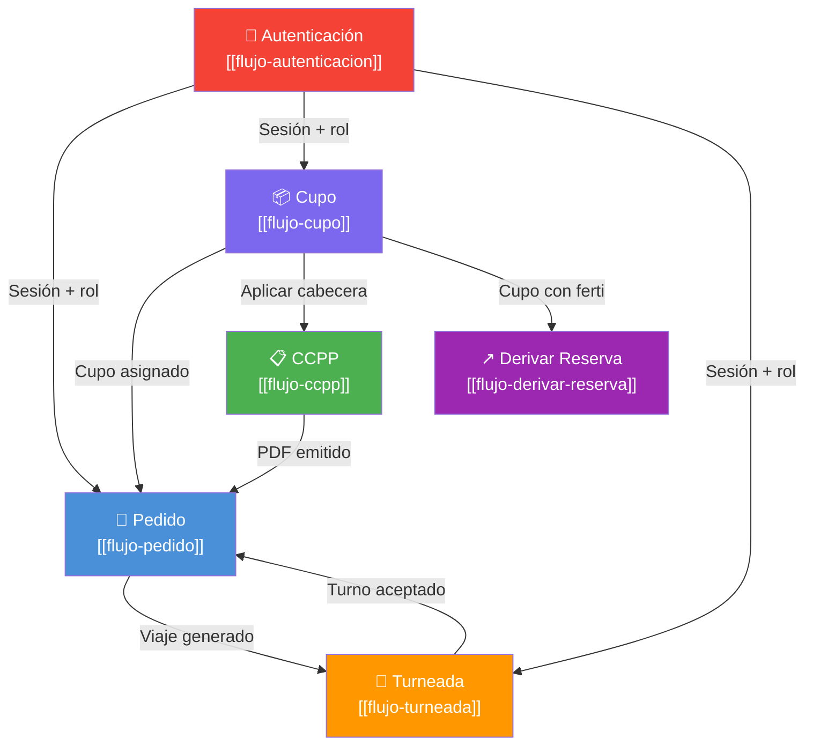

# Índice de Flujos Transversales

> **Última revisión:** 2026-04-16
> **Total de flujos documentados:** 6
> **Nota:** Flujos end-to-end que atraviesan múltiples módulos del sistema

---

## Propósito

Los flujos transversales describen procesos de negocio que cruzan las fronteras de un solo módulo. Son la mejor forma de entender cómo interactúan las distintas partes del sistema para cumplir un objetivo de negocio completo.

---

## Flujos documentados

| # | Flujo | Módulos involucrados | Criticidad | Detalle |
|---|---|---|---|---|
| 1 | Autenticación y bootstrap de sesión | Sessions, Admin, todos | 🔴 Alta | [[flujo-autenticacion]] |
| 2 | Ciclo de vida del pedido (order-to-delivery) | Admin, Cupo, Destino | 🔴 Alta | [[flujo-pedido]] |
| 3 | Asignación de cupos | Cupo, Cupera, CCPP, Admin | 🔴 Alta | [[flujo-cupo]] |
| 4 | Turneada (scheduling) | Admin, Destino, Fertilizante | 🟡 Media | [[flujo-turneada]] |
| 5 | Carta de Porte (CCPP) | CCPP, Cupera, Cupo | 🔴 Alta | [[flujo-ccpp]] |
| 6 | Derivación de reservas | Fertilizante (SharedModule) | 🟡 Media | [[flujo-derivar-reserva]] |

---

## Mapa de interacciones entre flujos

---

## Convenciones de los diagramas

| Tipo de diagrama | Cuándo se usa |
|---|---|
| `sequenceDiagram` | Interacciones temporales entre componentes y backend |
| `flowchart TD` | Flujo principal con decisiones |
| `stateDiagram-v2` | Ciclo de vida de una entidad |

---

## Referencias

- [[_indice-servicios]] — Índice de servicios backend
- [[_indice-modulos]] — Índice de módulos
- [[_indice-entidades]] — Modelo de datos
- [[arquitectura-alto-nivel]] — Arquitectura del sistema
