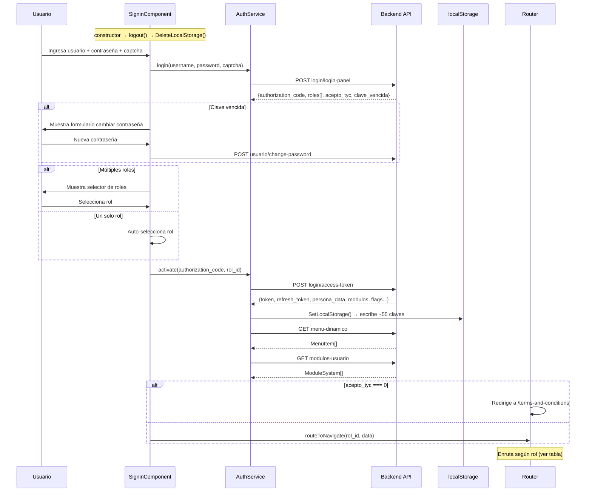
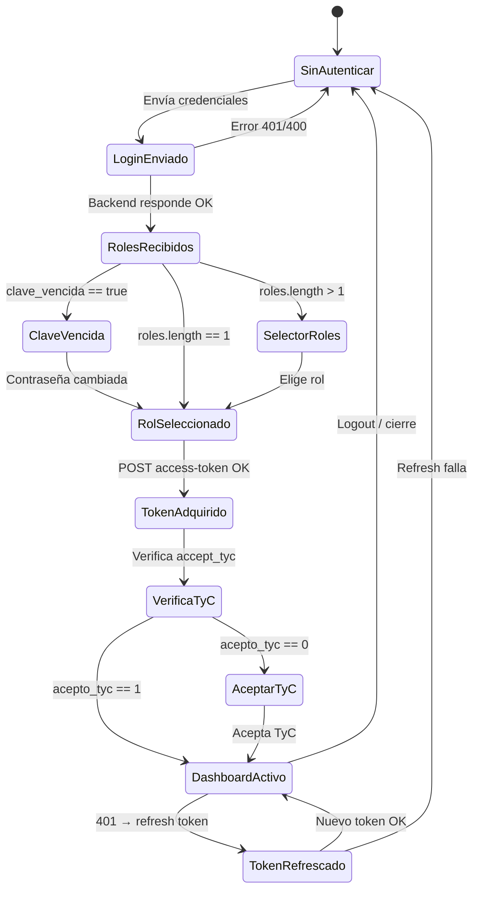
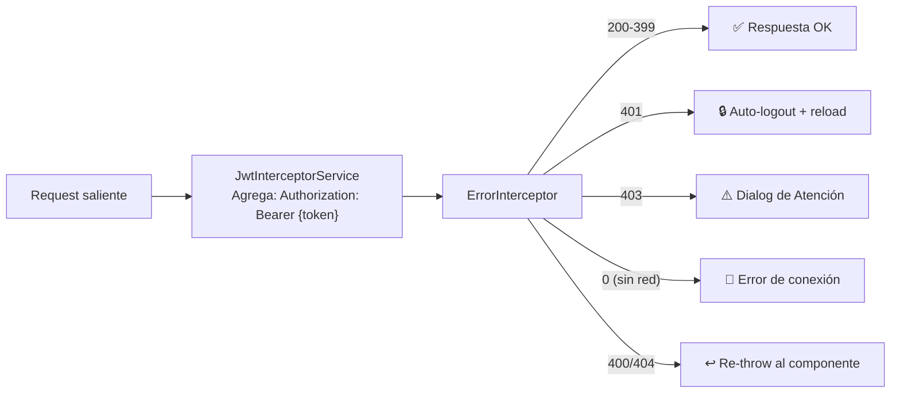

# Flujo: Autenticación y Bootstrap de Sesión

> **Criticidad:** 🔴 Alta
> **Módulos:** Sessions, todos (prerequisito universal)
> **Tipo:** Flujo de inicio de sesión con routing basado en rol
> **Punto de entrada UI:** `/sessions/signin`

---

## Descripción funcional

Todo acceso al panel comienza en `SigninComponent`. El usuario ingresa credenciales + captcha. El backend devuelve roles disponibles; si hay más de uno, se muestra un selector. Tras elegir el rol, se obtiene el JWT y se almacenan ~55 claves en localStorage. El sistema enruta automáticamente al dashboard correspondiente según el rol.

---

## Componentes y servicios involucrados

| Rol | Archivo |
|---|---|
| Login UI | `src/app/views/sessions/signin/signin.component.ts` |
| Auth Service | `src/app/shared/services/auth.service.ts` |
| JWT Interceptor | `src/app/shared/helpers/jwt-interceptor.service.ts` |
| Error Interceptor | `src/app/shared/helpers/error.interceptor.ts` |
| Route resolver | `src/app/views/sessions/signin/functions/route-to-navigate.ts` |
| Set localStorage | `src/app/shared/services/utils/set-local-storage.ts` |
| Delete localStorage | `src/app/shared/services/utils/delete-local-storage.ts` |
| Auth Guard | `src/app/shared/services/auth/auth.guard.ts` |
| App root | `src/app/app.component.ts` |

---

## Flujo principal

---

## Routing post-login por rol

| Rol ID | Tipo | Ruta destino |
|---|---|---|
| 1 | SuperAdmin | `/admin/dashboard` |
| 3 | Centro | `/cupo/cupera-panel` o `/cupo/panel-consolidado` |
| 4 | Transportista | `/admin/logistica` |
| 5 | Destino | `/destino/turnos` |
| 7 | Dador | `/dador/dashboard` |
| 12 | Admin BCR | `/admin/dashboard` |
| 14 | MAGyP | `/magyp/gestion/dashboard` |
| 15 | Fertilizante | `/fertilizante/dashboard` |
| Otros | — | `/admin/dashboard` (fallback) |

---

## Ciclo de vida de la sesión

---

## Endpoints involucrados

| Paso | Verbo | Ruta | Payload resumido | Respuesta resumida |
|---|---|---|---|---|
| 1 | POST | `login/login-panel` | `{username, password, captcha}` | `{authorization_code, roles[], acepto_tyc, clave_vencida}` |
| 2 | POST | `login/access-token` | `{authorization_code, rol_id}` | `{token, refresh_token, persona_data, flags...}` |
| 3 | GET | `menu-dinamico` | — | `MenuItem[]` |
| 4 | GET | `modulos-usuario` | — | `ModuleSystem[]` |
| 5 | POST | `login/logout` | `{token, refresh_token}` | `{ok}` |
| — | POST | `usuario/change-password` | `{old, new}` | `{ok}` |

---

## localStorage — Claves de sesión (~55)

> [!warning] Superficie de ataque
> La sesión vive completamente en localStorage. Un ataque XSS puede leer todas las claves de sesión.

Claves principales:

| Clave | Uso |
|---|---|
| `token` | JWT access token |
| `refresh_token` | Token de refresco |
| `currentUser` | Datos de usuario (JSON) |
| `expires_at` | Expiración del token |
| `rol` | ID del rol activo |
| `id_centro` | Centro activo |
| `tipo_turneada` | Tipo de turneada (0/1/2) |
| `usaCupera` | Flag cupera (0/5) |
| `contratoRequerido` | Si requiere contrato |
| `cupos_propios_ferti` | Flag cupos propios fertilizante |
| `linea_whats_app` | Línea WhatsApp del centro |
| `accept_tyc` | Si aceptó TyC |
| ...más ~40 flags | Configuración persona/centro |

---

## Interceptores HTTP

---

## Riesgos de seguridad

| # | Sev. | Hallazgo |
|---|---|---|
| 1 | 🔴 | **Tokens en localStorage**: vulnerable a XSS |
| 2 | 🔴 | **~55 claves**: superficie de ataque amplia |
| 3 | 🟡 | **Auto-logout via location.reload()**: pierde contexto del usuario |
| 4 | 🟡 | **Sin mecanismo de lock para token refresh**: race condition posible con requests simultáneos |
| 5 | 🟡 | **FertilizantesAuthGuard existe pero no se usa en rutas** |

---

## Referencias

- [[auth-endpoints]] — Detalle de endpoints de autenticación
- [[_indice-servicios]] — Servicios involucrados
- [[arquitectura-alto-nivel]] — Diagrama de capas
