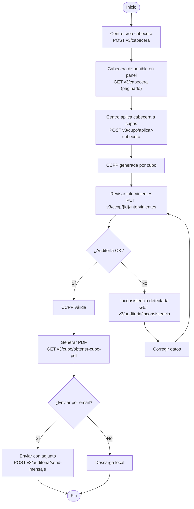
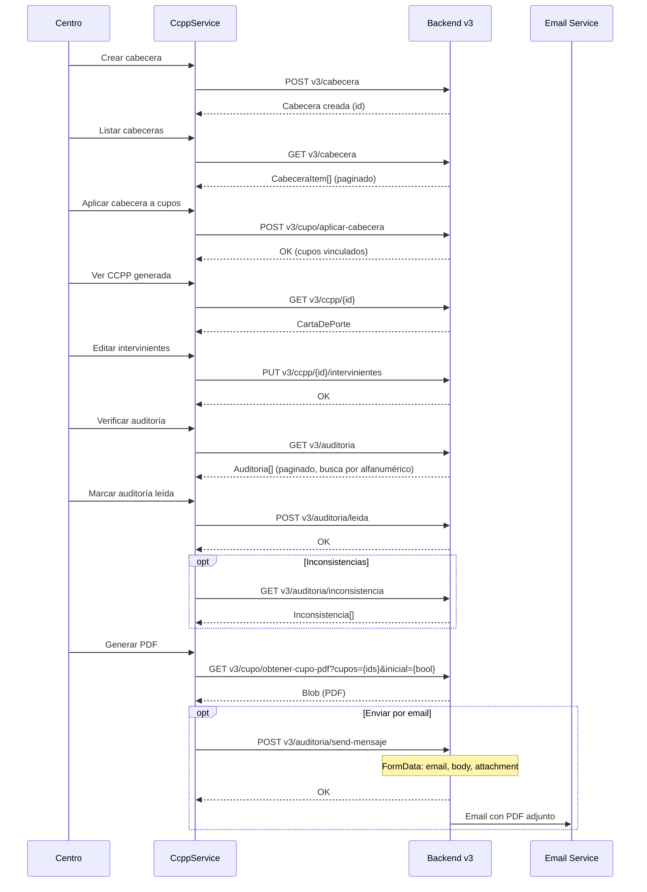
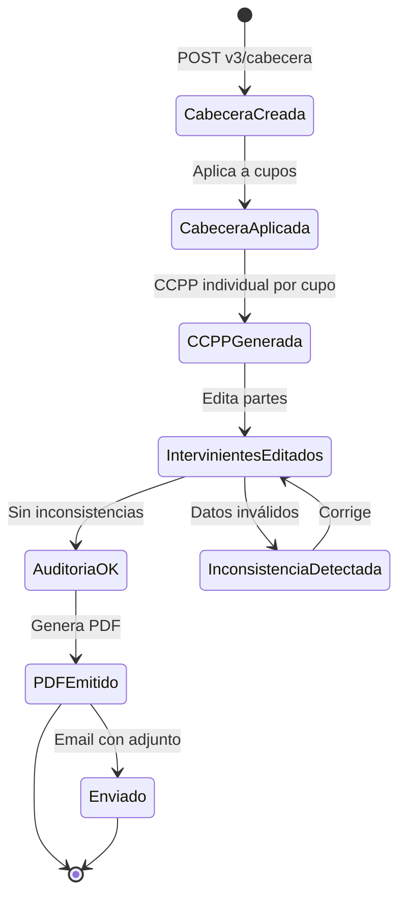

# Flujo: Carta de Porte (CCPP)

> **Criticidad:** 🔴 Alta
> **Módulos:** CCPP, [[modulo-cupo]], [[modulo-cupera]]
> **Tipo:** Flujo documental regulado (MAGyP/AFIP)
> **Punto de entrada UI:** CCPP → Cabecera / Cupo → Confección CCPP

---

## Descripción funcional

La Carta de Porte (CCPP) es el documento legal requerido por MAGyP/AFIP para el transporte de granos en Argentina. En Muvinapp, el flujo comienza con la creación de una "cabecera" (plantilla), que luego se aplica a uno o más cupos. Una vez aplicada, se genera la CCPP individual con los intervinientes (partes del negocio). El documento pasa por auditorías y puede generar inconsistencias que deben resolverse antes de emitir el PDF final.

---

## Flujo principal

---

## Secuencia temporal

---

## Ciclo de vida de la CCPP

---

## Endpoints involucrados

### Cabecera (plantilla)

| Verbo | Ruta | Propósito |
|---|---|---|
| GET | `v3/cabecera` | Listar cabeceras (paginado) |
| GET | `v3/cabecera/select` | Dropdown de cabeceras |
| POST | `v3/cabecera` | Crear cabecera |
| GET | `v3/cabecera/{id}` | Obtener cabecera por ID |
| PUT | `v3/cabecera/{id}` | Actualizar cabecera |
| DELETE | `v3/cabecera/{id}` | Eliminar cabecera |

### Carta de Porte

| Verbo | Ruta | Propósito |
|---|---|---|
| GET | `v3/ccpp/{id}` | Obtener CCPP por ID |
| PUT | `v3/ccpp` | Crear CCPP |
| PUT | `v3/ccpp/{id}` | Actualizar CCPP |
| PUT | `v3/ccpp/{id}/intervinientes` | Editar intervinientes |

### Auditoría

| Verbo | Ruta | Propósito |
|---|---|---|
| GET | `v3/auditoria` | Listar auditorías (paginado) |
| GET | `v3/auditoria/leida` | Auditorías leídas |
| POST | `v3/auditoria/leida` | Marcar como leída |
| GET | `v3/auditoria/inconsistencia` | Inconsistencias |
| GET | `v3/auditoria/ccpp` | Auditorías de CCPP |
| GET | `v3/auditoria/ccpp-historica?id={id}` | Histórico de CCPP |
| POST | `v3/auditoria/send-mensaje` | Enviar email con PDF |

### Puente CCPP ↔ Cupo

| Verbo | Ruta | Propósito |
|---|---|---|
| POST | `v3/cupo/aplicar-cabecera` | Aplicar cabecera a cupos |
| GET | `v3/cupo/obtener-cupo-pdf` | Generar PDF del cupo/CCPP |

---

## Estructura del módulo CCPP

| Componente | Función |
|---|---|
| `CcppComponent` | Shell con tabs |
| `CabeceraComponent` | Listado y gestión de cabeceras |
| `AddCabeceraComponent` | Dialog para crear/editar |
| `VerCabeceraComponent` | Dialog para visualizar |
| `CopiaCabeceraComponent` | Dialog para duplicar |
| `views-ccp/` | Sub-vistas de CCPP |
| `AuditoriaComponent` | Auditorías (tab, actualmente comentado) |
| `ConsultaComponent` | Consultas (tab, actualmente comentado) |
| `InconsistenciaComponent` | Inconsistencias (tab, actualmente comentado) |

> [!warning] Tabs deshabilitados
> Solo el tab de Cabecera está activo. Los tabs de Inconsistencias, Auditoría y Consulta están comentados en el código del `CcppComponent`. Posible feature incompleta.

---

## Flag `usaCupera`

El flag `usaCupera` (almacenado en localStorage durante el login) determina si el flujo CCPP usa la variante cupera:

| Valor | Comportamiento |
|---|---|
| `0` | Flujo CCPP estándar |
| `5` | Flujo CCPP con cupera |

Tanto `CcppComponent` como `CabeceraComponent` leen este flag para condicionar la UI.

---

## Relación con otros flujos

- **[[flujo-cupo]]**: La cabecera se aplica a cupos asignados; el PDF se genera desde el cupo
- **[[flujo-pedido]]**: La CCPP se emite como documento final del viaje completado
- **[[flujo-autenticacion]]**: Guard `CentroAuthGuard` restringe acceso; `usaCupera` se setea en login

---

## Riesgos

| # | Sev. | Hallazgo |
|---|---|---|
| 1 | 🟡 | **3 de 4 tabs comentados**: Auditoría, Consulta e Inconsistencia están deshabilitados → feature incompleta o legacy |
| 2 | 🟡 | **PUT para crear CCPP**: `v3/ccpp` usa PUT para crear, lo cual viola convenciones REST |
| 3 | 🔴 | **Documento regulado (MAGyP/AFIP)**: Errores en la generación de CCPP tienen consecuencias legales |
| 4 | 🟡 | **Email envía adjunto sin confirmación adicional**: `send-mensaje` no tiene doble verificación visible |

---

## Referencias

- [[_indice-flujos]] — Índice de flujos
- [[_indice-servicios]] — Servicios backend
- [[cupos-endpoints]] — Endpoints de cupos
- [[modulo-cupera]] — Módulo cupera
- [[diagrama-er-global]] — Modelo de datos
