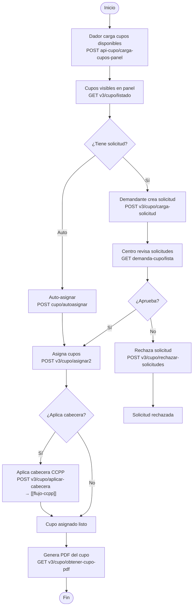
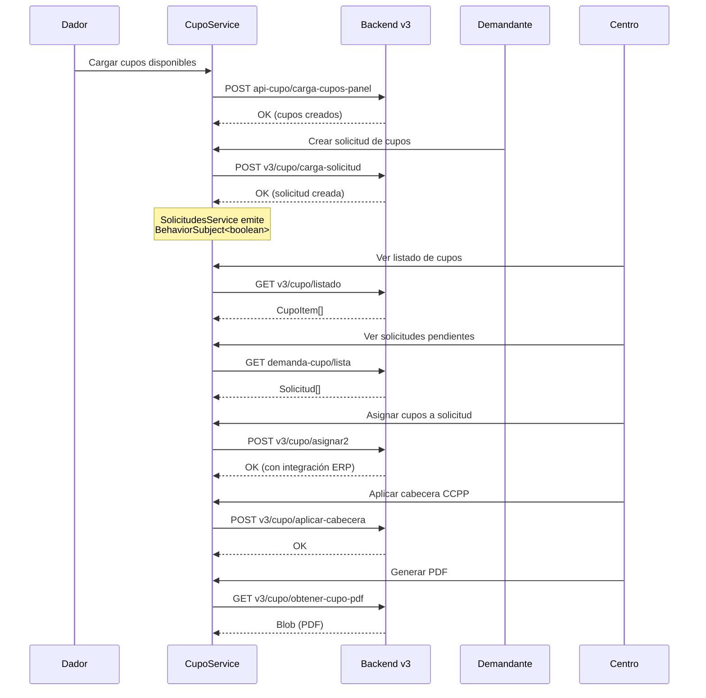
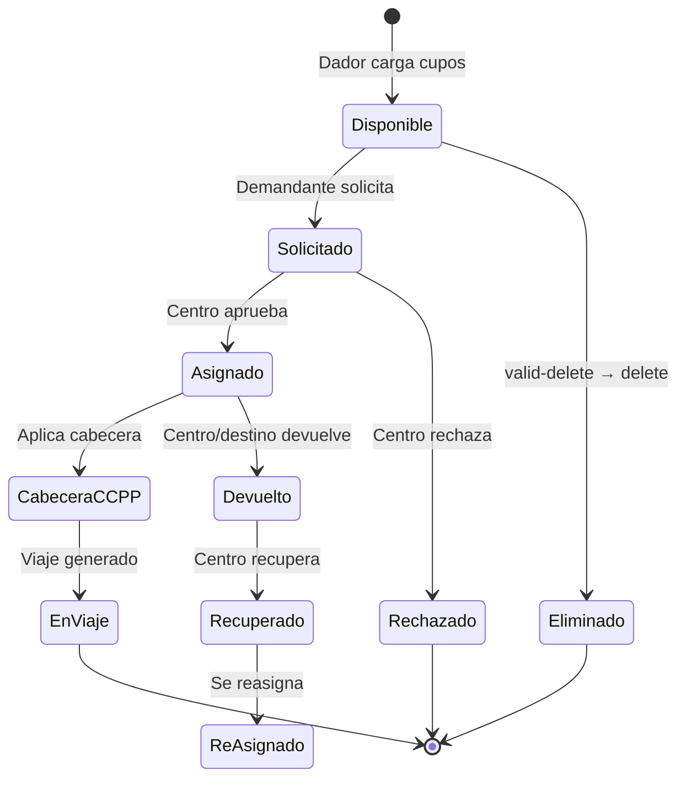

# Flujo: Asignación de Cupos

> **Criticidad:** 🔴 Alta
> **Módulos:** [[modulo-cupo]], [[modulo-cupera]], CCPP
> **Tipo:** Flujo de oferta-demanda con asignación y devolución
> **Punto de entrada UI:** Cupo → Panel / Cupera

---

## Descripción funcional

El sistema de cupos es el mecanismo central de oferta y demanda de capacidad de transporte. Un dador de carga publica cupos disponibles (oferta). Un demandante crea solicitudes (demanda). El centro operador asigna cupos a solicitudes. Los cupos pueden devolverse, recuperarse y eliminarse. Al asignar, se puede vincular opcionalmente con la confección de la carta de porte (CCPP).

---

## Vista general del ciclo

---

## Secuencia temporal del flujo de asignación

---

## Ciclo de vida del cupo

---

## Endpoints del flujo (por versión de API)

### Operaciones principales

| Verbo | Ruta | Propósito |
|---|---|---|
| POST | `api-cupo/carga-cupos-panel` | Cargar cupos disponibles |
| GET | `v3/cupo/listado` | Listar cupos asignados |
| GET | `v3/cupo/listado-asignacion` | Cupos para asignación |
| GET | `v3/cupo/listado-asignacion-zonas` | Cupos por zona (Cupera C3) |
| GET | `v2/cupos/disponibles/{fecha}` | Cupos disponibles por fecha |
| GET | `v3/cupo/demandados/{fecha}` | Cupos demandados |
| GET | `v3/cupo/all-map` | Cupos para mapa |

### Solicitudes (demanda)

| Verbo | Ruta | Propósito |
|---|---|---|
| POST | `v3/cupo/carga-solicitud` | Crear solicitud demandante |
| POST | `v3/cupo/carga-solicitud-propia` | Solicitud propia |
| POST | `v3/cupo/carga-solicitud-distribuida` | Solicitud distribuida |
| POST | `v3/cupo/carga-solicitud-propia-distribuida` | Propia + distribuida |
| GET | `demanda-cupo/lista` | Listar solicitudes |
| GET | `demanda-cupo/solicitudes-vencidas` | Solicitudes expiradas |
| POST | `demanda-cupo/variar-cantidad` | Modificar cantidad |

### Asignación y gestión

| Verbo | Ruta | Propósito |
|---|---|---|
| POST | `v3/cupo/asignar` | Asignar cupos v3 |
| POST | `v3/cupo/asignar2` | Asignar v3.2 (con ERP) |
| POST | `cupo/autoasignar` | Auto-asignación |
| POST | `v3/cupo/rechazar-solicitudes` | Rechazar solicitudes |
| POST | `v3/cupo/devolver` | Devolver cupos |
| POST | `cupo/devolver-lote` | Devolución por lote |
| POST | `v3/cupo/recuperar` | Recuperar cupos |
| POST | `cupo/validar-cupo` | Validar cupo |
| POST | `cupo/delete-cupos` | Eliminar cupos |

### Consulta y reporting

| Verbo | Ruta | Propósito |
|---|---|---|
| GET | `cupo/{id}` | Detalle de cupo |
| GET | `v3/cupo/seguimiento-cupera2/` | Seguimiento cupera |
| GET | `v3/cupo/obtener-cupo-pdf` | PDF del cupo |
| GET | `cupo-cliente/panel-consolidado` | Panel consolidado |
| GET | `cupo-cliente/detalle-dador` | Detalle por dador |
| GET | `cupo-cliente/asignados-receptor` | Asignados a receptor |

---

## Sub-componentes del módulo Cupo

> [!info] El módulo Cupo contiene ~20 sub-vistas organizadas por operación

| Sub-vista | Función |
|---|---|
| `add-cupos-disponibles/` | Carga de cupos disponibles (dador) |
| `add-cupos-solicitados/` | Carga de solicitudes (demandante) |
| `asignacion/` | Asignación v1 |
| `asignacion-v2/` | Asignación v2 mejorada |
| `asignar-solicitud/` | Asignar a solicitud existente |
| `asignar-sin-solicitud/` | Asignar sin solicitud previa |
| `devolver/` | Devolución de cupos |
| `recuperar/` | Recuperación de cupos |
| `rechazar-cupos/` | Rechazo de cupos |
| `rechazar-solicitud/` | Rechazo de solicitudes |
| `panel-consolidado/` | Vista consolidada |
| `seguimiento/` | Seguimiento de cupos |
| `solicitudes-cupo/` | Gestión de solicitudes |
| `turnos/` | Turnos desde cupo |
| `confeccion-ccpp/` | Bridge hacia CCPP |
| `cuponera/` | Vista cuponera |
| `cupera3/` | Cupera v3 |
| `mapa-cupos/` | Mapa geográfico |

---

## Notificación reactiva

`SolicitudesService` expone un `BehaviorSubject<boolean>` para notificar a los componentes sobre cambios en el estado de solicitudes. Esto permite actualizar vistas dependientes sin recargar la página completa.

---

## Versionado de API

> [!warning] Coexistencia de 4 versiones
> Los endpoints de cupos coexisten en versiones sin prefijo, `v2`, y `v3`. Esto genera ambigüedad sobre cuál usar. El v3 con sufijo `2` (`asignar2`) incluye integración ERP.

---

## Relación con otros flujos

- **[[flujo-pedido]]**: Un cupo se vincula a un pedido para ejecutar el transporte
- **[[flujo-ccpp]]**: La aplicación de cabecera CCPP al cupo genera la carta de porte
- **[[flujo-derivar-reserva]]**: Las reservas de fertilizantes consumen cupos

---

## Referencias

- [[cupos-endpoints]] — Detalle técnico de endpoints
- [[modulo-cupo]] — Documentación del módulo
- [[modulo-cupera]] — Módulo cupera
- [[diagrama-er-global]] — Modelo de datos
