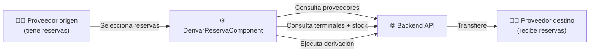
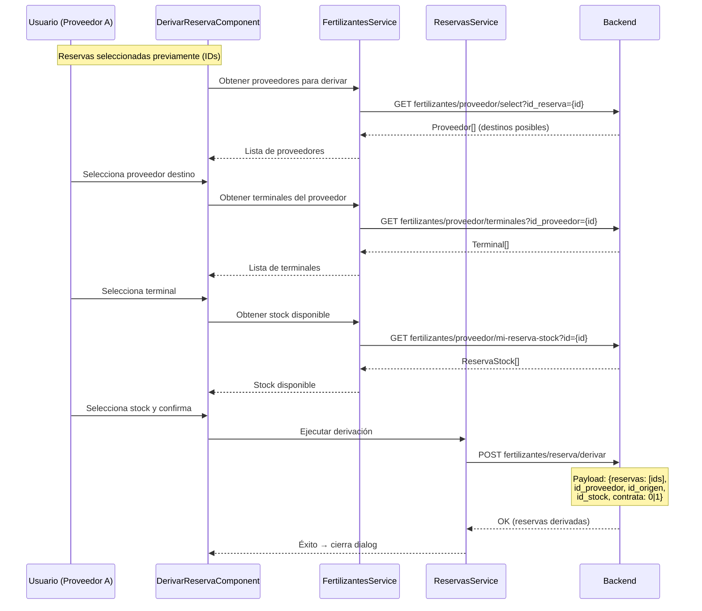
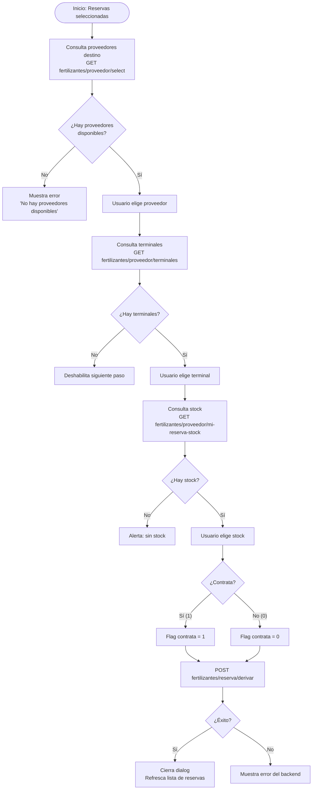
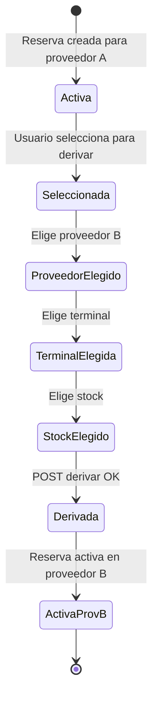

# Flujo: Derivación de Reservas

> **Criticidad:** 🟡 Media
> **Módulos:** [[modulo-fertilizante]] (SharedModule)
> **Tipo:** Flujo de redistribución de reservas entre proveedores
> **Punto de entrada UI:** Fertilizante → Reservas → Derivar

---

## Descripción funcional

La derivación de reservas permite a un proveedor de fertilizantes reasignar una o más reservas a otro proveedor. El usuario selecciona reservas, elige el proveedor destino, la terminal y el stock de origen, y ejecuta la derivación. El componente vive en SharedModule (no en FertilizanteModule) porque puede ser invocado desde diferentes contextos.

---

## Actores involucrados



---

## Flujo paso a paso



---

## Flujo de decisiones



---

## Ciclo de vida de la reserva derivada



---

## Endpoints involucrados

| Paso | Verbo | Ruta | Servicio | Propósito |
|---|---|---|---|---|
| 1 | GET | `fertilizantes/proveedor/select?id_reserva={id}` | FertilizantesService | Proveedores destino posibles |
| 2 | GET | `fertilizantes/proveedor/terminales?id_proveedor={id}` | FertilizantesService | Terminales del proveedor |
| 3 | GET | `fertilizantes/proveedor/mi-reserva-stock?id={id}` | FertilizantesService | Stock disponible en terminal |
| 4 | POST | `fertilizantes/reserva/derivar` | ReservasService | Ejecuta la derivación |

### Endpoints de soporte (consulta de reservas)

| Verbo | Ruta | Propósito |
|---|---|---|
| GET | `seguimiento/filtrar-reservas` | Filtrar reservas para selección |
| GET | `fertilizantes/reserva/by-pedido?id_pedido={id}` | Reservas por pedido |
| GET | `seguimiento/detalle-reservas` | Detalle de reservas |
| GET | `seguimiento/ver-cupo-proveedor?id_reserva={id}` | Ver cupo del proveedor |
| GET | `seguimiento/ver-cupo-cliente?id_reserva={id}` | Ver cupo del cliente |
| GET | `fertilizantes/reserva/proveedor` | Reservas del proveedor |

---

## Payload de derivación

```json
{
  "reservas": [101, 102, 103],
  "id_proveedor": 42,
  "id_origen": 7,
  "id_stock": 15,
  "contrata": 1
}
```

| Campo | Tipo | Descripción |
|---|---|---|
| `reservas` | `number[]` | IDs de reservas a derivar |
| `id_proveedor` | `number` | Proveedor destino |
| `id_origen` | `number` | Terminal de origen |
| `id_stock` | `number` | Stock seleccionado |
| `contrata` | `0 \| 1` | Si incluye contrata |

---

## Ubicación del componente

> [!info] Componente compartido
> `DerivarReservaComponent` está en `src/app/shared/components/derivar-reserva/` — forma parte de SharedModule, no del FertilizanteModule. Esto permite reutilizarlo desde diferentes módulos que manejan reservas.

---

## Relación con otros flujos

- **[[flujo-cupo]]**: Las reservas derivadas pueden estar vinculadas a cupos
- **[[flujo-pedido]]**: Las reservas pueden consultarse por pedido (`by-pedido`)

---

## Riesgos

| # | Sev. | Hallazgo |
|---|---|---|
| 1 | 🟡 | **Componente en SharedModule**: Incrementa el acoplamiento de SharedModule. Debería ser un sub-módulo del módulo Fertilizante |
| 2 | 🟡 | **Sin validación visible de cantidad**: No se verifica si el stock del destino es suficiente para las reservas derivadas (posible validación en backend) |
| 3 | 🟡 | **`contrata` como 0/1**: Flag numérico en lugar de booleano — patrón legacy |

---

## Referencias

- [[_indice-flujos]] — Índice de flujos
- [[modulo-fertilizante]] — Módulo fertilizante
- [[fertilizantes-endpoints]] — Endpoints de fertilizantes
- [[cross-module-dependencies]] — Dependencias SharedModule
