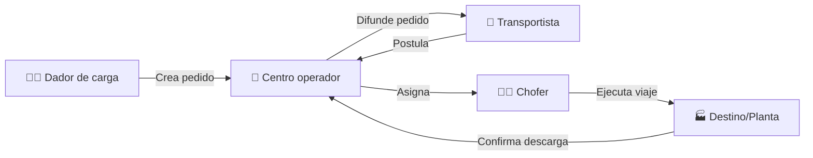
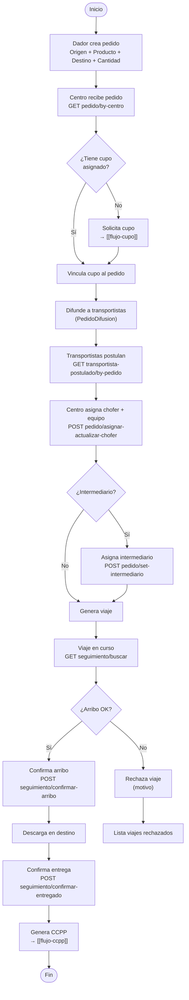
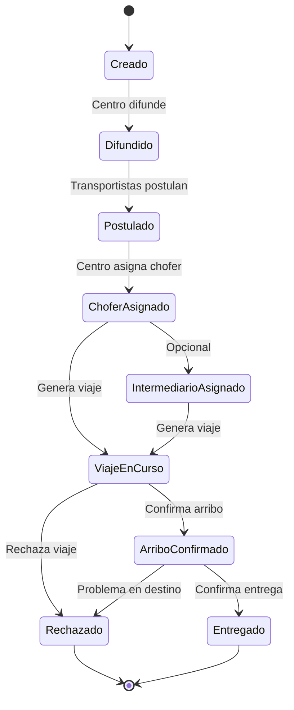

# Flujo: Ciclo de Vida del Pedido (Order-to-Delivery)

> **Criticidad:** 🔴 Alta
> **Módulos:** [[modulo-admin]], [[modulo-cupo]], [[modulo-destino]]
> **Tipo:** Flujo end-to-end de transporte de granos
> **Punto de entrada UI:** Admin → Logística / Dador → Dashboard

---

## Descripción funcional

El pedido es la unidad central de la operación logística. Un dador de carga crea un pedido especificando origen, destino, producto y cantidad. El pedido se difunde a transportistas que postulan. El centro asigna chofer y equipo (camión + acoplado). Se genera un viaje que transita por estados hasta la descarga en destino. Opcionalmente se genera carta de porte (CCPP).

---

## Actores involucrados

---

## Flujo principal

---

## Ciclo de vida del pedido

---

## Endpoints involucrados (en orden)

| Paso | Verbo | Ruta | Propósito | Servicio |
|---|---|---|---|---|
| 1 | GET | `pedido/by-centro` | Listar pedidos del centro | CentrosService |
| 2 | GET | `pedido/pedido-centro2` | Listado alternativo | CentrosService |
| 3 | GET | `transportista-postulado/by-pedido` | Transportistas postulados | CentrosService |
| 4 | GET | `intermediario-postulado/by-pedido` | Intermediarios postulados | CentrosService |
| 5 | GET | `pedido/check-chofer?cuit={cuit}` | Validar datos del chofer | FertilizantesService |
| 6 | POST | `pedido/asignar-actualizar-chofer?id_pedido={id}` | Asignar chofer al pedido | ChoferService |
| 7 | POST | `pedido/set-intermediario?id_pedido={id}` | Asignar intermediario | ChoferService |
| 8 | POST | `pedido/validar-producto` | Validar producto del pedido | FertilizantesService |
| 9 | GET | `seguimiento/buscar` | Buscar viajes/seguimiento | — |
| 10 | POST | `seguimiento/confirmar-arribo` | Confirmar arribo | — |
| 11 | POST | `seguimiento/confirmar-entregado` | Confirmar entrega | — |
| 12 | GET | `viaje/lista-historico` | Historial de viajes | CentrosService |
| 13 | GET | `viaje/estadistica-by-centro` | Estadísticas | CentrosService |

---

## Modelo de datos del pedido difundido

Campos clave de `PedidoDifundido`:

| Campo | Tipo | Descripción |
|---|---|---|
| `id` | number | ID del pedido difundido |
| `id_pedido` | number | Pedido padre |
| `id_centro` | number | Centro operador |
| `id_cliente` | number | Cliente (comprador) |
| `id_producto` | number | Producto a transportar |
| `id_zona_destino` | number | Zona destino |
| `id_origen` | number | Origen de carga |
| `fecha_desde` / `fecha_hasta` | string | Rango de fechas |
| `cantidad` | number | Toneladas |
| `precio_viaje` | number | Precio del flete |
| `condiciones_pago` | string | Condiciones de pago |
| `da_gasoil` | boolean | Si provee gasoil |
| `km` | number | Kilómetros del recorrido |

---

## Relación con otros flujos

- **[[flujo-cupo]]**: Un pedido puede consumir un cupo asignado
- **[[flujo-turneada]]**: El viaje generado participa de la turneada si el centro la tiene configurada
- **[[flujo-ccpp]]**: Al completar la entrega se genera la carta de porte

---

## Riesgos

| # | Sev. | Hallazgo |
|---|---|---|
| 1 | 🟡 | **ChoferService tiene solo 2 endpoints**: la lógica de validación del chofer está dispersa entre FertilizantesService y CentrosService |
| 2 | 🟡 | **Doble listado de pedidos**: `pedido/by-centro` y `pedido/pedido-centro2` con diferencias no documentadas |
| 3 | 🟡 | **Seguimiento endpoints**: no se encontró un servicio dedicado; probablemente están en CentrosService o llamados directamente desde componentes |

---

## Referencias

- [[_indice-flujos]] — Índice de flujos
- [[centros-endpoints]] — Endpoints de centros
- [[logistica-endpoints]] — Endpoints de logística
- [[diagrama-er-global]] — Relaciones Pedido → Viaje → Cupo
