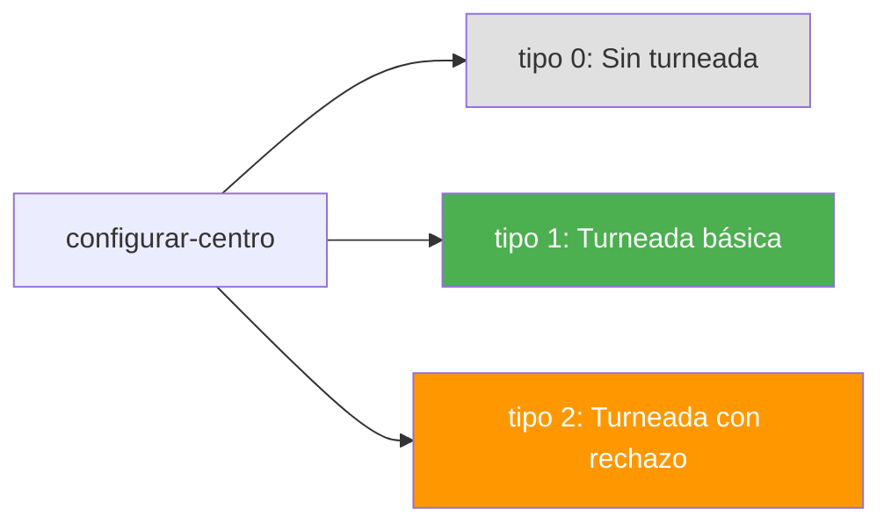
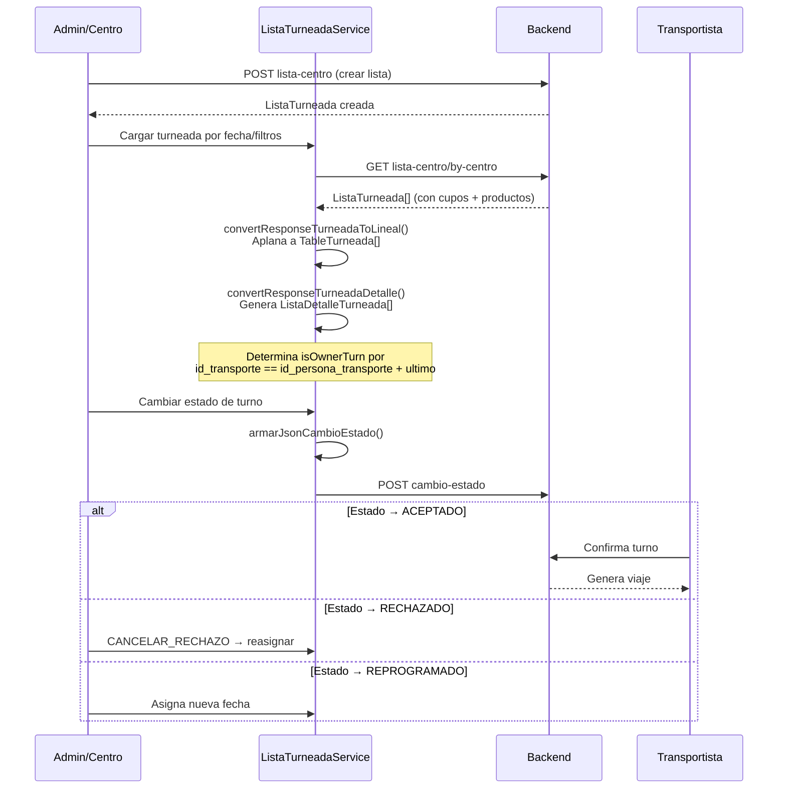
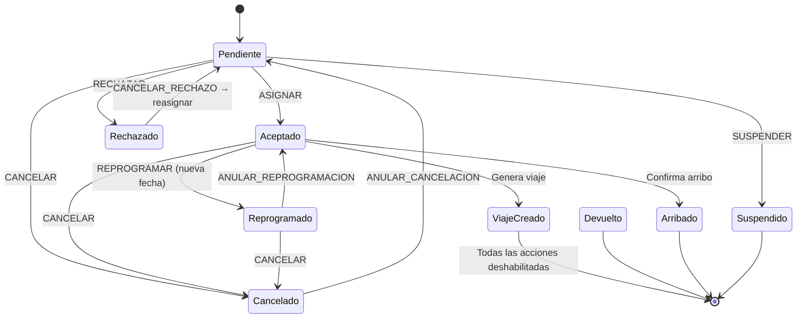
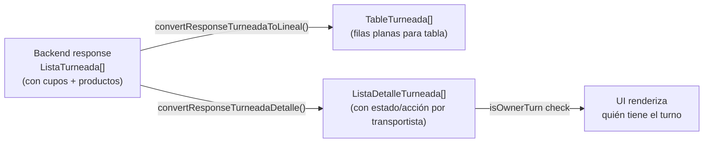

# Flujo: Turneada (Scheduling de Transporte)

> **Criticidad:** 🟡 Media
> **Módulos:** [[modulo-admin]], [[modulo-destino]], [[modulo-fertilizante]]
> **Tipo:** Sistema de turnos con máquina de estados
> **Punto de entrada UI:** Admin → Lista Turneada / Destino → Turnos

---

## Descripción funcional

La turneada es el sistema de asignación de turnos para la descarga de camiones en destino (planta). Cada centro configura su tipo de turneada (ninguna, tipo 1, tipo 2 con acción de rechazo). Se crean listas con grupos de transportistas. Cada turno tiene un estado que sigue una máquina de estados estricta con acciones como aceptar, rechazar, reprogramar, cancelar y reasignar.

---

## Configuración del tipo de turneada



El valor `id_tipo_turneada` se almacena en localStorage y determina el comportamiento del módulo turneada para el centro activo.

---

## Flujo principal



---

## Máquina de estados de la turneada



### Enum de estados

| ID | Estado | Constante |
|---|---|---|
| 1 | Pendiente | `PENDIENTE` |
| 2 | Aceptado | `ACEPTADO` |
| 3 | Rechazado | `RECHAZADO` |
| 4 | Devuelto | `DEVUELTO` |
| 5 | Suspendido | `SUSPENDIDO` |
| 6 | Cancelado | `CANCELADO` |
| 7 | Arribado | `ARRIBADO` |

---

## Endpoints involucrados

| Verbo | Ruta | Propósito | Servicio |
|---|---|---|---|
| GET | `lista-centro/by-centro` | Listas del centro por tipo turneada | CentrosService |
| GET | `lista-centro/select` | Dropdown de listas | CentrosService |
| GET | `lista-centro/chofer` | Listas del chofer | CentrosService |
| POST | `lista-centro` | Crear lista | CentrosService |
| POST | `lista-centro/duplicar?id_lista={id}` | Duplicar lista | CentrosService |
| PUT | `lista-centro/{id}` | Actualizar lista | CentrosService |
| GET | `turneada/control-viajes/{endPoint}` | Control de viajes (ferti) | FertilizantesService |
| GET | `turneada/lista/select?activa=1` | Listas activas | FertilizantesService |
| GET | `turneada/grupo/select` | Grupos de turneada | FertilizantesService |
| GET | `turneada/grupo-transporte/by-proveedor` | Grupos por proveedor | FertilizantesService |

---

## Estructuras de datos clave

### FiltroTurneada

```
{
  fecha_desde, fecha_hasta,   // Rango de fechas
  id_proveedor,               // Filtro por proveedor
  id_estado,                  // Estado del turno
  id_origen,                  // Origen de carga
  id_lista,                   // Lista específica
  id_destino,                 // Destino
  id_producto,                // Producto
  id_grupo,                   // Grupo de transporte
  id_transporte,              // Transportista específico
  con_viaje: boolean          // Solo con viaje generado
}
```

### CambioEstadoTurneada (payload)

```
{
  id_pedido,                  // Pedido vinculado
  id_lista,                   // Lista de turneada
  id_grupo,                   // Grupo dentro de la lista
  id_persona_transporte,      // Transportista
  estado                      // Nuevo estado (1-7)
}
```

### Grupo

```
{
  transportes[],              // Array de transportistas
  penalizado_hasta: date      // Fecha de penalización
}
```

---

## Penalización de grupos

Cada grupo puede ser penalizado con una fecha `penalizado_hasta`. El servicio `ListaTurneadaService` verifica esta fecha para mostrar penalizaciones en la UI e impedir acciones en grupos penalizados.

---

## Transformación de datos



---

## Relación con otros flujos

- **[[flujo-pedido]]**: El viaje generado desde la turneada se vincula a un pedido
- **[[flujo-cupo]]**: Los cupos determinan qué pedidos entran a la turneada
- **[[flujo-autenticacion]]**: El `tipo_turneada` se almacena en localStorage durante el login

---

## Riesgos

| # | Sev. | Hallazgo |
|---|---|---|
| 1 | 🟡 | **Tipo de turneada en localStorage**: Si se manipula, puede desactivar el sistema de turnos |
| 2 | 🟡 | **Lógica de transformación compleja en el frontend**: 3 funciones de conversión con lógica de negocio que debería estar en backend |
| 3 | 🟡 | **Endpoints divididos**: turneada genérica en CentrosService, turneada fertilizante en FertilizantesService |

---

## Referencias

- [[_indice-flujos]] — Índice de flujos
- [[modulo-admin]] — Módulo Admin (lista-turneada)
- [[modulo-fertilizante]] — Módulo Fertilizante (turneada ferti)
- [[centros-endpoints]] — Endpoints CentrosService
- [[fertilizantes-endpoints]] — Endpoints FertilizantesService
