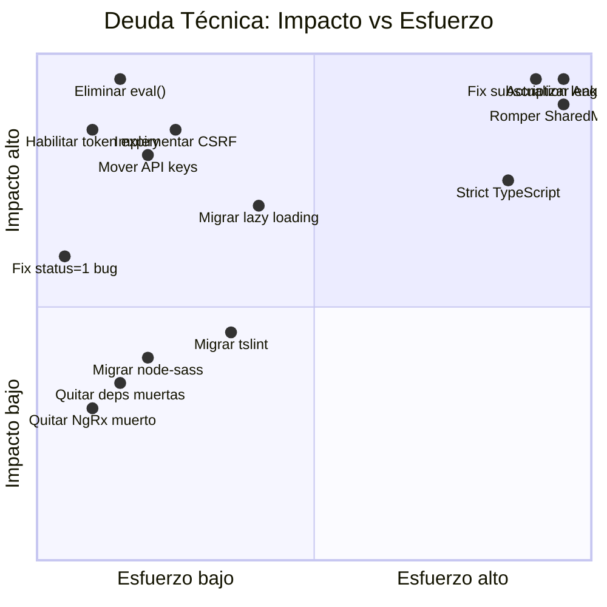
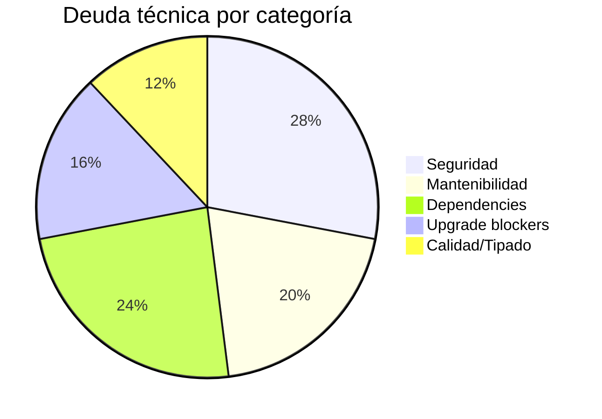

# Deuda Técnica — Inventario Priorizado

> **Última revisión:** 2026-04-16
> **Items totales:** 25
> **Distribución:** 🔴 Crítico: 8 | 🟠 Alto: 9 | 🟡 Medio: 8

---

## Matriz impacto vs esfuerzo

---

## Inventario completo

### 🔴 Crítico — Bloquean seguridad o estabilidad

| # | Deuda | Impacto | Esfuerzo | Archivos afectados |
|---|---|---|---|---|
| DT-01 | **Angular 6 EOL** — 13 major versions atrás, sin parches de seguridad desde Nov 2019 | Seguridad, compatibilidad | Muy alto | Global |
| DT-02 | **3,349 subscription leaks** — 95.3% sin cleanup (`takeUntil`/`unsubscribe`/`async` pipe) | Memory leaks, UX | Muy alto | ~500+ componentes |
| DT-03 | **SharedModule god-module** — 363 líneas, ~100+ declarations, imports bidireccionales con admin/ccpp/ferti/cupera | Mantenibilidad, bundle size | Muy alto | `shared.module.ts` + todos los lazy modules |
| DT-04 | **9 instancias de `eval()`** — inyección de código potencial | Seguridad | Bajo | 9 componentes |
| DT-05 | **RBAC client-side** — guards leen `rol` de localStorage, escalación trivial | Seguridad | Medio | 10 guards |
| DT-06 | **Sin CSRF/XSRF** — ninguna protección implementada | Seguridad | Bajo | Global |
| DT-07 | **Token expiry comentado** — en todos los guards | Seguridad | Bajo | 10 guards |
| DT-08 | **TypeScript sin strict mode** — `strict`, `strictNullChecks`, `noImplicitAny` no habilitados | Calidad, bugs ocultos | Muy alto | `tsconfig.json` + miles de errores |

### 🟠 Alto — Degradan calidad y mantenibilidad

| # | Deuda | Impacto | Esfuerzo | Archivos afectados |
|---|---|---|---|---|
| DT-09 | **15 componentes >1,500 líneas** (max: 6,292 ln) | Mantenibilidad | Alto | 15 archivos |
| DT-10 | **`centros.service.ts` con ~147 métodos** — god-service | Mantenibilidad | Alto | 1 servicio + consumidores |
| DT-11 | **818 `Observable<any>`** — cero type safety en HTTP | Calidad, refactoring | Alto | Servicios HTTP |
| DT-12 | **36 archivos versionados** (v1/v2/v3/v5) coexistiendo — código zombie | Bundle size, confusión | Medio | 36 archivos |
| DT-13 | **String-based `loadChildren`** — syntax deprecada desde Angular 8 | Bloqueante para upgrade | Medio | ~20 rutas |
| DT-14 | **`@angular/http` importado** — deprecado en Angular 5, eliminado en 9 | Bloqueante para upgrade | Bajo | Importaciones |
| DT-15 | **`rxjs-compat` presente** — shim de migración rxjs 5→6 | Bloqueante para upgrade | Medio | `package.json` |
| DT-16 | **API keys hardcodeadas** — Firebase + Google Maps en source code | Seguridad | Bajo | Environments + 3 módulos |
| DT-17 | **43+ items PII en localStorage** — incluye CUIT/CUIL | Seguridad, compliance | Medio | `set-local-storage.ts` |

### 🟡 Medio — Mejoras de calidad y mantenimiento

| # | Deuda | Impacto | Esfuerzo | Archivos afectados |
|---|---|---|---|---|
| DT-18 | **`@ngrx/store` ^8.4.0 instalado pero nunca usado** — dep fantasma, además incompatible (NgRx 8 requiere Angular 8+) | Bundle size | Bajo | `package.json` |
| DT-19 | **Deps duplicadas** — `ngx-pipes` + `ng2-pipes`, `@angular/fire` + `angularfire2`, `jspdf` duplicado | Confusión, bundle | Bajo | `package.json` |
| DT-20 | **Deps server-side en app client** — `cors`, `http`, `http-proxy` | Confusión, bundle | Bajo | `package.json` |
| DT-21 | **`@angular/material-moment-adapter` v11** en Angular 6 — posible incompatibilidad | Runtime errors | Bajo | `package.json` |
| DT-22 | **`SharedMaterialModule` declarado pero no usado** — dead module | Confusión | Bajo | `shared-material.module.ts` |
| DT-23 | **`node-sass` 4.14.1** — deprecado, CVEs conocidos; migrar a `sass` (dart-sass) | Seguridad de build | Bajo | `package.json` |
| DT-24 | **`tslint` 4.5.0 + `codelyzer` 2.0** — deprecados; migrar a ESLint | Tooling | Medio | Config files |
| DT-25 | **Protractor 5.1** — deprecado; migrar a Playwright o Cypress | Testing | Medio | `protractor.conf.js` |

---

## Distribución por categoría

---

## Dependencias muertas o problemáticas

| Paquete | Versión | Estado | Acción |
|---|---|---|---|
| `@ngrx/store` | ^8.4.0 | 💀 Nunca usado + incompatible | Eliminar |
| `@angular/http` | 6.0.1 | 💀 Deprecado | Eliminar (usar `HttpClient`) |
| `rxjs-compat` | 6.1.0 | 💀 Shim de migración | Eliminar tras actualizar imports |
| `angularfire2` | ^5.2.1 | 💀 Renombrado | Eliminar (usar `@angular/fire`) |
| `http` | 0.0.1-security | 💀 Placeholder npm | Eliminar |
| `cors` | ^2.8.5 | 💀 Server-side en client app | Eliminar |
| `http-proxy` | ^1.18.1 | 💀 Server-side en client app | Eliminar |
| `ng2-pipes` | ^1.5.0 | 💀 Duplica `ngx-pipes` | Consolidar |
| `angular-in-memory-web-api` | 0.6.0 | ⚠️ Dev tool en producción | Mover a devDependencies |

---

## Build y despliegue

| Item | Valor actual | Problema | Acción |
|---|---|---|---|
| Node (Docker) | **12** | EOL Abr 2022 (~4 años) | Actualizar a 20/22 LTS |
| Nginx | **1.21.4-alpine** | EOL, sin parches | Actualizar a 1.27+ |
| Bundle budgets | No configurados | Sin alertas de crecimiento | Configurar en `angular.json` |
| Global scripts | `jspdf.min.js` + `exceljs.min.js` | Se cargan en **toda** página | Lazy-load bajo demanda |
| `--max_old_space_size` | 8096 | Typo (debería ser 8192) | Corregir |
| tslint | 4.5.0 | Deprecado | Migrar a ESLint |

---

## Configuración TypeScript

| Setting | Valor actual | Recomendado |
|---|---|---|
| `strict` | No seteado | `true` |
| `strictNullChecks` | No seteado | `true` |
| `noImplicitAny` | No seteado | `true` |
| `target` | `es5` | `es2017`+ |
| `skipLibCheck` | No seteado | `true` (para deps incompatibles) |

> [!warning] Habilitar `strict` surfaceará miles de errores
> Recomendamos habilitar flags de strictness de forma incremental: primero `strictNullChecks`, luego `noImplicitAny`, finalmente `strict: true`.

---

## Tests

| Métrica | Valor | Evaluación |
|---|---|---|
| Archivos `.spec.ts` | **554** | Existen, pero... |
| Tests con lógica real | ⚠️ Pendiente de verificar | Probablemente scaffolds CLI (`should create`) |
| Framework | Jasmine + Karma | Funcional pero antiguo |
| E2E | Protractor 5.1 | Deprecado |
| Cobertura CI | Sin enforcement | No hay umbral configurado |

---

## Referencias

- [[hotspots]] — Archivos de mayor riesgo
- [[security-inventory]] — Inventario de seguridad
- [[recomendaciones-modernizacion]] — Plan de modernización
- [[stack-tecnologico]] — Versiones del stack
- [[core-vs-custom-dependencies]] — Análisis de dependencias
