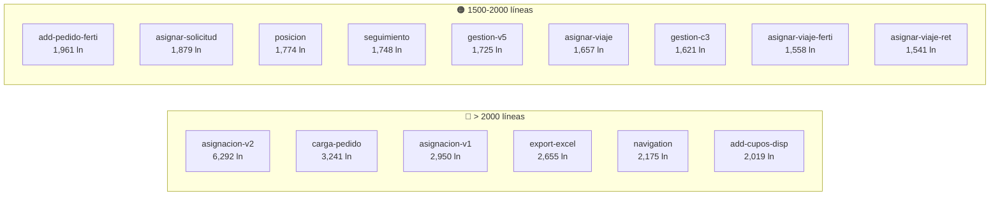
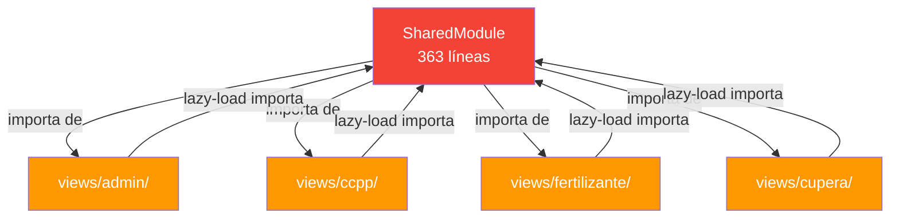
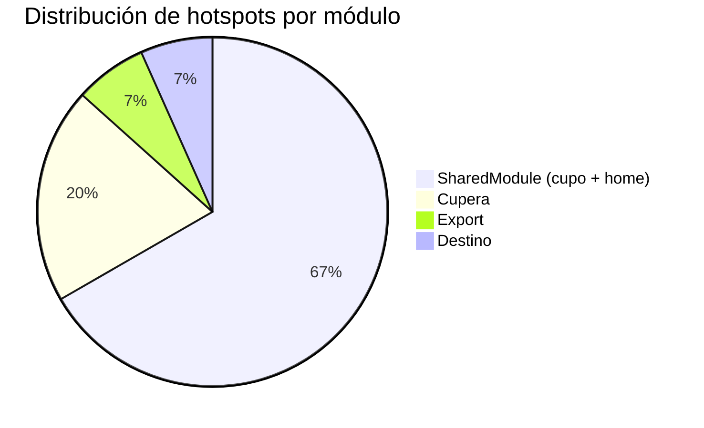

# Hotspots — Archivos de Mayor Riesgo y Complejidad

> **Última revisión:** 2026-04-16
> **Criterio:** Archivos que concentran complejidad, acoplamiento y riesgo de regresión
> **Umbral de alerta:** >800 líneas por archivo, >50 métodos por servicio

---

## Resumen

El proyecto tiene **15 componentes que superan 1.500 líneas** y **5 servicios con más de 800 líneas**. El archivo más grande (`asignacion-v2.component.ts`) tiene **6.292 líneas** — 7.8× el máximo recomendado. El servicio `centros.service.ts` tiene **~147 métodos** (god-service).

---

## Top 15 — Componentes más grandes

| # | Archivo | Líneas | Módulo | Riesgo |
|---|---|---:|---|---|
| 1 | `shared/components/cupo/asignacion-v2/asignacion-v2.component.ts` | **6,292** | Cupo | 🔴 |
| 2 | `shared/components/home/carga-pedido/carga-pedido.component.ts` | **3,241** | Shared/Home | 🔴 |
| 3 | `shared/components/cupo/asignacion/asignacion.component.ts` | **2,950** | Cupo | 🔴 |
| 4 | `views/export/export-excel.service.ts` | **2,655** | Export | 🔴 |
| 5 | `shared/services/navigation.service.ts` | **2,175** | SharedModule | 🔴 |
| 6 | `shared/components/cupo/add-cupos-disponibles/add-cupos-disponibles.component.ts` | **2,019** | Cupo | 🔴 |
| 7 | `shared/components/home/add-pedido-fertilizantes/add-pedido-fertilizantes.component.ts` | **1,961** | Shared/Home | 🟠 |
| 8 | `shared/components/cupo/asignar-solicitud/asignar-solicitud.component.ts` | **1,879** | Cupo | 🟠 |
| 9 | `views/destino/plantas/posicion/posicion.component.ts` | **1,774** | Destino | 🟠 |
| 10 | `shared/components/cupo/seguimiento/seguimiento.component.ts` | **1,748** | Cupo | 🟠 |
| 11 | `views/cupera/components/asignacion-v5/.../gestion-v5.component.ts` | **1,725** | Cupera | 🟠 |
| 12 | `shared/components/home/asignar-viaje/asignar-viaje.component.ts` | **1,657** | Shared/Home | 🟠 |
| 13 | `shared/components/cupo/cupera3/.../gestion/gestion.component.ts` | **1,621** | Cupo/Cupera3 | 🟠 |
| 14 | `shared/components/home/asignar-viaje-fertilizante/asignar-viaje-fertilizante.component.ts` | **1,558** | Shared/Home | 🟠 |
| 15 | `shared/components/home/asignar-viaje-retorno/asignar-viaje-retorno.component.ts` | **1,541** | Shared/Home | 🟠 |

---

## Top 10 — Servicios más grandes

| # | Servicio | Líneas | Métodos (~) | Riesgo |
|---|---|---:|---:|---|
| 1 | `shared/services/navigation.service.ts` | **2,175** | — (config) | 🔴 |
| 2 | `shared/services/nomencladores.service.ts` | **1,322** | ~60+ | 🔴 |
| 3 | `shared/services/centros.service.ts` | **1,102** | **~147** | 🔴 |
| 4 | `shared/components/cupo/cupo.service.ts` | **881** | ~40+ | 🟠 |
| 5 | `views/cupera/services/cupera.service.ts` | **857** | ~40+ | 🟠 |
| 6 | `shared/services/personas.service.ts` | **819** | ~30+ | 🟠 |
| 7 | `shared/services/lista-turneada.service.ts` | **524** | — | 🟡 |
| 8 | `shared/services/fertilizantes.service.ts` | **488** | — | 🟡 |
| 9 | `shared/services/lista-reserva.service.ts` | **471** | — | 🟡 |
| 10 | `shared/services/user.service.ts` | **393** | — | 🟡 |

> [!danger] God-service
> `CentrosService` con **~147 métodos** es el anti-patrón god-service más extremo. Cualquier cambio en este archivo tiene probabilidad alta de regresión en múltiples módulos.

---

## SharedModule — God-module 🔴

`shared.module.ts` (**363 líneas**) es el hotspot arquitectónico más crítico:

| Métrica | Valor |
|---|---|
| Imports de Angular Material | ~50+ (muchos duplicados) |
| Declarations (componentes/directivas/pipes) | ~100+ |
| Entry components (dialogs) | ~40 |
| Providers (servicios, guards) | ~22 |
| Imports cross-boundary | admin, ccpp, fertilizante, cupera |

**Impacto:** SharedModule se carga con **cada** módulo lazy-loaded, anulando los beneficios del lazy loading. Las dependencias bidireccionales impiden la extracción de módulos.

---

## Duplicación por versionado — 36 archivos

Coexisten **hasta 4 generaciones** del mismo feature:

| Feature | v1 (shared/cupo) | v2 (shared/cupo) | v3/cupera3 | v5 (views/cupera) |
|---|:---:|:---:|:---:|:---:|
| Asignación | ✅ 2,950 ln | ✅ **6,292 ln** | ✅ 1,203 ln | ✅ asignacion-v5 |
| Cupos solicitados | ✅ | ✅ v2 | — | ✅ cupos-v5 |
| Panel consolidado | ✅ | ✅ v2 | — | — |
| Recuperar | ✅ | ✅ v2 (1,028 ln) | — | — |
| Gestión | — | — | ✅ 1,621 ln | ✅ 1,725 ln |
| Seguimiento | ✅ 1,748 ln | — | — | ✅ seguimiento-v5 |

> [!warning] Código zombie
> Las versiones anteriores parecen seguir en el bundle. No se encontró evidencia de que estén excluidas de la compilación.

---

## Subscription leaks — 🔴 CRÍTICO

| Métrica | Cantidad |
|---|---:|
| `.subscribe()` calls | **3,349** |
| `takeUntil` patterns | **10** |
| `.unsubscribe()` calls | **147** |
| `OnDestroy` implementaciones | Subconjunto pequeño |

**~95.3% de subscriptions sin mecanismo de cleanup.** Esto genera memory leaks acumulativos en navegación SPA.

---

## Tipado inseguro — 🔴 CRÍTICO

| Métrica | Cantidad |
|---|---:|
| `Observable<any>` | **818** |
| `: any` en servicios | **81** |

Prácticamente cero type safety en la capa HTTP.

---

## Concentración de riesgo por módulo

---

## Mapa de calor

| Zona | Archivos >1500 ln | God-services | Subscription leaks | `eval()` | 🔴 Total |
|---|:---:|:---:|:---:|:---:|:---:|
| `shared/components/cupo/` | 5 | 1 | Alta | 0 | 6 |
| `shared/components/home/` | 5 | 0 | Alta | 1 | 6 |
| `shared/services/` | 0 | 3 | Alta | 0 | 3 |
| `views/admin/` | 0 | 0 | Media | 5 | 5 |
| `views/cupera/` | 1 | 1 | Alta | 0 | 2 |
| `views/destino/` | 1 | 0 | Media | 1 | 2 |
| `views/export/` | 1 | 0 | Baja | 0 | 1 |

---

## Referencias

- [[security-inventory]] — Vulnerabilidades de seguridad
- [[deuda-tecnica]] — Deuda técnica priorizada
- [[cross-module-dependencies]] — Dependencias entre módulos
- [[depends-matrix]] — Matriz de dependencias
