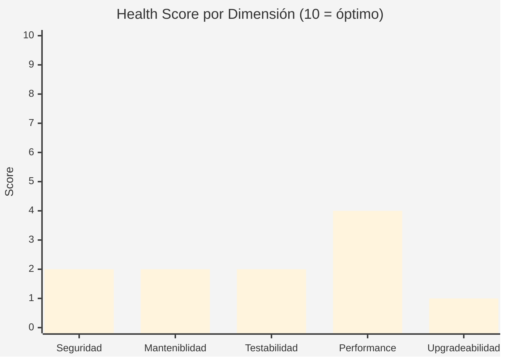
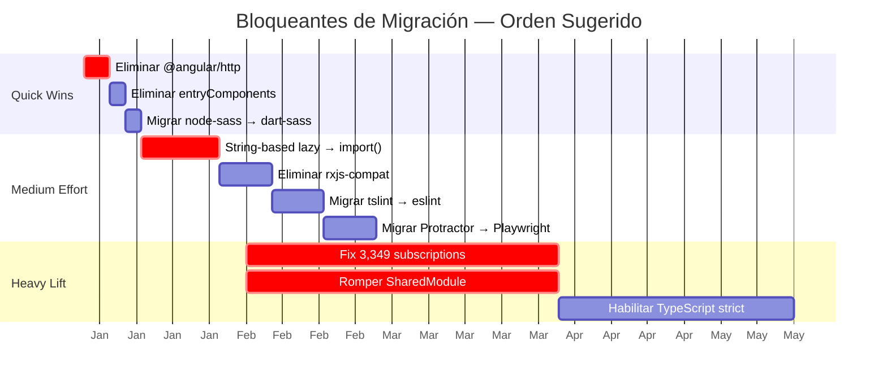
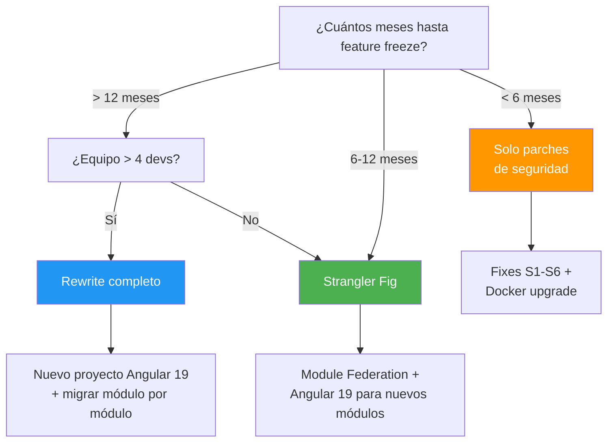

# Recomendaciones de Modernización

> **Última revisión:** 2026-04-16
> **Estado:** Angular 6 → Angular 19+ (13 major versions)
> **Estrategia recomendada:** Rewrite incremental (strangler fig)

---

## Score de riesgo actual

| Dimensión | Score (1-10) | Evaluación |
|---|:---:|---|
| Seguridad | **2/10** | 🔴 `eval()`, RBAC client-side, sin CSRF, tokens en localStorage |
| Mantenibilidad | **2/10** | 🔴 God-module, 15 archivos >1.5K líneas, 147-method service |
| Testabilidad | **2/10** | 🔴 554 spec files, probablemente scaffold-only; sin CI gates |
| Performance | **4/10** | 🟠 SharedModule anula lazy loading, scripts globales innecesarios |
| Upgradeability | **1/10** | 🔴 NgRx muerto, string-based routes, angular/http, rxjs-compat |

---

## Gap de versiones

| Stack | Actual | Target (2026) | Gap |
|---|---|---|---|
| Angular | **6.0.1** | **19.x** | 13 major versions |
| TypeScript | **2.7.2** | **5.7+** | 3 major versions |
| RxJS | **6.1.0** | **7.8+** | 1 major version |
| Node.js (Docker) | **12** (EOL) | **22 LTS** | 10 major versions |
| Nginx | **1.21.4** (EOL) | **1.27+** | ~6 minor versions |
| Angular Material | **6.4.7** | **19.x** | 13 major versions |
| Angular CLI | **6.0.3** | **19.x** | 13 major versions |
| Zone.js | **0.8.26** | **0.15+** | Muchas versiones |

---

## Estrategia: ¿Upgrade incremental o rewrite?

### Opción A: Upgrade versión por versión 🔴 NO RECOMENDADO

| Pros | Contras |
|---|---|
| Migración path documentado por Angular | **13 pasos** (6→7→8→...→19) |
| Menor riesgo por salto | SharedModule + string routes bloquean en v8-v9 |
| — | 3,349 subscription leaks se arrastran |
| — | 36 archivos zombie se arrastran |
| — | Estimación: **6-12 meses** con equipo dedicado |

### Opción B: Strangler Fig (rewrite incremental) ✅ RECOMENDADO

| Pros | Contras |
|---|---|
| Coexistencia old + new | Requiere infra para micro-frontends o iframe bridge |
| Migrar módulo por módulo | Período de duplicación de código |
| Features nuevas en stack moderno | Costo de integración |
| Kill old code progresivamente | — |

### Opción C: Rewrite completo 🟡 SEGÚN CONTEXTO

| Pros | Contras |
|---|---|
| Stack limpio desde cero | Alto riesgo de feature regression |
| Sin arrastrar deuda | 400+ endpoints que reimplementar |
| — | ~12+ meses sin delivery |

---

## 10 Bloqueantes de migración — Orden de resolución

> [!important] Estos bloqueantes deben resolverse ANTES o DURANTE la migración, independientemente de la estrategia elegida.

| # | Bloqueante | Severidad | Esfuerzo | Bloquea | Detalle |
|---|---|:---:|:---:|---|---|
| 1 | **Eliminar `@angular/http`** | 🔴 | Bajo | Angular 9+ | API removida; migrar a `HttpClient` |
| 2 | **String-based `loadChildren` → `import()`** | 🔴 | Medio | Angular 8+ | ~20 rutas con syntax vieja |
| 3 | **Eliminar `rxjs-compat`** | 🟠 | Medio | RxJS 7 | Shim que esconde imports rotos |
| 4 | **SharedModule → feature modules** | 🔴 | Muy alto | Tree-shaking, Ivy | 100+ declarations, imports bidireccionales |
| 5 | **Fix 3,349 subscriptions** | 🔴 | Muy alto | Estabilidad | `takeUntilDestroyed()` o `async` pipe |
| 6 | **TypeScript strict mode** | 🟠 | Muy alto | Angular 15+ | Miles de errores de `any` y null |
| 7 | **Eliminar `entryComponents`** | 🟡 | Bajo | Ivy (v9+) | ~40 entry components en SharedModule |
| 8 | **Migrar `node-sass` → `sass`** | 🟡 | Bajo | Angular 12+ | Drop-in replacement (mayormente) |
| 9 | **Migrar `tslint` → ESLint** | 🟡 | Medio | Angular 12+ | `ng lint` ya no soporta tslint |
| 10 | **Migrar Protractor → Playwright** | 🟡 | Medio | Angular 12+ | Protractor deprecado oficialmente |

---

## Remediaciones de seguridad urgentes (pre-migración)

Estas correcciones deben aplicarse **inmediatamente**, sin esperar la migración:

| # | Fix | Esfuerzo | Impacto inmediato |
|---|---|---|---|
| S1 | Reemplazar 9 `eval()` → bracket notation | 2-4 horas | Elimina inyección de código |
| S2 | Habilitar token expiry en guards (descomentar) | 1 hora | Tokens robados expiran |
| S3 | Implementar `HttpClientXsrfModule` | 2-4 horas | Protección CSRF |
| S4 | Mover API keys a env de CI/CD | 2-4 horas | Secrets fuera de source |
| S5 | Eliminar `angular-in-memory-web-api` de prod | 30 min | Remover API mock de producción |
| S6 | Fix `status = 1` → `status === 1` | 30 min | Login valida correctamente |

---

## Roadmap recomendado por fases

### Fase 0: Estabilización de seguridad (2-3 semanas)

- [ ] Fixes S1-S6 de la tabla anterior
- [ ] Agregar Firebase security rules para `configuracion-panel`
- [ ] Separar config Firebase dev/prod
- [ ] Actualizar Docker: Node 20 LTS + Nginx 1.27

### Fase 1: Cleanup de dependencias (2-4 semanas)

- [ ] Eliminar: `@ngrx/store`, `@angular/http`, `angularfire2`, `http`, `cors`, `http-proxy`, `ng2-pipes`, `angular-in-memory-web-api`
- [ ] Consolidar: `ngx-pipes` ↔ `ng2-pipes`, `jspdf` duplicado
- [ ] Mover: `angular-in-memory-web-api` a devDependencies
- [ ] Fix: `max_old_space_size=8096` → `8192`
- [ ] Migrar `node-sass` → `sass`

### Fase 2: Preparación estructural (4-8 semanas)

- [ ] Migrar string-based lazy loading → `import()` (~20 rutas)
- [ ] Eliminar `rxjs-compat` + fix imports RxJS 6
- [ ] Comenzar extracción de SharedModule en feature modules
- [ ] Eliminar `entryComponents`
- [ ] Migrar tslint → ESLint

### Fase 3: Subscription management (6-10 semanas)

- [ ] Establecer patrón `takeUntilDestroyed()` o `DestroyRef`
- [ ] Migrar componentes prioritarios (hotspots de [[hotspots]])
- [ ] Implementar lint rule para prevenir `.subscribe()` sin cleanup

### Fase 4: Migración Angular (timeline varía por estrategia)

**Si strangler fig:**
1. Setup de Module Federation o Native Federation
2. Migrar primer módulo feature (sugerido: `magyp` por menor acoplamiento)
3. Migrar progresivamente: `destino` → `fertilizante` → `dador` → `admin` → `cupera` → `cupo` (shared)

**Si upgrade incremental:**
1. Angular 6→8 (TypeScript 3.x, eliminar `@angular/http`)
2. Angular 8→9 (Ivy, eliminar `entryComponents`)
3. Angular 9→12 (eliminar `node-sass`, `tslint`)
4. Angular 12→15 (strict mode, standalone components)
5. Angular 15→19 (signals, deferrable views)

### Fase 5: Calidad y testing (ongoing)

- [ ] Habilitar TypeScript strict flags incrementalmente
- [ ] Escribir tests reales para componentes migrados
- [ ] Configurar bundle budgets en angular.json
- [ ] Implementar CI con cobertura mínima 80%

---

## Árbol de decisión de migración

---

## Estimaciones de esfuerzo total

| Estrategia | Duración estimada | Equipo mínimo | Riesgo de regresión |
|---|---|---|---|
| **Parches de seguridad** | 2-3 semanas | 1 dev | 🟢 Bajo |
| **Strangler fig** | 6-9 meses | 2-3 devs | 🟡 Medio |
| **Upgrade incremental** | 9-15 meses | 2-3 devs | 🔴 Alto |
| **Rewrite completo** | 12-18 meses | 3-5 devs | 🔴 Alto |

> [!tip] Recomendación
> Independientemente de la estrategia de migración a largo plazo, ejecutar **Fase 0 (seguridad)** y **Fase 1 (cleanup de deps)** de forma inmediata. Esto reduce la superficie de ataque y simplifica cualquier camino futuro.

---

## Referencias

- [[deuda-tecnica]] — Inventario de deuda técnica
- [[hotspots]] — Archivos de mayor riesgo
- [[security-inventory]] — Vulnerabilidades de seguridad
- [[stack-tecnologico]] — Versiones del stack
- [[cross-module-dependencies]] — Dependencias entre módulos
- [[core-vs-custom-dependencies]] — Análisis de dependencias
