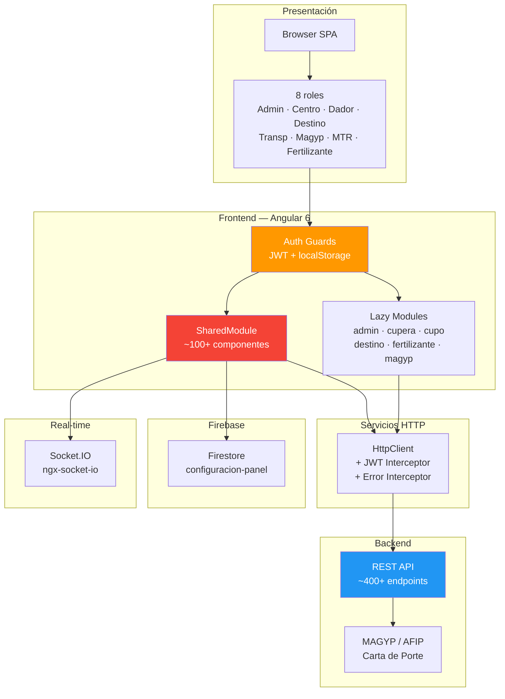
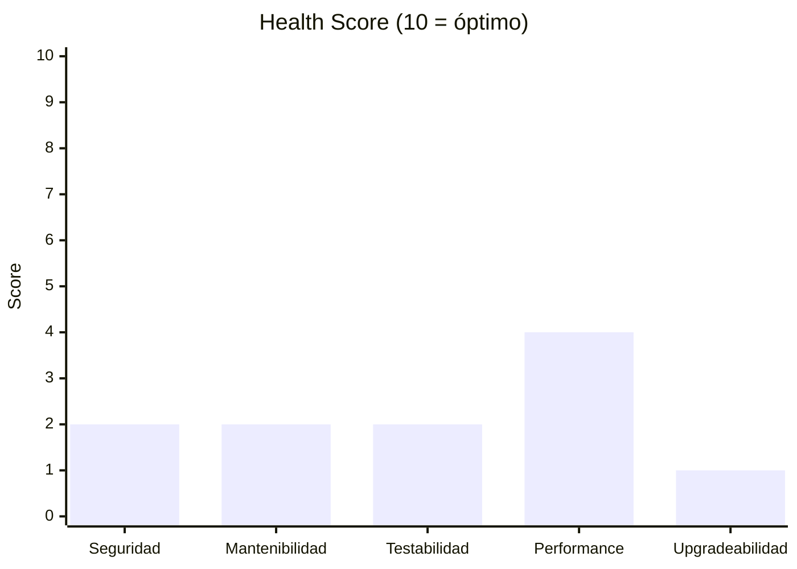
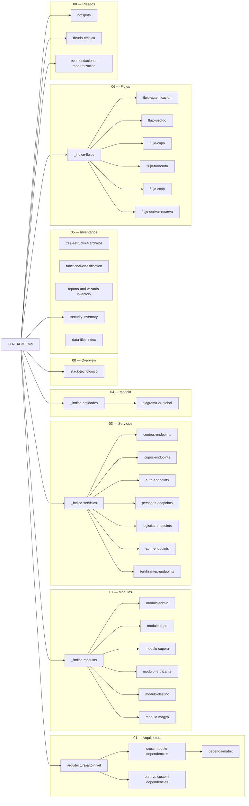

# Muvinapp — Documentación Técnica

> **Proyecto:** Muvinapp — Panel de administración multi-rol
> **Stack:** Angular 6.0.1 · TypeScript 2.7.2 · Angular Material · Kendo UI · Firebase/Firestore · Docker
> **Tipo:** SPA multi-rol para gestión de logística de transporte de granos y fertilizantes (Argentina)
> **Última revisión:** 2026-04-16
> **Archivos de documentación:** 38

---

> [!abstract] Propósito del sistema
> Muvinapp es el panel web de gestión logística que integra el circuito completo de transporte de granos y fertilizantes en Argentina: **dador de carga → corredor/operador → transportista → chofer → terminal/planta destino**. Incluye integración con MAGYP para carta de porte electrónica, gestión de cupos de descarga, turneada de camiones y reporting operativo. Opera en producción desde hace ~10 años sobre Angular 6 (EOL).

---

## Arquitectura de alto nivel



---

## Módulos principales

| # | Módulo | Descripción | Criticidad | Enlace |
|---|---|---|:---:|---|
| 1 | **Admin** | Gestión de usuarios, choferes, vehículos, parámetros del sistema | 🔴 | [[modulo-admin]] |
| 2 | **Cupo** | Asignación de cupos de descarga, solicitudes, seguimiento | 🔴 | [[modulo-cupo]] |
| 3 | **Cupera** | Evolución del módulo de cupos (v3/v5), gestión avanzada | 🔴 | [[modulo-cupera]] |
| 4 | **Fertilizante** | Circuito paralelo para transporte de fertilizantes | 🟡 | [[modulo-fertilizante]] |
| 5 | **Destino** | Panel de planta destino, posición, recepción | 🟡 | [[modulo-destino]] |
| 6 | **MAGYP** | Integración con MAGYP para carta de porte electrónica | 🟡 | [[modulo-magyp]] |

---

## Navegación rápida

### 📖 Visión general y arquitectura

| Documento | Contenido |
|---|---|
| [[stack-tecnologico]] | Versiones, estado de soporte y riesgos de cada tecnología |
| [[arquitectura-alto-nivel]] | Diagrama de capas, módulos y flujo de datos |
| [[cross-module-dependencies]] | Grafo de dependencias entre módulos |
| [[depends-matrix]] | Matriz de dependencias cuantificada |
| [[core-vs-custom-dependencies]] | Análisis core Angular vs librerías custom |

### 📦 Módulos y funcionalidades

| Documento | Contenido |
|---|---|
| [[_indice-modulos]] | Índice de los 6 módulos documentados |
| [[functional-classification]] | Clasificación funcional de todas las vistas |
| [[reports-and-wizards-inventory]] | Inventario de reportes, exports y wizards |
| [[data-files-index]] | Índice de archivos de datos estáticos |

### 🔌 Servicios backend y modelo de datos

| Documento | Contenido |
|---|---|
| [[_indice-servicios]] | Índice de 7 dominios de endpoints (~400+ rutas) |
| [[centros-endpoints]] | Endpoints de centros/plantas |
| [[cupos-endpoints]] | Endpoints de cupos y asignaciones |
| [[auth-endpoints]] | Endpoints de autenticación |
| [[personas-endpoints]] | Endpoints de personas/entidades |
| [[logistica-endpoints]] | Endpoints de logística y transporte |
| [[abm-endpoints]] | Endpoints ABM (alta-baja-modificación) |
| [[fertilizantes-endpoints]] | Endpoints de fertilizantes |
| [[_indice-entidades]] | Índice de entidades del dominio |
| [[diagrama-er-global]] | Diagrama ER global del sistema |

### 🔀 Flujos transversales

| Documento | Contenido |
|---|---|
| [[_indice-flujos]] | Índice de 6 flujos documentados |
| [[flujo-autenticacion]] | Login → JWT → guards → refresh |
| [[flujo-pedido]] | Carga de pedido → asignación → viaje |
| [[flujo-cupo]] | Solicitud de cupo → asignación → consumo |
| [[flujo-turneada]] | Gestión de turneada en planta destino |
| [[flujo-ccpp]] | Carta de porte electrónica (CCPP/MAGYP) |
| [[flujo-derivar-reserva]] | Derivación y reserva de cupos entre entidades |

### 📋 Inventarios

| Documento | Contenido |
|---|---|
| [[tree-estructura-archivos]] | Árbol completo de archivos del proyecto |
| [[security-inventory]] | 🔴 20 hallazgos de seguridad (10 críticos) |
| [[functional-classification]] | Clasificación funcional completa |
| [[reports-and-wizards-inventory]] | Reportes, exports y wizards |
| [[data-files-index]] | Archivos de datos e i18n |

### ⚠️ Riesgos y deuda técnica

| Documento | Contenido |
|---|---|
| [[hotspots]] | 🔴 15 archivos >1,500 líneas, god-services, SharedModule |
| [[deuda-tecnica]] | 🔴 25 items priorizados con matriz impacto/esfuerzo |
| [[recomendaciones-modernizacion]] | Roadmap de modernización en 5 fases |
| [[security-inventory]] | 🔴 Vulnerabilidades de seguridad (eval, RBAC, CSRF, secrets) |

---

## Estado de salud del proyecto



| Dimensión | Score | Observación clave |
|---|:---:|---|
| **Seguridad** | 2/10 | `eval()` activo, RBAC client-side, sin CSRF, JWT en localStorage |
| **Mantenibilidad** | 2/10 | God-module (SharedModule), 15 archivos >1,500 líneas, ~147 métodos en un servicio |
| **Testabilidad** | 2/10 | 554 spec files scaffold-only, sin CI gates de cobertura |
| **Performance** | 4/10 | SharedModule anula lazy loading, scripts globales innecesarios |
| **Upgradeabilidad** | 1/10 | Angular 6 (13 major versions atrás), deps muertas, string-based routes |

---

## Números clave

| Métrica | Valor |
|---|---:|
| Versión Angular | **6.0.1** (EOL Nov 2019) |
| Módulos lazy-loaded | **~20** |
| Endpoints backend | **~400+** |
| Roles del sistema | **8** |
| Archivos `.ts` en `src/` | **~1,200+** |
| Archivos `.spec.ts` | **554** |
| `.subscribe()` sin cleanup | **~3,200** (~95.3% del total) |
| Líneas del archivo más grande | **6,292** (`asignacion-v2.component.ts`) |
| Métodos en mayor servicio | **~147** (`centros.service.ts`) |
| Archivos versionados (zombie) | **36** |
| Items en localStorage | **43+** (incluye PII) |
| Hallazgos de seguridad | **20** (10 🔴 críticos) |

---

## Mapa completo de la documentación



---

## Convenciones de esta documentación

### Íconos de estado

| Ícono | Significado |
|:---:|---|
| 🟢 | OK / Bajo riesgo / Activo |
| 🟡 | Atención / Riesgo medio / Mantenimiento |
| 🔴 | Crítico / Alto riesgo / EOL / Deprecado |
| ⚠️ | Pendiente de verificar / Dato incierto |
| 💀 | Código muerto / Dependencia sin usar |

### Navegación

- Todos los documentos usan **`[[wikilinks]]`** compatibles con [Obsidian](https://obsidian.md/).
- Los diagramas están en **Mermaid** — se renderizan nativamente en Obsidian y GitHub.
- Cada módulo/servicio/flujo enlaza a sus documentos relacionados en la sección "Referencias".

### Estructura de carpetas

```
docs/
├── README.md                            ← Este archivo
├── 00-overview/                         ← Stack tecnológico
│   └── stack-tecnologico.md
├── 01-arquitectura/                     ← Arquitectura y dependencias
│   ├── arquitectura-alto-nivel.md
│   ├── cross-module-dependencies.md
│   ├── depends-matrix.md
│   └── core-vs-custom-dependencies.md
├── 01-modulos/                          ← Documentación por módulo
│   ├── _indice-modulos.md
│   └── modulo-{nombre}.md (×6)
├── 03-servicios-backend/                ← Endpoints REST agrupados por dominio
│   ├── _indice-servicios.md
│   └── {dominio}-endpoints.md (×7)
├── 04-modelo-de-datos/                  ← Entidades y diagrama ER
│   ├── _indice-entidades.md
│   └── diagrama-er-global.md
├── 05-inventarios/                      ← Inventarios transversales
│   ├── tree-estructura-archivos.md
│   ├── functional-classification.md
│   ├── reports-and-wizards-inventory.md
│   ├── security-inventory.md
│   └── data-files-index.md
├── 06-flujos-transversales/             ← Flujos de negocio end-to-end
│   ├── _indice-flujos.md
│   └── flujo-{nombre}.md (×6)
└── 08-riesgos-y-deuda-tecnica/          ← Riesgos, deuda y modernización
    ├── hotspots.md
    ├── deuda-tecnica.md
    └── recomendaciones-modernizacion.md
```

### Cómo contribuir

1. Abrir la carpeta `docs/` como vault en Obsidian.
2. Cualquier corrección o adición debe mantener los `[[wikilinks]]` y diagramas Mermaid.
3. Marcar datos no verificados con `⚠️ Pendiente de verificar`.
4. No eliminar hallazgos de seguridad o deuda técnica — actualizar su estado cuando se resuelvan.
