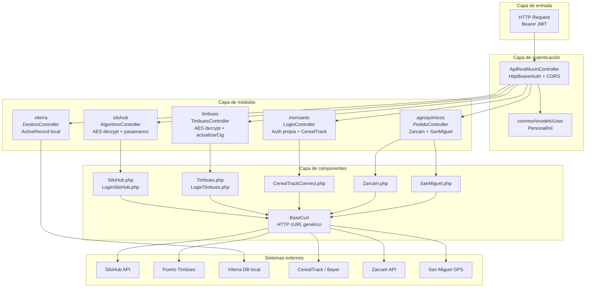
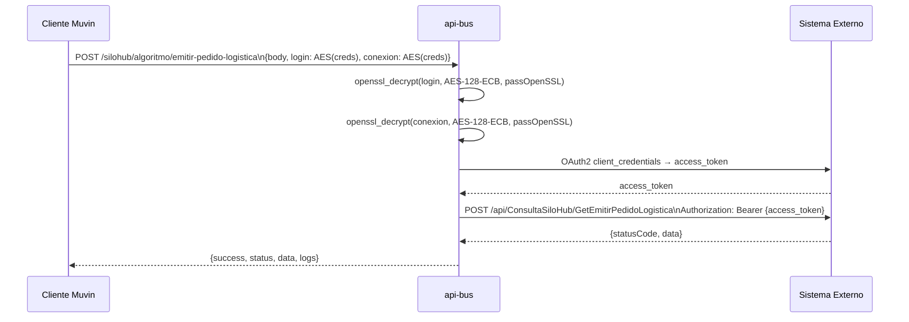

# Arquitectura de Alto Nivel — api-bus

## Diagrama de capas



## Patrón de proxy AES

Los módulos `silohub` y `timbues` reciben las credenciales **cifradas con AES-128-ECB** desde el cliente. El bus las descifra usando su `passOpenSSL` interno (configurado en `main.php`) y las usa para autenticarse contra el sistema externo. Esto evita que las credenciales viajen en texto plano por la red interna.



## Formato de respuesta estándar

Todos los endpoints devuelven JSON normalizado por el `beforeSend` de Yii:

```json
{
  "success": true,
  "status": 200,
  "data": { ... }
}
```

En caso de error del proxy interno:

```json
{
  "status": 500,
  "mensaje": "Datos de conexión o login inválidos"
}
```
