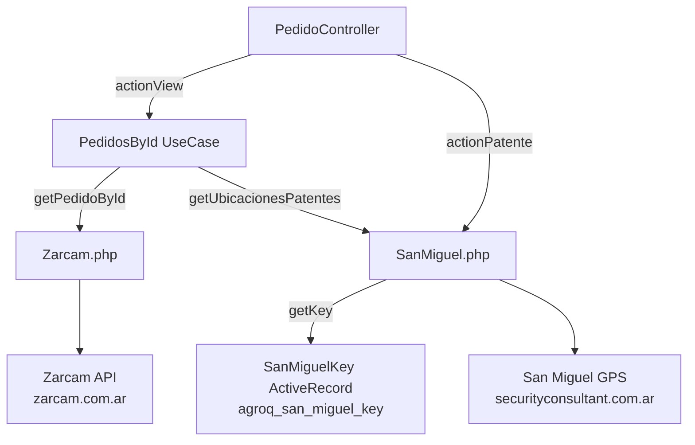

# Módulo: agroquimicos

> **Ruta/Namespace:** `source/modules/agroquimicos/`
> **Criticidad:** 🟡 Media
> **Estado:** Activo

## Propósito

Integra dos sistemas externos para el flujo de **agroquímicos**:
1. **Zarcam** — gestión de pedidos de agroquímicos
2. **San Miguel GPS** — ubicación de camiones por patente

Usa la única tabla propia de api-bus (`agroq_san_miguel_key`) para almacenar la API key de San Miguel.

## Funcionalidades que expone

| # | Funcionalidad | Descripción | Detalle |
|---|---|---|---|
| 5.1 | Ver pedido por ID | Pedido Zarcam + ubicaciones GPS San Miguel combinados | [f07-agroquimicos-pedido.md](../02-funcionalidades/f07-agroquimicos-pedido.md) |
| 5.2 | Ubicación por patente | GPS de un camión por patente desde San Miguel | [f07-agroquimicos-pedido.md](../02-funcionalidades/f07-agroquimicos-pedido.md) |

## Dependencias

- **Depende de:** [[modulo-common]] (BaseCurl), `agroquimicos\models\SanMiguelKey` (BD)
- **Es usado por:** Frontend de agroquímicos en Muvin

## Diagrama de componentes



## Modelo de datos

| Tabla | Descripción |
|---|---|
| `agroq_san_miguel_key` | Almacena la API key para autenticación con San Miguel GPS |

```sql
CREATE TABLE agroq_san_miguel_key (
  id  INT PRIMARY KEY AUTO_INCREMENT,
  key VARCHAR(255) NOT NULL
);
```

## Configuración (main.php)

```php
'agroquimicos' => [
    'urlBaseZarcam' => 'http://api.zarcam.com.ar:443/SGLAPIS-ZARCAM-PROD',
    'usernameZarcam' => 'admin',      // 🔒 hardcodeado
    'secretZarcam' => 'admin',        // 🔴 credencial trivial
    'urlBaseSanMiguel' => 'https://desa3.securityconsultant.com.ar:8081',  // ⚠️ URL de desa
]
```

## Riesgos

- 🔴 `usernameZarcam = 'admin'` / `secretZarcam = 'admin'` — credenciales triviales hardcodeadas
- 🔴 `urlBaseSanMiguel` apunta a `desa3` — posible URL de entorno de desarrollo usada en producción ⚠️ Pendiente de verificar
- 🟡 `PedidosById::excecute()` — typo en nombre del método (`excecute` en lugar de `execute`)

## Archivos fuente relevantes

- `source/modules/agroquimicos/controllers/PedidoController.php`
- `source/modules/agroquimicos/useCase/PedidosById.php`
- `source/modules/agroquimicos/components/Zarcam.php`
- `source/modules/agroquimicos/components/SanMiguel.php`
- `source/modules/agroquimicos/models/SanMiguelKey.php`
- `source/migrations/m220711_134828_create_agroq_san_miguel_key_table.php`
