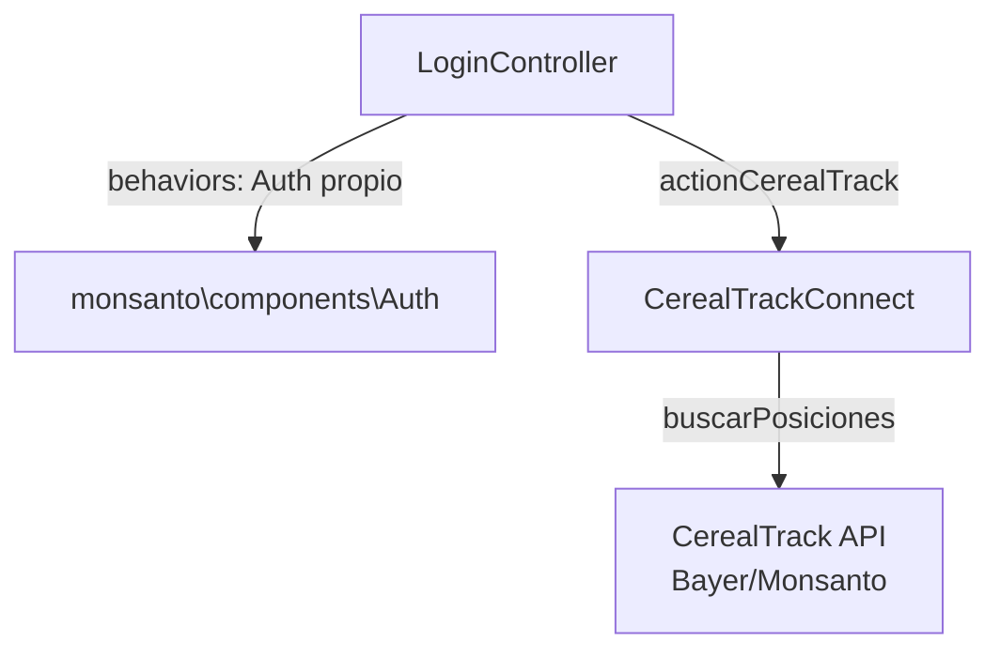

# Módulo: monsanto

> **Ruta/Namespace:** `source/modules/monsanto/`
> **Criticidad:** 🟡 Media
> **Estado:** Activo

## Propósito

Proxy hacia **CerealTrack** (sistema de Bayer/Monsanto) para consultar **posiciones geográficas de camiones** en tiempo real por demandante. Tiene su propio sistema de autenticación (`monsanto\components\Auth`).

## Funcionalidades que expone

| # | Funcionalidad | Descripción | Detalle |
|---|---|---|---|
| 4.1 | CerealTrack — buscar posiciones | Devuelve posiciones de camiones para un demandante | [f06-monsanto-cereal-track.md](../02-funcionalidades/f06-monsanto-cereal-track.md) |

## Dependencias

- **Depende de:** [[modulo-common]] (BaseCurl), `monsanto\components\Auth`
- **Es usado por:** Frontend Muvin (visualización de camiones en mapa)

## Diagrama de componentes



## Configuración

```php
// urlBase se obtiene de Yii::$app->params['urlCerealTrack']
// No hay módulo con propiedades propias — usa params globales
```

## Riesgos

- 🔴 `Origin: ['*']` en CORS — acepta requests de cualquier origen
- 🟡 URL en `params` globales — no en propiedades del Module como los demás módulos (inconsistente)
- ⚠️ `monsanto\components\Auth` sin documentación — mecanismo de autenticación propio no analizado

## Archivos fuente relevantes

- `source/modules/monsanto/controllers/LoginController.php`
- `source/modules/monsanto/components/CerealTrackConnect.php`
- `source/modules/monsanto/components/Auth.php`
- `source/modules/monsanto/Module.php`
