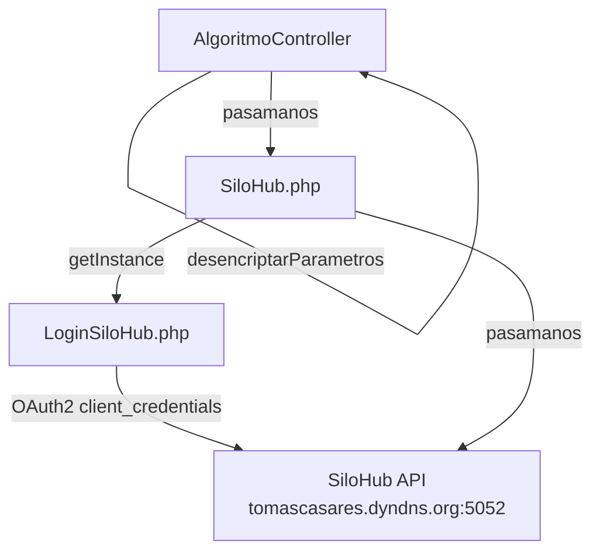

# Módulo: silohub

> **Ruta/Namespace:** `source/modules/silohub/`
> **Criticidad:** 🔴 Alta
> **Estado:** Activo

## Propósito

Proxy hacia la **API REST de SiloHub** — sistema de gestión de operaciones en plantas de acopio de granos. Permite emitir pedidos de logística, consultar contratos, existencias, plantas, campos de productores y choferes. Descifra credenciales AES antes de comunicarse con SiloHub.

## Funcionalidades que expone

| # | Funcionalidad | Descripción | Detalle |
|---|---|---|---|
| 1.1 | Emitir pedido logística | Registra un egreso de grano en SiloHub | [f01-silohub-emitir-pedido.md](../02-funcionalidades/f01-silohub-emitir-pedido.md) |
| 1.2 | Anular egreso planta | Cancela un egreso registrado | [f02-silohub-anular-egreso.md](../02-funcionalidades/f02-silohub-anular-egreso.md) |
| 1.3 | GetEntidadesClientes | Sincroniza catálogo de clientes (2 páginas) | [f03-silohub-entidades.md](../02-funcionalidades/f03-silohub-entidades.md) |
| 1.4 | GetCamposProductor | Consulta campos del productor | [f03-silohub-entidades.md](../02-funcionalidades/f03-silohub-entidades.md) |
| 1.5 | GetProductos | Lista especies/productos disponibles | [f03-silohub-entidades.md](../02-funcionalidades/f03-silohub-entidades.md) |
| 1.6 | GetContratos | Lista contratos activos | [f03-silohub-entidades.md](../02-funcionalidades/f03-silohub-entidades.md) |
| 1.7 | GetPlantas | Catálogo de plantas (GET paginado) | [f03-silohub-entidades.md](../02-funcionalidades/f03-silohub-entidades.md) |
| 1.8 | GetSaldoProductorEspecieCosecha | Saldo por especie y cosecha | [f03-silohub-entidades.md](../02-funcionalidades/f03-silohub-entidades.md) |
| 1.9 | GetChoferesAlgoritmo | Lista transportistas SiloHub | [f03-silohub-entidades.md](../02-funcionalidades/f03-silohub-entidades.md) |
| 1.10 | GetModificarEgreso | Modifica un egreso existente | [f03-silohub-entidades.md](../02-funcionalidades/f03-silohub-entidades.md) |

## Dependencias

- **Depende de:** [[modulo-common]] (BaseCurl)
- **Es usado por:** `ms-legacy`, `full-platform` (descargas-app backend)

## Diagrama de componentes



## Configuración (main.php)

```php
'silohub' => [
    'urlBaseSiloHub' => 'http://tomascasares.dyndns.org:5052',
    'empresaSiloHub' => 'PRU',
    'usuarioSiloHub' => 'MUVIN',
    'sucursalSiloHub' => 'CENTRAL',
    'client_id' => 'api.mobile.client',
    'client_secret' => 'secret',
    'grant_type' => 'client_credentials',
    'passOpenSSL' => 'p7^W:E[9[%FkYx9Rtu3ZH~N8?a(eCwDu',  // 🔒 hardcodeado
]
```

## Riesgos

- 🔴 `passOpenSSL` hardcodeada en `config/main.php` — ver [[security-inventory]]
- 🔴 `empresaSiloHub = 'PRU'` — parece ser valor de prueba en producción ⚠️ Pendiente de verificar
- 🟡 URL usa dominio dinámico DYNDNS — riesgo de indisponibilidad si cambia la IP
- 🔴 `client_secret = 'secret'` — credencial trivial hardcodeada

## Archivos fuente relevantes

- `source/modules/silohub/controllers/AlgoritmoController.php`
- `source/modules/silohub/components/SiloHub.php`
- `source/modules/silohub/components/LoginSiloHub.php`
- `source/modules/silohub/Module.php`
