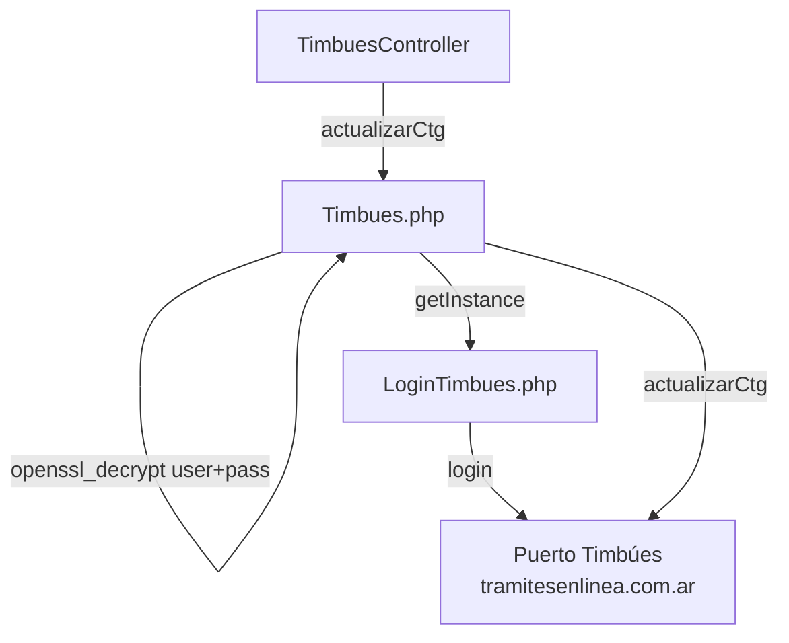

# Módulo: timbues

> **Ruta/Namespace:** `source/modules/timbues/`
> **Criticidad:** 🔴 Alta
> **Estado:** Activo

## Propósito

Proxy hacia el **sistema del Puerto Timbúes** (`tramitesenlinea.com.ar/puertos/muvin`). Permite actualizar el **CTG (Código de Trazabilidad de Granos)** de camiones que ingresan a ese puerto, operación requerida por AFIP/SENASA para tránsito de granos.

## Funcionalidades que expone

| # | Funcionalidad | Descripción | Detalle |
|---|---|---|---|
| 2.1 | Actualizar CTG | Actualiza el CTG del camión en el sistema del puerto | [f04-timbues-actualizar-ctg.md](../02-funcionalidades/f04-timbues-actualizar-ctg.md) |

## Dependencias

- **Depende de:** [[modulo-common]] (BaseCurl)
- **Es usado por:** `api-plugin`, `descargas-app`

## Diagrama de componentes



## Configuración (main.php)

```php
'timbues' => [
    'urlBaseTimbues' => 'https://puerto.tramitesenlinea.com.ar/puertos/muvin',
    'passOpenSSL' => '9TL69DM>}r]grz`WB]{-xb8yh_{rNK6[',  // 🔒 hardcodeado
]
```

## Riesgos

- 🔴 `passOpenSSL` hardcodeada en `config/main.php`
- 🟡 Sin reintentos automáticos si falla la conexión al puerto

## Archivos fuente relevantes

- `source/modules/timbues/controllers/TimbuesController.php`
- `source/modules/timbues/components/Timbues.php`
- `source/modules/timbues/components/LoginTimbues.php`
- `source/modules/timbues/Module.php`
