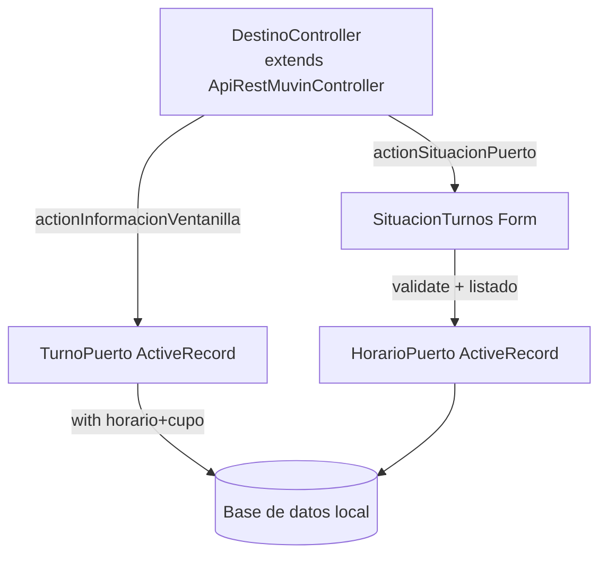

# Módulo: viterra

> **Ruta/Namespace:** `source/modules/viterra/`
> **Criticidad:** 🟡 Media
> **Estado:** Activo

## Propósito

Gestiona **turnos y ventanillas de descarga** en terminales Viterra. A diferencia de los demás módulos, **no conecta a una API externa**: opera sobre **modelos ActiveRecord locales** que replican datos de Viterra en la base de datos de api-bus.

## Funcionalidades que expone

| # | Funcionalidad | Descripción | Detalle |
|---|---|---|---|
| 3.1 | Situación Puerto | Lista turnos disponibles con filtros | [f05-viterra-situacion-puerto.md](../02-funcionalidades/f05-viterra-situacion-puerto.md) |
| 3.2 | Información Ventanilla | Detalle de un horario/turno específico | [f05-viterra-situacion-puerto.md](../02-funcionalidades/f05-viterra-situacion-puerto.md) |

## Dependencias

- **Depende de:** Base de datos local (modelos ActiveRecord)
- **Es usado por:** Frontend de destino / `full-platform`
- **Requiere autenticación:** JWT Bearer vía [[modulo-common]] (`ApiRestMuvinController`)

## Diagrama de componentes

## Modelos ActiveRecord

| Modelo | Tabla (inferida) | Descripción |
|---|---|---|
| `TurnoPuerto` | `turno_puerto` | Turno asignado en el puerto |
| `HorarioPuerto` | `horario_puerto` | Configuración de horarios por fecha y puerto |
| `OrigenDestino` | `origen_destino` | Relación persona-rol con un puerto |
| `Cupo` | `cupo` | Cupo de descarga |
| `Ventanilla` | `ventanilla` | Ventanilla de atención |
| `Producto`, `Camion`, `Acoplado`, `Equipo`, `ChoferEquipo`, `Personas`, `PersonaRol` | — | Entidades de soporte |

## Riesgos

- 🟡 `behaviors()` de autenticación comentado — autenticación activa vía `ApiRestMuvinController` padre, pero los comentarios pueden confundir a nuevos desarrolladores
- ⚠️ Sin API externa: la sincronización de datos Viterra→BD local no está documentada en este repositorio

## Archivos fuente relevantes

- `source/modules/viterra/controllers/DestinoController.php`
- `source/modules/viterra/forms/SituacionTurnos.php`
- `source/modules/viterra/models/` (12 modelos)
- `source/modules/viterra/Module.php`
