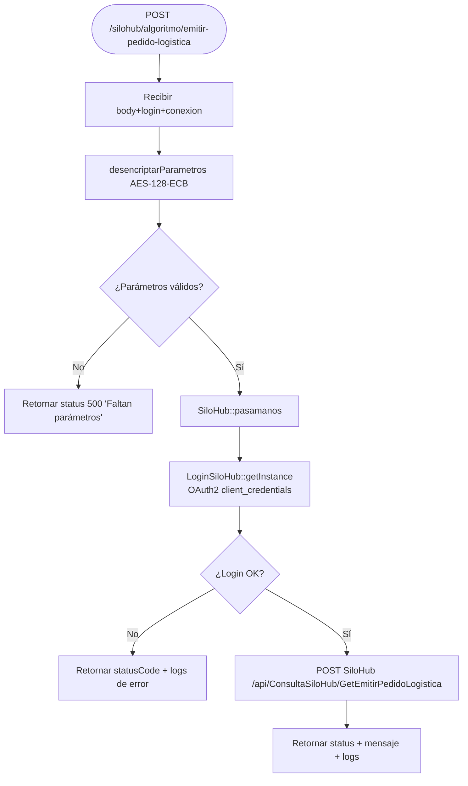

# F-01 — Emitir Pedido Logística (SiloHub)

> **Módulo:** [[modulo-silohub]]
> **Tipo:** 🔌 Integración
> **Endpoint de entrada:** `POST /silohub/algoritmo/emitir-pedido-logistica`

## Descripción funcional

Registra un **egreso de grano** desde una planta SiloHub hacia un camión. Descifra las credenciales AES recibidas, se autentica con SiloHub vía OAuth2 y reenvía el pedido al endpoint `/api/ConsultaSiloHub/GetEmitirPedidoLogistica`.

## Precondiciones

- Cliente debe enviar `body`, `login` y `conexion` cifrados con AES-128-ECB usando la `passOpenSSL` del módulo silohub
- SiloHub debe estar disponible en `tomascasares.dyndns.org:5052`

## Flujo principal



## Servicios backend invocados

| Paso | Verbo | Ruta | Payload | Respuesta |
|---|---|---|---|---|
| Auth | POST | `{host}/connect/token` | `client_credentials` grant | `{access_token}` |
| Acción | POST | `/api/ConsultaSiloHub/GetEmitirPedidoLogistica` | `body` descifrado | `{statusCode, mensaje, logs}` |

## Respuesta normalizada

```json
{ "success": true, "status": 200, "data": { "status": 200, "mensaje": {...}, "logs": [...] } }
```
