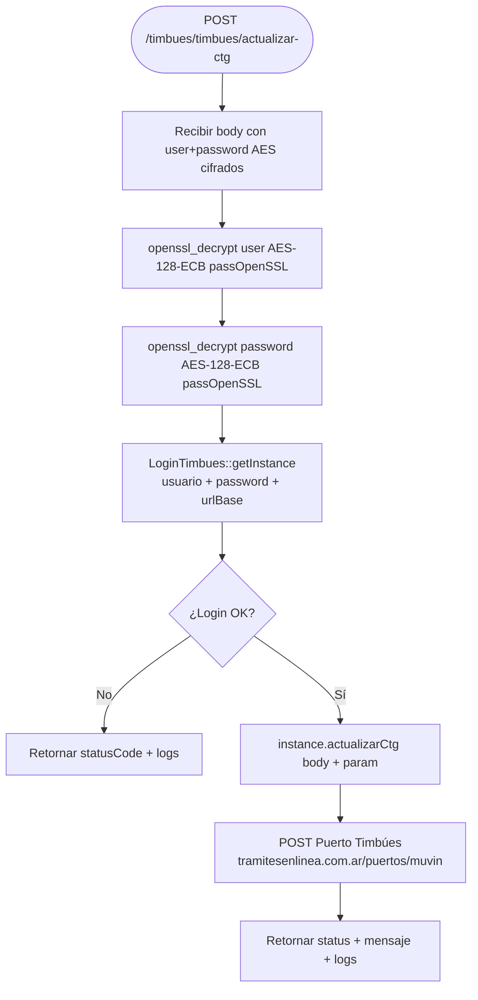

# F-04 — Actualizar CTG (Timbúes)

> **Módulo:** [[modulo-timbues]]
> **Tipo:** 🔌 Integración
> **Endpoint de entrada:** `POST /timbues/timbues/actualizar-ctg`

## Descripción funcional

Actualiza el **CTG (Código de Trazabilidad de Granos)** de un camión que ingresa al Puerto Timbúes. Las credenciales del usuario del puerto viajan cifradas con AES-128-ECB y son descifradas por el bus antes de autenticarse.

## Flujo principal



## Servicios backend invocados

| Verbo | Ruta | Descripción |
|---|---|---|
| POST | `https://puerto.tramitesenlinea.com.ar/puertos/muvin/[accion]` | Actualización de CTG |

## Payload esperado

```json
{
  "user": "<AES-128-ECB cifrado>",
  "password": "<AES-128-ECB cifrado>",
  "ctg": "...",
  "patente": "...",
  "...": "otros campos del CTG"
}
```

## Riesgos

- 🔴 Sin reintentos si el puerto no responde
- 🟡 Un fallo en el descifrado AES retorna `statusCode` de error sin indicar claramente que fue un problema de credenciales
