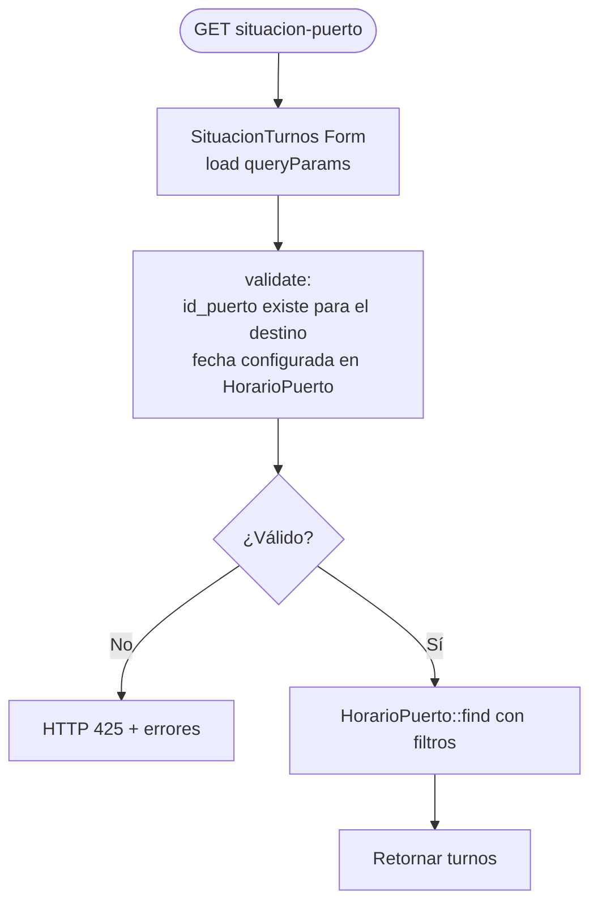

# F-05 — Situación Puerto y Ventanilla (Viterra)

> **Módulo:** [[modulo-viterra]]
> **Tipo:** 📊 Consulta
> **Endpoints de entrada:** `GET /viterra/destino/situacion-puerto` · `GET /viterra/destino/informacion-ventanilla/{id_horario}`

## Descripción funcional

Permite al usuario destino (Viterra) consultar el estado de turnos en un puerto específico para un producto y fecha dados, y ver el detalle de un horario/ventanilla particular.

## Endpoints

### `GET /viterra/destino/situacion-puerto`

**Parámetros query:**

| Parámetro | Tipo | Req | Descripción |
|---|---|---|---|
| `id_puerto` | int | ✅ | ID del puerto (valida que pertenezca al destino autenticado) |
| `id_producto` | int | ✅ | ID del producto |
| `fecha` | date (yyyy-M-d) | ✅ | Fecha de consulta |
| `cam_ventana` | — | No | Filtro adicional |

**Validaciones:**
- `id_puerto` debe existir en `OrigenDestino` para el `id_destino_persona` del usuario autenticado
- La fecha debe tener configuración de `HorarioPuerto` existente (si no → HTTP 425)

### `GET /viterra/destino/informacion-ventanilla/{id_horario}`

Devuelve `TurnoPuerto[]` con relaciones `horario` y `cupo` para el horario indicado.

## Flujo principal

