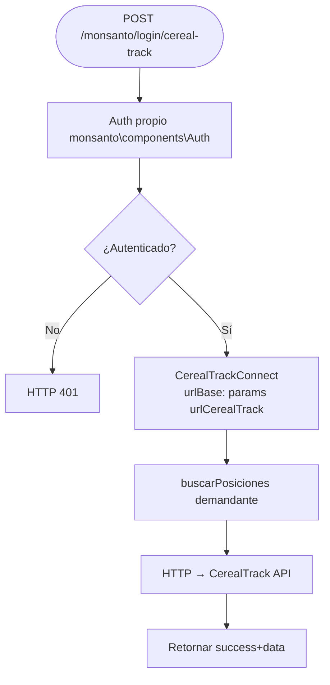
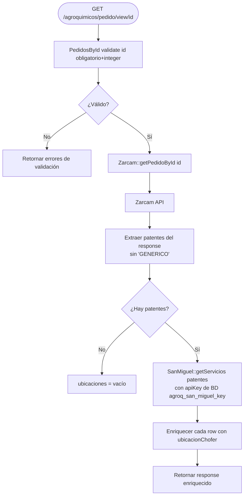

# F-06 — Posiciones CerealTrack (Monsanto/Bayer)

> **Módulo:** [[modulo-monsanto]]
> **Tipo:** 🔌 Integración
> **Endpoint de entrada:** `POST /monsanto/login/cereal-track`

## Descripción funcional

Consulta las **posiciones geográficas de camiones** en tiempo real para un `demandante` dado, usando la API de CerealTrack de Bayer/Monsanto.

## Flujo



## Payload esperado

```json
{ "demandante": "<identificador del demandante>" }
```

## Servicios backend invocados

| Verbo | Ruta | Descripción |
|---|---|---|
| POST/GET | `{urlCerealTrack}/[acción]` | Posiciones de camiones | 

⚠️ La URL exacta del endpoint CerealTrack no está visible en el código analizado — está encapsulada en `CerealTrackConnect::buscarPosiciones`.

---

# F-07 — Pedido Agroquímico + GPS (Zarcam + San Miguel)

> **Módulo:** [[modulo-agroquimicos]]
> **Tipo:** 🔌 Integración
> **Endpoints:** `GET /agroquimicos/pedido/view/{id}` · `GET /agroquimicos/pedido/patente/{patente}`

## Descripción funcional

Dos operaciones:
1. **Ver pedido por ID**: obtiene pedido de Zarcam y enriquece con ubicaciones GPS de los camiones (San Miguel)
2. **Ubicación por patente**: consulta directa a San Miguel por una patente específica

## Flujo: Ver pedido por ID



## Servicios backend invocados

| Paso | Verbo | Sistema | Ruta/Acción | Descripción |
|---|---|---|---|---|
| 1 | GET/POST | Zarcam | `{urlBaseZarcam}/[acción]` | Pedido por ID |
| 2 | POST | San Miguel | `{urlBaseSanMiguel}/[acción]` | Ubicaciones por patentes |

## Datos que lee

- `agroquimicos\models\SanMiguelKey` (tabla `agroq_san_miguel_key`) para obtener la API key activa
