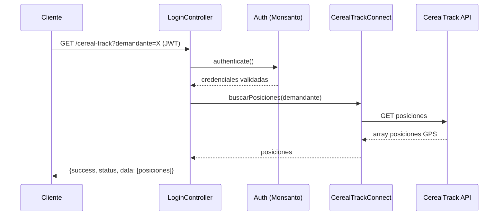

# Endpoints — Módulo Monsanto / CerealTrack

> **Controlador:** `modules/monsanto/controllers/LoginController.php`
> **Base URL:** `/monsanto/login/`
> **Autenticación:** JWT Bearer + autenticación propia Monsanto via `monsanto\components\Auth`

---

## GET `/monsanto/login/cereal-track`

**Descripción:** Consulta las posiciones GPS de los camiones registrados en el sistema CerealTrack (Bayer). Retorna trazabilidad de movimientos de semillas.

**Flujo:**



**Query Params:**

| Campo | Tipo | Requerido | Descripción |
|-------|------|-----------|-------------|
| `demandante` | string | Sí | Identificador del demandante/empresa |

**Response:**
```json
{
  "success": true,
  "status": 200,
  "data": [
    {
      "patente": "ABC123",
      "latitud": -34.123,
      "longitud": -58.456,
      "timestamp": "2024-01-15T10:30:00",
      "estado": "EN_TRANSITO"
    }
  ]
}
```

---

## Componentes internos

| Componente | Rol |
|---|---|
| `LoginController` | Controlador con acción `cerealTrack` |
| `Auth` | Autenticador propio del módulo Monsanto |
| `CerealTrackConnect` | Cliente de integración con CerealTrack API |
| `BaseCurl` | Cliente HTTP (SSL deshabilitado ⚠️) |

---

## Configuración requerida

En `config/main.php`:

```php
'urlCerealTrack' => 'https://...',    // URL de la API CerealTrack
```

> ⚠️ La URL real está en `params.php` y puede ser variable por entorno.

---

## Referencias

- [[modulo-monsanto]]
- [[f06-monsanto-cereal-track]]
