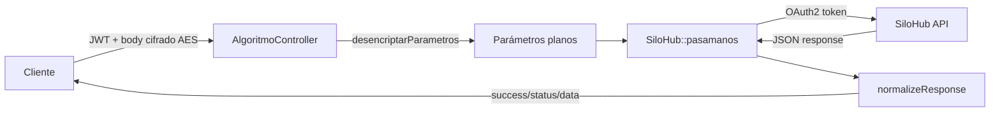

# Endpoints — Módulo SiloHub

> **Controlador:** `modules/silohub/controllers/AlgoritmoController.php`
> **Base URL:** `/silohub/algoritmo/`
> **Autenticación:** JWT Bearer

---

## Patrón común

Todos los endpoints de SiloHub siguen el mismo flujo:



---

## Endpoints

### POST `/silohub/algoritmo/emitir-pedido-logistica`

**Descripción:** Emite un pedido de logística en el sistema SiloHub.

**Autenticación:** JWT Bearer

**Request Body (cifrado AES-128-ECB):**

| Campo | Tipo | Descripción |
|-------|------|-------------|
| `empresa` | string | Código empresa (ej: `PRU`) |
| `login` | string | Usuario SiloHub |
| `connection` | string | Conexión SiloHub |
| `...` | mixed | Campos específicos del pedido |

**Response:**
```json
{
  "success": true,
  "status": 200,
  "data": { ... }
}
```

---

### POST `/silohub/algoritmo/anular-egreso-planta`

**Descripción:** Anula un egreso de planta en SiloHub.

**Request Body (cifrado):** Incluye `nroComprobante`, `empresa`, `login`, `connection`.

---

### GET `/silohub/algoritmo/get-entidades-clientes`

**Descripción:** Obtiene catálogo de entidades y clientes. Realiza **dos llamadas** a SiloHub y fusiona resultados paginados.

**Query Params (cifrados en `param`):**

| Campo | Descripción |
|-------|-------------|
| `empresa` | Código empresa |
| `login` | Usuario |
| `connection` | Conexión |
| `pagina` | Número de página (para paginación) |

> ⚠️ Este endpoint realiza 2 requests consecutivos a SiloHub y combina los resultados en un único array.

---

### GET `/silohub/algoritmo/get-campos-productor`

**Descripción:** Retorna los campos asociados a un productor en SiloHub.

---

### GET `/silohub/algoritmo/get-productos`

**Descripción:** Catálogo de productos disponibles.

---

### GET `/silohub/algoritmo/get-contratos`

**Descripción:** Lista de contratos del productor.

---

### GET `/silohub/algoritmo/get-plantas`

**Descripción:** Plantas disponibles para el productor.

---

### GET `/silohub/algoritmo/get-saldo-productor-especie-cosecha`

**Descripción:** Saldo del productor discriminado por especie y cosecha.

---

### GET `/silohub/algoritmo/get-choferes-algoritmo`

**Descripción:** Lista de choferes registrados en el sistema.

---

### POST `/silohub/algoritmo/get-modificar-egreso`

**Descripción:** Modifica un egreso previamente registrado en SiloHub.

---

## Componentes internos

| Componente | Rol |
|---|---|
| `AlgoritmoController` | Controlador con las 10 acciones |
| `SiloHub::pasamanos()` | Facade que gestiona OAuth2 y proxea el request |
| `LoginSiloHub` | Singleton que obtiene y cachea el token OAuth2 |
| `desencriptarParametros()` | Función que aplica AES-128-ECB decrypt |
| `BaseCurl` | Cliente HTTP (SSL verification deshabilitada ⚠️) |

---

## Referencias

- [[modulo-silohub]]
- [[f01-silohub-emitir-pedido]]
- [[f02-silohub-anular-egreso]]
