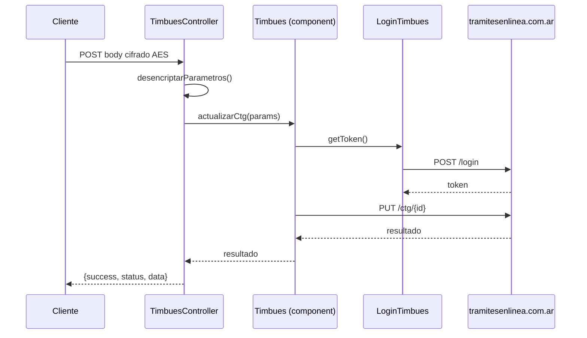

# Endpoints — Módulo Timbúes

> **Controlador:** `modules/timbues/controllers/TimbuesController.php`
> **Base URL:** `/timbues/timbues/`
> **Autenticación:** JWT Bearer

---

## POST `/timbues/timbues/actualizar-ctg`

**Descripción:** Actualiza la Carta de Porte (CTG) en el sistema de Puerto Timbúes.

**Flujo:**



**Request Body (cifrado AES-128-ECB):**

| Campo | Tipo | Descripción |
|-------|------|-------------|
| `ctg` | string | Número de CTG a actualizar |
| `login` | string | Usuario Timbúes |
| `...` | mixed | Campos adicionales del CTG |

**Response exitosa:**
```json
{
  "success": true,
  "status": 200,
  "data": { "ctg": "...", "estado": "CONFIRMADO" }
}
```

**Errores posibles:**

| Código | Descripción |
|--------|-------------|
| 401 | Token JWT inválido o expirado |
| 500 | Error al conectar con tramitesenlinea.com.ar |
| 422 | Validación de parámetros fallida |

---

## Componentes internos

| Componente | Rol |
|---|---|
| `TimbuesController` | Controlador con acción `actualizarCtg` |
| `Timbues` | Facade de integración con Timbúes |
| `LoginTimbues` | Gestión de autenticación con puerto Timbúes |
| `BaseCurl` | Cliente HTTP (SSL deshabilitado ⚠️) |

---

## Referencias

- [[modulo-timbues]]
- [[f04-timbues-actualizar-ctg]]
