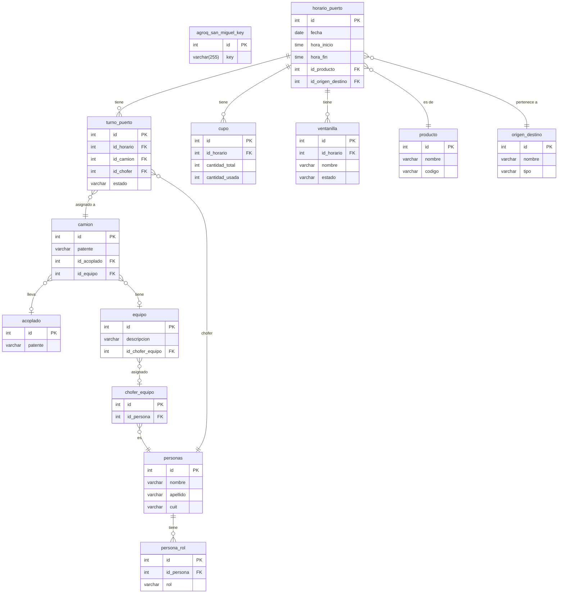

# Modelo de Datos — api-bus

> **Última revisión:** 2026-04-29

api-bus es principalmente un proxy de integración y **no posee un modelo de datos propio extenso**. Sin embargo, mantiene dos conjuntos de entidades:

1. **`SanMiguelKey`** — Tabla propia: almacena credenciales/tokens para el GPS SanMiguel.
2. **Modelos Viterra (12 entidades)** — ActiveRecord que mapea la base de datos del sistema Viterra (leída, no escrita por api-bus).

---

## Diagrama ER Global

---

## Resumen de entidades

| Entidad | Tabla | Módulo | Tipo | Descripción |
|---------|-------|--------|------|-------------|
| `SanMiguelKey` | `agroq_san_miguel_key` | agroquimicos | Propia (R/W) | Tokens GPS SanMiguel |
| `HorarioPuerto` | `horario_puerto` | viterra | Externa (R) | Franjas horarias de carga |
| `TurnoPuerto` | `turno_puerto` | viterra | Externa (R) | Turnos asignados |
| `Cupo` | `cupo` | viterra | Externa (R) | Disponibilidad por horario |
| `Ventanilla` | `ventanilla` | viterra | Externa (R) | Ventanillas de carga |
| `Producto` | `producto` | viterra | Externa (R) | Granos/productos |
| `OrigenDestino` | `origen_destino` | viterra | Externa (R) | Orígenes y destinos |
| `Camion` | `camion` | viterra | Externa (R) | Vehículos registrados |
| `Acoplado` | `acoplado` | viterra | Externa (R) | Acoplados de camiones |
| `Equipo` | `equipo` | viterra | Externa (R) | Equipos de trabajo |
| `ChoferEquipo` | `chofer_equipo` | viterra | Externa (R) | Relación chofer-equipo |
| `Personas` | `personas` | viterra | Externa (R) | Personas/choferes |
| `PersonaRol` | `persona_rol` | viterra | Externa (R) | Roles de personas |

---

## Archivos de detalle

- [[entidad-san-miguel-key]]
- [[entidades-viterra]]
