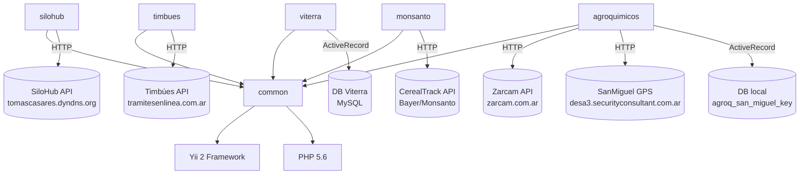

# Dependencias entre módulos — api-bus

> **Última revisión:** 2026-04-29

---

## Matriz de dependencias

| Módulo | common | silohub | timbues | viterra | monsanto | agroquimicos | DB externa |
|--------|--------|---------|---------|---------|----------|--------------|------------|
| **common** | — | ← | ← | ← | ← | ← | ✗ |
| **silohub** | ✅ usa | — | ✗ | ✗ | ✗ | ✗ | ✗ |
| **timbues** | ✅ usa | ✗ | — | ✗ | ✗ | ✗ | ✗ |
| **viterra** | ✅ usa | ✗ | ✗ | — | ✗ | ✗ | ✅ Viterra DB |
| **monsanto** | ✅ usa | ✗ | ✗ | ✗ | — | ✗ | ✗ |
| **agroquimicos** | ✅ usa | ✗ | ✗ | ✗ | ✗ | — | ✅ agroq_san_miguel_key |

> Todos los módulos dependen de `common` (JWT auth, BaseCurl, normalización de respuestas).
> Ningún módulo depende de otro módulo de negocio (bajo acoplamiento horizontal ✅).

---

## Diagrama de dependencias

---

## Dependencias de composer

Dependencias declaradas en `composer.json`:

| Paquete | Versión | Tipo | Uso |
|---------|---------|------|-----|
| `yiisoft/yii2` | ~2.0.14 | Producción | Framework principal |
| `yiisoft/yii2-swiftmailer` | ~2.0.0 | Producción | Email (no usado actualmente) |
| `yiisoft/yii2-redis` | ~2.0.0 | Producción | Caché Redis (posiblemente no activo) |
| `yiisoft/yii2-bootstrap` | ~2.0.0 | Producción | Bootstrap (no relevante para API) |
| `yiisoft/yii2-debug` | ~2.0.0 | Dev | Debugger Yii |
| `yiisoft/yii2-gii` | ~2.0.0 | Dev | Generador de código |
| `yiisoft/yii2-faker` | ~0.1.0 | Dev | Datos falsos para tests |

> ⚠️ `yii2-debug` y `yii2-gii` son herramientas de desarrollo. Verificar que **no estén activas en producción** (pueden exponer información sensible).

---

## Clasificación funcional de archivos

### Core (no eliminar)

| Archivo | Rol |
|---------|-----|
| `config/main.php` | Configuración central |
| `common/components/BaseCurl.php` | Cliente HTTP base |
| `common/components/rest/ApiRestMuvinController.php` | Controlador base con auth |
| `common/models/User.php` | Identidad JWT |
| `modules/*/Module.php` | Bootstrap de cada módulo |
| `modules/*/controllers/*.php` | Endpoints de cada módulo |
| `modules/*/components/*.php` | Lógica de integración |

### Prescindibles (código muerto)

| Archivo | Razón |
|---------|-------|
| `commands/HelloController.php` | Ejemplo Yii, nunca usado |
| `models/ContactForm.php` | Form web, irrelevante para API REST |
| `models/LoginForm.php` | Form web, irrelevante para API REST |
| `controllers/SiteController.php` | Solo sirve página de error básica |

---

## Referencias

- [[_indice-modulos]]
- [[deuda-tecnica]]
- [[stack-tecnologico]]
