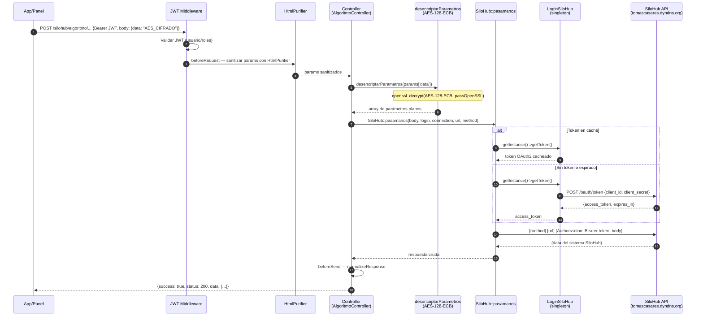
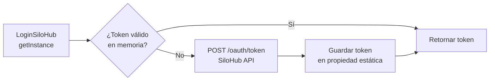

# Flujo: Proxy AES + OAuth2 (Patrón SiloHub / Timbúes)

> **Aplica a:** módulos `silohub` y `timbues`
> **Última revisión:** 2026-04-29

---

## Descripción

El patrón central de api-bus para integraciones externas autenticadas:

1. El cliente envía parámetros **cifrados con AES-128-ECB**
2. api-bus los descifra con la clave configurada en `main.php`
3. api-bus obtiene un token OAuth2 (o equivalente) del sistema externo, con caché singleton
4. api-bus proxea el request al sistema externo
5. La respuesta se normaliza al formato `{success, status, data}`

---

## Diagrama de secuencia completo

---

## Puntos críticos de seguridad

| Punto | Riesgo | Descripción |
|-------|--------|-------------|
| `passOpenSSL` hardcoded | 🔴 Crítico | La clave AES está en `config/main.php` en texto plano |
| AES-128-ECB | 🔴 Crítico | ECB es determinístico; no provee confidencialidad real |
| `client_secret = 'secret'` | 🔴 Crítico | Credencial OAuth2 trivial |
| SSL deshabilitado | 🔴 Crítico | `verifyPeer=false`, `verifyHost=false` en `BaseCurl` |

---

## Flujo de tokens OAuth2 (SiloHub)

> ⚠️ El token se cachea **en memoria por request PHP**. Al ser PHP sin estado, en cada nuevo request HTTP se re-autentica con SiloHub. No hay caché persistente entre requests.

---

## Variante Timbúes

El flujo es análogo pero:
- La URL externa es `tramitesenlinea.com.ar/puertos/muvin`
- La autenticación usa `LoginTimbues` con su propio mecanismo
- La clave AES es diferente (`passOpenSSL` de Timbúes)

---

## Referencias

- [[modulo-silohub]]
- [[modulo-timbues]]
- [[stack-tecnologico]]
- [[security-inventory]]
