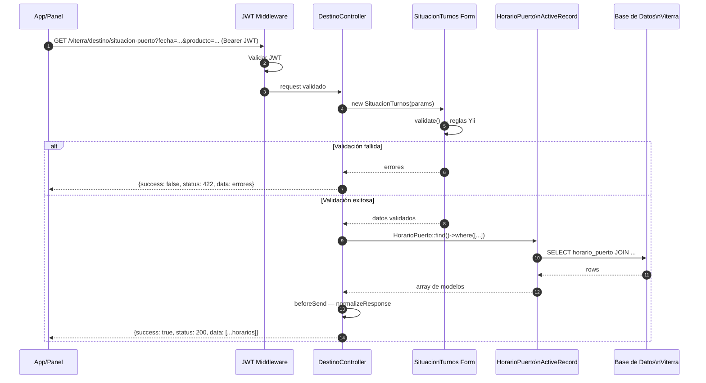

# Flujo: Integración Viterra (Base de Datos Local)

> **Aplica a:** módulo `viterra`
> **Última revisión:** 2026-04-29

---

## Descripción

A diferencia del resto de los módulos, **Viterra no realiza llamadas HTTP a un sistema externo**. En su lugar, api-bus expone vía REST los datos de una base de datos relacional que el sistema Viterra sincroniza y gestiona.

Este patrón es más simple: JWT → validación → consulta ActiveRecord → normalización.

---

## Diagrama de secuencia



---

## Flujo informaciónVentanilla

```mermaid
flowchart LR
    A[GET /viterra/destino/\ninformacion-ventanilla/123] --> B[DestinoController\ninformacionVentanilla]
    B --> C[HorarioPuerto::findOne\nid_horario = 123]
    C --> D[(DB Viterra)]
    D --> C
    C -->|modelo con relaciones| B
    B -->|{success, status, data}| A
```

---

## Consideraciones de diseño

| Aspecto | Descripción |
|---------|-------------|
| **Sin HTTP externo** | Toda la data viene de DB local; latencia muy baja |
| **Read-only** | api-bus nunca escribe en el esquema Viterra |
| **Sincronización** | Es responsabilidad del sistema Viterra mantener la DB actualizada |
| **Conexión DB** | Configurada en `config/main.php` como conexión Yii 2 (`db`) |
| **12 modelos AR** | Representan el esquema completo de Viterra visible a api-bus |

---

## Posibles puntos de falla

| Fallo | Impacto | Mitigación |
|-------|---------|------------|
| DB Viterra no accesible | 🔴 Módulo completo caído | Monitoreo de conectividad DB |
| Datos desactualizados | 🟡 Info incorrecta a usuario | Verificar frecuencia de sync Viterra |
| Schema drift (tablas cambian) | 🔴 Errores ActiveRecord | Versionar schema, tests de integración |

---

## Referencias

- [[modulo-viterra]]
- [[viterra-endpoints]]
- [[entidades-viterra]]
