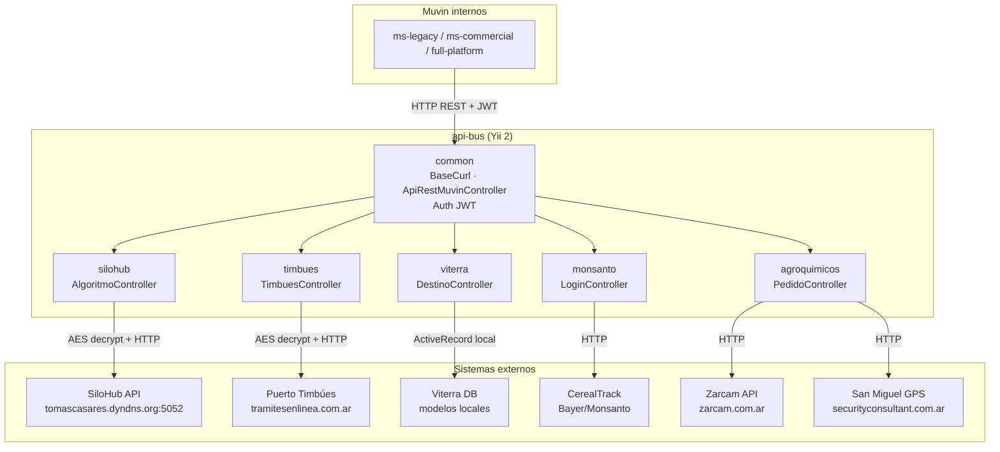

# api-bus — Documentación Técnica

> **Proyecto:** api-bus — Bus de integración con sistemas externos
> **Stack:** PHP 5.6+ · Yii 2 · REST · Docker · Apache
> **Tipo:** API Gateway / Bus de integración (proxy hacia sistemas de terceros)
> **Última revisión:** 2026-04-29

---

> [!abstract] Propósito del sistema
> `api-bus` es un bus de integración construido sobre Yii 2 que actúa como **proxy seguro entre el ecosistema Muvin y sistemas externos de terceros** (SiloHub, Timbues, Viterra, Monsanto/CerealTrack, Zarcam, San Miguel). Cada módulo encapsula la autenticación, el cifrado AES y la comunicación HTTP con un sistema externo específico, exponiendo endpoints REST consumibles por los microservicios internos de Muvin.

---

## Módulos

| # | Módulo | Sistema externo | Criticidad | Enlace |
|---|---|---|---|---|
| M-01 | `silohub` | SiloHub (gestión de granos en planta) | 🔴 Alta | [[modulo-silohub]] |
| M-02 | `timbues` | Puerto Timbúes (actualización CTG) | 🔴 Alta | [[modulo-timbues]] |
| M-03 | `viterra` | Viterra (turnos y ventanillas de puerto) | 🟡 Media | [[modulo-viterra]] |
| M-04 | `monsanto` | CerealTrack / Bayer (posiciones de camiones) | 🟡 Media | [[modulo-monsanto]] |
| M-05 | `agroquimicos` | Zarcam + San Miguel (pedidos y ubicaciones) | 🟡 Media | [[modulo-agroquimicos]] |
| M-06 | `common` | Infraestructura compartida (BaseCurl, Auth) | 🟢 Soporte | [[modulo-common]] |

---

## Arquitectura de alto nivel

---

## Enlaces rápidos

- [[tree-estructura-archivos]]
- [[security-inventory]]
- [[deuda-tecnica]]
- [[_indice-modulos]]
- [[_indice-funcionalidades]]
- [[_indice-servicios]]

---

## Convenciones

- 🟢 Sano / Bajo riesgo
- 🟡 Atención / Riesgo medio
- 🔴 Crítico / Alto riesgo
- ⚠️ Advertencia puntual
- 🔒 Afecta seguridad
- 🔌 Integración con sistema externo
